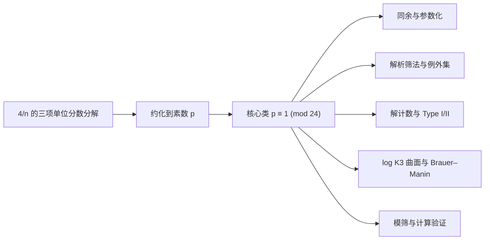

# Erdős–Straus 猜想研究进展综述

> 更新日期：2026-07-27
> 核查口径：优先采用原始论文、出版社页面、arXiv 正文及作者公开代码。同行评议论文、一般预印本和“声称完全证明”的预印本在下文中明确区分。

## 执行摘要

Erdős–Straus 猜想断言：对每个整数 \(n\ge 2\)，存在正整数 \(x,y,z\) 使

\[
\frac{4}{n}=\frac1x+\frac1y+\frac1z.
\]

等价地，

\[
4xyz=n(xy+xz+yz).
\]

截至 2026 年 7 月 23 日，**该猜想仍未解决**。经典恒等式把核心困难约化到素数
\(p\equiv1\pmod{24}\)；现有研究从同余构造、解析筛法、解计数、代数几何和计算验证等方向取得了显著进展，但尚未给出适用于每个这类素数的无条件构造。[Salez（2014）](https://arxiv.org/abs/1406.6307)、[Elsholtz 与 Tao（2013）](https://doi.org/10.1017/S1446788712000468)以及 [Bright 与 Loughran（2020）](https://doi.org/10.1112/blms.12374)分别提供了这些方向的现代基础。

计算方面，Salez 报告验证到 \(10^{17}\)，Mihnea 与 Dumitru 的 2025 年预印本报告验证到 \(10^{18}\)。两项原始计算报告均以 arXiv 预印本形式公开；2026 年经同行评议发表的 Pomerance–Weingartner 论文提及并致谢这两项计算，但这**不等于对 \(10^{18}\) 的独立复现**。因此，准确表述应是：**目前公开报告的最高验证上界为 \(10^{18}\)，其依据是带公开代码的预印本计算**。[Salez（2014）](https://arxiv.org/abs/1406.6307)、[Mihnea 与 Dumitru（2025）](https://arxiv.org/abs/2509.00128)、[Pomerance 与 Weingartner（2026）](https://doi.org/10.1007/s11139-025-01312-2)

2025–2026 年出现了多篇结构性预印本，也出现了个别“完全证明”声称。它们不能等量齐观：Bradford 的覆盖系统论证缺少覆盖性证明；Dyachenko 的仿射格论证则用一个共同平移量同时命中两个独立选取的剩余类，却没有证明二者相容。两处缺口都位于主证明链上，因此均不构成完整证明；同期论文仍明确把问题作为开放问题研究。[Bradford（2026）](https://arxiv.org/abs/2602.11774)、[Dyachenko（2025）](https://arxiv.org/abs/2511.07465)、[Chamberland（2026）](https://doi.org/10.5281/zenodo.19403738)

本次系统整理形成 51 张论文卡、18 张主张卡和 10 张概念卡。正文只概括主线；完整首发时间线见 [`index/timeline.md`](index/timeline.md)，规范 BibTeX 见 [`bibliography/library.bib`](bibliography/library.bib)，全部纳入、归并、排除与待审决定见 [`bibliography/candidates.yaml`](bibliography/candidates.yaml)。

## 研究路线总览

下表按“一个方法能回答什么问题”组织文献，而不是把不同量词的结论混在同一条进展线上。更细的可检索版本见 [`concepts/research-directions-and-proof-gap.md`](concepts/research-directions-and-proof-gap.md)。

| 路线 | 代表性已确立结论 | 仍未跨越的缺口 |
|---|---|---|
| 经典恒等式、同余类与多项式族 | 约化到 \(p\equiv1\pmod{24}\)；固定多项式机制可覆盖非平方原始类。 | 对所有核心素数给出覆盖，或突破平方类方法障碍。 |
| 解析筛法与例外集 | 可解分母具有自然密度 \(1\)，并有定量例外集上界。 | 密度零的例外仍可无限。 |
| Type I/II、gcd 与除子参数化 | 素数解可按整除型态穷尽分类；若存在解，多个参数化能给出可核验的除子证书。 | 对每个核心素数证明至少存在一个证书。 |
| 解计数与枚举算法 | 素数平均解数达到 \(N(\log N)^2\) 量级，并有可枚举算法。 | 平均解数和算法速度都不保证某个具体素数有解。 |
| 模筛与大规模计算 | 公开计算报告的上界达到 \(10^{18}\)，筛结构和代码可审查。 | 任意有限计算都不能替代无穷量词，也不等于独立全量复现。 |
| log K3 与 Brauer-Manin | 自然 Brauer 类不产生否定所需整点的该类障碍。 | 排除一种局部整体障碍并不构造整点。 |
| 一般 \(m/n\)、更多单位分数与 Erdős-Straus-Schinzel 问题 | 提供计数、算法和例外集工具，并显示一般固定分子有不同的例外现象。 | 一般问题的结论不能自动回推为 \(m=4\) 的逐点结论。 |

这张图给出阅读新材料的最低判据：有限同余族必须证明覆盖性，除子条件必须证明对所有目标素数可满足，计算必须说明范围和复现状态。任何一个环节没有闭合，都不能称为完整证明。

## 1. 问题结构与基本约化

### 1.1 从一般整数约化到素数

若 \(4/n=1/x+1/y+1/z\)，则对任意正整数 \(m\)，

\[
\frac{4}{mn}=\frac1{mx}+\frac1{my}+\frac1{mz}.
\]

因此，只要对每个素数分母证明猜想，就能推出一般整数情形；若存在最小反例，它必为素数。

### 1.2 只剩 \(p\equiv1\pmod{24}\)

经典显式恒等式分别处理

\[
n\equiv-1\pmod3,\qquad n\equiv-1\pmod4,
\qquad n\equiv-3\pmod8.
\]

结合素数约化，只需研究

\[
p\equiv1\pmod{24}.
\]

这不是新的猜想，而是所有现代理论与计算方法共享的核心瓶颈。[Salez（2014）](https://arxiv.org/abs/1406.6307)

### 1.3 Type I 与 Type II

对奇素数 \(p\)，Elsholtz 与 Tao 按分母是否被 \(p\) 整除把解分为两类：

- **Type I**：\(p\mid x\)，且 \(p\nmid yz\)；
- **Type II**：\(p\mid y,z\)，且 \(p\nmid x\)。

交换 \(x,y,z\) 后，每个解都落入其中一类，并有

\[
f(p)=3f_I(p)+3f_{II}(p),
\]

其中 \(f(p)\) 是有序正整数解的数量。[Elsholtz 与 Tao（2013）](https://doi.org/10.1017/S1446788712000468)

## 2. 已确立的理论进展

### 2.1 同余构造与参数化

Rosati、Yamamoto 等人的显式恒等式长期构成同余方法的基础。Salez 把**四条既有参考模方程**（其中包括 Yamamoto 整理的、源自 Rosati 的两条）与自己的**三条新方程**合并为七条参考方程，并证明一次素多项式情形下相应模方程的完备性。这里应理解为“共七条”，而不是把 Rosati、Yamamoto 与 Salez 的数量相加成九条。[Salez（2014）](https://arxiv.org/abs/1406.6307)

Mordell 的 *Diophantine Equations*（1969，第 287--290 页）是这条经典公式路线的常用二手入口，但不是 Rosati 公式的原始优先权来源。Salez 已明确按 Mordell 的归属把相关两种解型回溯到 Rosati；因此本库将 Mordell 作为历史枢纽书目，而把具体公式的原始归属保留给 Rosati。[Mordell 书目卡](papers/mordell1969.md)、[Rosati 书目卡](papers/rosati1954.md)

Elsholtz 与 Tao 还证明了一个重要的模 \(840\) 分类：若原始剩余类 \(n\equiv r\pmod{840}\) 中的 \(r\) 不是平方类，则该剩余类可由多项式恒等式统一处理；平方类则不能被这种固定多项式参数化覆盖。后一句并不表示平方类无解，只表示这一类统一参数化方法有结构性边界。[Elsholtz 与 Tao（2013）](https://doi.org/10.1017/S1446788712000468)

### 2.2 例外集与密度结果

令

\[
E(N)=\#\{n\le N:f(n)=0\}.
\]

Vaughan 证明存在常数 \(c>0\)，使

\[
E(N)\ll N\exp\!\left(-c(\log N)^{2/3}\right).
\]

因此，可解整数具有自然密度 \(1\)。Li 后来证明，对任意固定 \(k\)，

\[
E(N)=O_k\!\left(\frac{N}{(\log N)^k}\right).
\]

需要注意强弱关系：Li 的结果给出任意多重对数节省，但从渐近量级看，**弱于** Vaughan 的伸缩指数界，而不是更强。[Vaughan（1970）](https://doi.org/10.1112/S0025579300002886)、[Li（1981）](https://doi.org/10.1016/0022-314X(81)90039-1)

Sander 随后分别用 Rosser 筛与 Iwaniec 半维筛继续研究该问题。准确书目信息是：Rosser 筛论文发表于 *Acta Arithmetica* 59（1991），183–204；半维筛论文发表于 *Journal of Number Theory* 46（1994），123–136。[Sander（1991）](https://doi.org/10.4064/aa-59-2-183-204)、[Sander（1994）](https://doi.org/10.1006/jnth.1994.1008)

Pomerance 与 Weingartner 把这条例外集路线推广到更一般的 Erdős–Straus–Schinzel 型问题。该文已在 2026 年同行评议发表，但它是例外集理论的推广，不是 \(m=4\) 情形的完全证明。[Pomerance 与 Weingartner（2026）](https://doi.org/10.1007/s11139-025-01312-2)

### 2.3 解计数与枚举算法

Elsholtz 与 Tao 证明

\[
N(\log N)^2
\ll \sum_{p\le N}f(p)
\ll N(\log N)^2\log\log N.
\]

这是素数分母解数的平均阶估计。它说明总体解数丰富，但平均值本身不能单独推出每个素数都有解；逐点非零仍是猜想最困难的部分。[Elsholtz 与 Tao（2013）](https://doi.org/10.1017/S1446788712000468)

在可快速分解整数的标准期望复杂度模型下，该文还给出枚举所有 Type I 与 Type II 解的期望时间，分别为

\[
O\!\left(n^{3/5+o(1)}\right),\qquad
O\!\left(n^{2/5+o(1)}\right).
\]

Elsholtz 与 Planitzer 将这一方向推广到一般 \(m/n\)，对固定 \(m\) 得到表示数上界

\[
O_\varepsilon\!\left(n^{3/5+\varepsilon}\right)
\]

以及枚举全部解的期望时间

\[
O_\varepsilon\!\left(
n^\varepsilon\left(\frac{n^3}{m^2}\right)^{1/5}
\right).
\]

[Elsholtz 与 Planitzer（2020）](https://doi.org/10.1017/prm.2018.137)

### 2.4 代数几何视角

Bright 与 Loughran 把

\[
4u_1u_2u_3=n(u_1u_2+u_1u_3+u_2u_3)
\]

视为仿射三次曲面 \(U_n\) 的整点问题；其几何模型是奇异的 log K3 曲面。他们证明，自然解空间没有足以否定猜想的 Brauer–Manin 障碍，但该障碍会阻碍某种强逼近，并统一解释了古典文献中的若干二次互反条件。这项工作提供的是结构约束，而不是逐个构造所有 \(p\equiv1\pmod{24}\) 的算法。[Bright 与 Loughran（2020）](https://doi.org/10.1112/blms.12374)

### 2.5 一变量约化、除子条件与有限证书

这条路线把“找三个分母”改写为“找一个满足整除和同余条件的参数”。Bradford 2021 在**假设解存在**的前提下用 gcd 恒等式消去第三个变量；它是结构刻画而非存在性定理。Bradford 2025 进一步证明，对于素数 \(p\)，Type I 或 Type II 解与最小分母 \(x\) 的除子 \(d\mid x^2\) 所满足的相应同余条件可以相互恢复。该等价把验证和枚举转成短证书问题，但“每个 \(p\) 都有这样的 \(x,d\)”仍正是原猜想的逐点难题。[Bradford（2021）](https://doi.org/10.5281/zenodo.10807535)、[Bradford（2025）](https://doi.org/10.5281/zenodo.15755958)

Chamberland 2026 对 Type II 给出另一种素数形状的充要刻画；Bello-Hernández、Benito、Fernández 2026 则用 `fab` 除子函数把一类“所有分母被给定分子整除”的分解统一参数化，并报告有限窗口实验。这些是互补的结构和计算语言，均没有证明对每个核心素数都存在可用参数。[Chamberland（2026）](https://doi.org/10.5281/zenodo.19403738)、[Bello-Hernández 等（2026）](https://arxiv.org/abs/2606.10922)

Chamberland 形状与 Type II 的 \(AC\) 因子射线其实可作精确翻译：
\(A=\gcd(s_1,s_2)\)、\(C=\operatorname{lcm}(s_1,s_2)/A\)，而
\(K=(q+1)/(4\operatorname{lcm}(s_1,s_2))\)。因此，当前“有界 \((A,C)\)、可变
\(K\)”的短证书目标正是寻找 Chamberland 表示中的低复杂度除子对，并非独立的新机制，见
[Chamberland--AC 射线翻译](claims/chamberland-ac-ray-translation.md)。

## 3. 2024–2026 年前沿材料的证据分级

| 工作 | 主要内容 | 当前证据状态 | 应如何引用 |
|---|---|---|---|
| Bradford 2025 | 把解的存在与两类除子同余条件建立对应 | 已发表于 *Integers* | 可作为已发表的结构性结果，不等于猜想已证 |
| Mihnea–Dumitru 2025 | 报告计算验证到 \(10^{18}\)，公开 Python、C++/GMP 代码 | arXiv 预印本；后续期刊文献提及，未见独立全量复现 | 写作“公开报告的计算上界” |
| Dyachenko 2025 | 声称对全部 \(p\equiv1\pmod4\) 构造解 | 预印本；仿射格对角平移步骤存在关键相容性缺口 | 不应写作已证明 |
| Bradford 2026（solution） | 声称完全解决猜想 | 预印本；覆盖系统关键步骤未证明 | 不应写作已证明或仅“待核验” |
| Mballa 2026 | 对含 \(3\pmod4\) 素因子的 \(n\equiv1\pmod4\) 构造解，该集合密度为 \(1\) | arXiv 预印本；核心素数全部在其零密度补集 | 写作显式 density-one 结果，不写作核心素数进展 |
| Chamberland 2026 | 刻画素数存在 Type II 解的充要形式 \(p=qr-4s_1s_2\) | 已发表于 *Integers*；等价定理已核对 | “全部素数都具有该形式”仍是猜想 |
| Xu 2026 | 提出 tame/wild 分类并做有限范围实验 | arXiv 预印本 | 写作分类框架与计算观察 |
| Ventas 2026 | 用 ceiling continued fractions 做大范围启发式搜索 | arXiv 预印本 | 只能作为启发式证据 |
| Bello-Hernández–Benito–Fernández 2026 | 提出一般除子参数化、平移不变模筛及有限参数刚性障碍 | arXiv 预印本 | 写作结构性部分结果，作者不是 Bradford |
| Pomerance–Weingartner 2026 | 推广 Erdős–Straus–Schinzel 例外集理论 | 同行评议期刊论文 | 可作为已发表的解析进展，不是完全证明 |

对应来源：[Bradford（2025）](https://doi.org/10.5281/zenodo.15755958)、[Mihnea 与 Dumitru（2025）](https://arxiv.org/abs/2509.00128)、[Dyachenko（2025）](https://arxiv.org/abs/2511.07465)、[Bradford（2026）](https://arxiv.org/abs/2602.11774)、[Mballa（2026）](https://arxiv.org/abs/2602.20036)、[Chamberland（2026）](https://doi.org/10.5281/zenodo.19403738)、[Xu（2026）](https://arxiv.org/abs/2605.23601)、[Ventas（2026）](https://arxiv.org/abs/2605.04551)、[Bello-Hernández 等（2026）](https://arxiv.org/abs/2606.10922)、[Pomerance 与 Weingartner（2026）](https://doi.org/10.1007/s11139-025-01312-2)。

Ventas 的三项 FCT 确定性构造可被完全翻译为既有的外部 source Type I 子空间：其 FCT 系数
\(c_0,c_1,c_2\) 给出缺口 \(m=c_2\)、首分母 \(x=kc_0\) 与除子
\(D=c_0x\)，反向也唯一恢复这些系数。因此它提供了不同的搜索坐标，而非无标记递降或新的
证书类型；详见 [三项 FCT--Type I 等价](claims/fct-three-term-type-I-equivalence.md)。
其中 source 独立性与 Borel--Cantelli 的结论仍只在该文明确采用的随机模型内成立，不能升级为逐点存在性定理。

### 关键归属与证明核查

1. **作者归属修正。** *A Divisor Parametrization for the Erdős–Straus Conjecture*（arXiv:2606.10922）的作者是 M. Bello-Hernández、M. Benito 与 E. Fernández，不是 Kyle Bradford。该文讨论一般除子函数、平移不变模筛和有限参数覆盖的刚性障碍，并与 Bradford 的方法作比较。

2. **“完全证明”声称的核查。** Bradford 的 arXiv:2602.11774 在正文中把最后一步表述为证明所列同余类构成覆盖系统，随后只检查或列举了开头若干素数情形，没有给出覆盖全部相关素数的论证。该缺口位于证明主链上，不能视为省略的例行细节。因此，本报告不把该预印本计入已解决结果。

3. **仿射格声称的核查。** Dyachenko 的 arXiv:2511.07465 在 Proposition 9.25 附近先分别选择满足两个模条件的代表元，再试图用同一个对角平移参数同时到达二者。第一个坐标已经决定该参数，正文没有证明第二个坐标自动相容；相关引理也未证明一个秩一对角陪集等于固定两个剩余类的全部格点。因此 Theorem 9.21 的关键存在性步骤尚未成立。

4. **已发表的 Type II 等价定理。** Chamberland 证明：素数 \(p\) 存在 Type II 解，当且仅当可写成 \(p=qr-4s_1s_2\)，其中 \(q\equiv3\pmod4\) 且 \(s_1,s_2\mid(q+1)/4\)。双向等价是定理；“所有素数都有这种表示”是论文另行提出的猜想，二者不可合并。

## 4. 时间线与里程碑

| 年份 | 进展 | 性质 |
|---:|---|---|
| 1948 | 通行文献把猜想提出时间追溯到 Erdős 与 Straus 的讨论；本库尚未定位二人共同署名的原始公告 | 历史归属，保留出处边界 |
| 1950 | Erdős 的一般单位分数论文与 Obláth 的直接论文构成最早印刷入口 | 原始书目入口 |
| 1954–1965 | Rosati、Bernstein、Yamamoto 等发展显式同余构造 | 经典部分结果 |
| 1962 | Bernstein 独立验证到 \(8000\)；这不是当时的最高纪录，因为更早已有超过 \(10^5\) 的计算记录 | 历史计算，非纪录推进 |
| 1970 | Vaughan 给出伸缩指数型例外集上界 | 解析里程碑 |
| 1981 | Li 给出任意多重对数节省的例外集界 | 解析部分结果 |
| 1991 | Sander 发表 Rosser 筛论文 | 解析筛法 |
| 1994 | Sander 引入 Iwaniec 半维筛 | 解析筛法 |
| 2012 | Bello-Hernández、Benito、Fernández 报告验证到 \(2\times10^{14}\) | 参数化与计算 |
| 2013 | Elsholtz–Tao 建立平均解数与 Type I/II 计数框架 | 理论里程碑 |
| 2013 | Rios 的渐近估计预印本后来因公式 (3)、(5) 的关键符号错误由作者撤回 | 负面研究记录，不可引用其结论 |
| 2014 | Salez 完成七个参考模方程框架并报告验证到 \(10^{17}\) | 理论与计算 |
| 2020 | Bright–Loughran 建立 log K3 / Brauer–Manin 框架 | 代数几何里程碑 |
| 2020 | Elsholtz–Planitzer 推广解计数上界与枚举算法 | 理论与算法 |
| 2021 | Bradford 发表一变量约化；Gionfriddo–Guardo 的 \(13\pmod{24}\) 结果正式发表 | 结构结果与易类公式 |
| 2025 | Bradford 发表除子同余对应；Mihnea–Dumitru 报告验证到 \(10^{18}\) | 已发表结构结果；预印本计算 |
| 2026 | Pomerance–Weingartner 发表例外集推广；Chamberland 发表 Type II 等价刻画；多篇预印本提出新参数化、分类和启发式 | 已发表进展与前沿探索并存 |

早期计算史和文献表可参见 [Elsholtz 与 Tao（2013）](https://doi.org/10.1017/S1446788712000468)；上表有意不把“独立完成的小范围验证”误写成“刷新最高纪录”。

### 4.1 计算验证阶梯及其证据边界

| 来源或历史归属 | 报告范围 | 应如何理解 |
|---|---:|---|
| Oblath（1948/49，1950 出版） | \(106128\) | Elsholtz--Tao 历史表归属，非本库原文重跑。 |
| Rosati（1954） | \(141648\) | 同为历史表归属。 |
| Yamamoto（1964/65） | \(10^7\) | 历史表把计算年份与论文出版年分开。 |
| Terzi（1971） | \(10^8\) | 历史表也警告后来的 Franceschine 记载不是独立复核。 |
| Jollensten（1976） | \(1.1\times10^7\) | 独立计算报告，但不是当时最高范围。 |
| Kotsireas（1999） | \(10^{10}\) | 已发表会议记录；此前还有未发表的 Elsholtz--Roth 范围，不能混作公开纪录。 |
| Swett（1999） | \(10^{14}\) | 作者网页计算报告。 |
| Bello-Hernández、Benito、Fernández（2012） | \(2\times10^{14}\) | 论文报告的有限验证。 |
| Salez（2014） | \(10^{17}\) | arXiv 论文和附件代码报告，未在本库全量复现。 |
| Mihnea--Dumitru（2025） | \(10^{18}\) | 公开代码的预印本报告，目前不是独立全量复现记录。 |

所以，“最高公开报告”与“最高经过独立复现的上界”是两项不同指标。当前前者为 \(10^{18}\)，后者在本库中不作未证实的宣称；只有小尺度公式和证书复现被标为 `computationally_reproduced`。

## 5. 计算验证与复现要点

### 5.1 Salez 的模筛

Salez 从 \(N_0=\{n:n\equiv1\pmod{24}\}\) 出发，用模过滤器排除已由参考方程保证可解的整数。文中给出的几个基础过滤器包括

\[
S_5=\{0,2,3\},\qquad
S_7=\{0,3,5,6\},\qquad
S_{11}=\{0,7,8,10\}.
\]

对合数模数再使用缩短过滤器 \(S_m^*\)，去掉已被真因子过滤器覆盖的冗余剩余类。依次使用 \(5,7,11,13,17,19,23\) 后，Salez 得到

\[
G_7=892\,371\,480,
\qquad \#R_7=147\,348,
\qquad g_7=6056.
\]

“约 43 倍”必须注明比较基准：在只使用 \(5,7\) 后，平均间隔为 \(140\)，所以 \(6056/140\approx43.3\)。若与原始序列 \(24k+1\) 的间隔 \(24\) 比较，则是约 \(252\) 倍，而不是 43 倍。[Salez（2014）](https://arxiv.org/abs/1406.6307)

对 \(N=10^{17}\)，论文报告实际检查候选数

\[
16\,512\,783\,482\,880,
\]

其中平方数为 \(51\,732\,427\)，并提供 arXiv 附件 `program.cpp`。这使其算法结构可以审查，但原始报告本身仍是 arXiv 预印本。

### 5.2 \(10^{18}\) 计算报告

Mihnea 与 Dumitru 延续模过滤器路线，使用 Python 生成过滤器，使用 C++/GMP 校验大整数，并将搜索拆成批次以便多线程执行。作者报告中等配置运行约两周，代码与数据公开在 [`esc-paper/erdos-straus`](https://github.com/esc-paper/erdos-straus)，仓库标注 CC0-1.0 许可。[Mihnea 与 Dumitru（2025）](https://arxiv.org/abs/2509.00128)

对该结果应区分三层证据：

- 论文和代码公开，可由第三方检查；
- Pomerance–Weingartner 的期刊论文提及并致谢该计算；
- 尚不能据此声称已有独立团队完整复现 \(10^{18}\) 的全部搜索。

因此，本报告采用“公开报告验证到 \(10^{18}\)”这一措辞。

### 5.3 本知识库的小尺度复现

[`reproductions/esc_reproduce.py`](reproductions/esc_reproduce.py) 使用整数运算和 `fractions.Fraction` 独立交叉核对四个环节：三个经典约化恒等式；\(S_5,S_7\) 与 \(n\equiv1\pmod{24}\) 合并后模 \(840\) 的六个残余类

\[
1,121,169,289,361,529;
\]

固定首分母后的因子对恒等式 \((ay-b)(az-b)=b^2\)；以及 Bradford Type I/II 除子条件到显式分母的对应。当前结果逐个验证 \(2\le n\le1000\)，并为 \(p\le10000\) 的全部 1229 个素数找到并精确核对一个 Type I 或 Type II 证书，其中首次命中的 Type I 为 851 个、Type II 为 378 个。

这些数字只说明复现脚本在有限范围内与理论接口一致，**不是**对 \(10^{17}\) 或 \(10^{18}\) 搜索的缩略证明，也不能外推为全称结论。运行方法和哈希见 [`reproductions/README.md`](reproductions/README.md) 与 [`reproductions/results.json`](reproductions/results.json)。

## 6. 方法评估与可行研究方向

### 6.1 各路线的能力边界

- **同余构造**直接、可计算，但七个参考方程的完备性表明，仅寻找更多同类型线性模恒等式可能难以覆盖全部困难素数。
- **解析筛法**能把潜在例外集压得极薄，却通常不能对一个给定的 \(p\equiv1\pmod{24}\) 产生具体分解。
- **解计数与除子参数化**兼具结构与算法价值，但平均解数为正不等于每个分母都有解。
- **Type II \(AC\) 因子射线**把证书化为 \(p+4A^2C\) 是否有
  \(h\equiv-1\pmod{4AC}\) 的因子；有限审计和共同残余筛支持这条路线，但单射线的
  失败序列不能普适压成“不含 \(-1\) 的真子群加次线性异常”。Kneser 临界序列给出
  线性反例，故结构理论还必须保留循环商中的双向算术级数主型。
- **Brauer–Manin 方法**统一了局部二次剩余限制，目前仍缺少把必要条件转化为全局充分构造的机制。
- **大规模计算**持续增强数值证据，不能替代对所有整数的证明；其长期价值取决于代码、参数和校验链是否可复现。

### 6.2 值得优先推进的问题

1. **直接 Type II 的移动窗口增长。** 固定窗口 \(j\le27\) 在 \(10^8\) 内仍覆盖
   全部核心素数，却在 \(p=153633769<2\cdot10^8\) 失效；该点首个 Type II 命中为
   \(j=32,m=127\)，且 \(j\le32\) 已在 \(p\le5\cdot10^8\) 的 3,292,848 个核心素数上
   恢复全覆盖，见 [移动窗口 500M 审计](claims/moving-window-type-II-audit.md)。这说明直接短证书
   值得优先研究，但必须解释最小窗口记录为何增长，不能假定存在已经观察到的固定界。
   可行中间目标是：把连续窗口共同失败的除子残数状态与相邻移位的固定差值联系起来，
   推出新的 Type II 命中或可提升的直接证书。
   这可先用有限碰撞状态化：对 \(x_j=(p+4j-1)/4\)，删去窗口差值的素因子后，
   各 \(x_j\) 的私有余因子两两互素，且每个失败恰为私有积集避开一个有限目标集；
   \(p=153633769,j\le31\) 已逐项复现，见
   [移动窗口碰撞分解](claims/type-II-moving-window-finite-collision-reduction.md)。
   这里已有一项必要的负向校准：以该记录点为种子，在“固定碰撞因子乘一个私有仿射
   素因子”的模型中，前 37 个窗口位置存在 Dickson/Schinzel 可采纳的条件性逃逸族，
   见 [一私有素因子条件逃逸](claims/type-II-moving-window-one-private-prime-conditional-escape.md)。
   因而 \(J=32\) 的有限全覆盖不能作为固定窗口定理的证据；主目标必须是**自适应扩窗
   的状态闭包或可提升递降**，而不是再提高某个固定 \(J\) 的计算上界。
   当前一私有素因子状态可沿自适应残数选择延展至 \(j\le51\)；其起始算术进程在
   第 52 个位置有无条件的缺口 \(207\) Type II 证书
   \(d=47x/9682\)，所以该整条状态分支被真正接回证书，见
   [缺口 207 进程证书](claims/type-II-gap-207-progression-certificate.md)。
   其一般机制已抽象为固定因子进程陷阱引理：若未来缺口冻结余因子残数，就可由固定
   因子的一个除子恢复整条算术进程上的 Type II 证书，见
   [固定因子进程陷阱](claims/type-II-fixed-factor-progression-trap.md)。
   该机制也有完整反例边界：记录点 \(p=8803369\) 在其 \(J=20\) 状态下，全部 3,929
   个可能的固定因子未来缺口均不命中；故它必须与多因子积集或递降机制结合，而不能单独
   作为全称选择器。
   该点确有平方因子外部源严格递降，所以固定 \(J=20\) 的千万范围已由“直接 Type II
   证书或严格递降”混合覆盖；这只是可复现基准，不是全称界，见
   [千万级混合闭合](claims/type-II-window-descent-hybrid-10m.md)。
2. **缓增参数盒的 Type II 饱和。** 争取证明：对某个常数 \(D\)，每个核心素数
   都存在 \(A,C\le(\log p)^D\)，使 \(p+4A^2C\) 有
   \(h\equiv-1\pmod{4AC}\) 的因子。这一逐点定理将直接给出 Type II 证书。其最有
   希望的中间问题不是再增加独立字符同余，而是给共同失败定义对“已引入模数素数”的
   封闭因子复杂度状态：前 16 条规范移位在固定模数的二层一私有因子模型中已无逃逸支，
   但第 17 条移位引入新的强制 \(17\)-因子后逃逸重新出现，见
   [强制因子阶梯边界](claims/type-II-prime-cofactor-forcing-ladder.md)。因此任何证明
   必须同时更新旧移位的强制因子，而不能把固定模的剥离结论作朴素归纳。
   对原始而非规范化的 AC 参数盒，这个最简单的私有因子模型也已得到一项正向压缩：
   保留每个 \((A,C)\) 的独立模数后，\(1\le A,C\le5\) 与 \(1\le A,C\le7\) 的
   一私有余因子安全类分别有 240 与 5,040 个，但全部被有限线性型族的局部素数覆盖，
   没有可采纳分支，见
   [原始 AC 射线盒一私有余因子边界](claims/type-II-ac-box-one-prime-local-closure.md)。
   这只排除“每条射线至多一个新素因子”的条件性共同遗漏模型；同一移位的不同
   \(4AC\) 模数不可合并，且余因子含多个私有素因子的真实失败尚未闭合。
   半径五盒已经跨过下一道最小障碍：其 240 个首层安全类均被同一个 \(7\) 覆盖；
   在全部 \(n\bmod7\) 分支剥离强制 \(7\)-幂后，960 个仍避靶的二层分支仍全部
   不可采纳，见
   [AC 半径五覆盖素数递归边界](claims/type-II-ac-box-recursive-covering-boundary.md)。
   这把真正剩余的问题压缩到第三层及以上的因子积状态，而非已经证明参数盒饱和。
   但这一压缩不能被外推为固定盒的单调终止：完整四层状态审计已在 268,250 个仍避靶
   状态中重新得到 242,390 个可采纳族；其中
   \(p=245044800t+1\) 的显式分支依次剥离 \(7,11,13,17\)，见
   [AC 半径五四层条件逃逸](claims/type-II-ac-box-depth-four-recursive-escape.md)。
   因而“继续剥离既有盒的覆盖素数”不是主证路线；若要利用这类状态，必须同步加入
   新射线或接入可提升递降。
   对该显式进程，甚至任意大小的固定或一次仿射新 AC 射线也不能整条接回：一次因子
   条件把搜索压缩为 \(245044800\) 的有限因子分解，全部 896,000 个必需 AC 分解均
   无命中，见
   [深层 AC 逃逸的仿射射线边界](claims/type-II-ac-escape-affine-ray-boundary.md)。
   这一 Type II 空结果现在由 Type I 的对应边界补齐：令
   \(x=(p+m)/4\)，任何固定缺口的常数或仿射 Type I 除子都被压缩为
   \(61261200\) 的有限因子状态；72 个缺口的 868 个候选均为空，见
   [深层 AC 逃逸的 Type I 仿射边界](claims/type-I-escape-affine-boundary.md)。
   所以“增加固定模板”也不是补救；正向桥必须使用随参数非线性变化的因子，或真正的
   带标记严格递降。
   最简单的动态外部源也尚不能提供该桥：取 \(p-c\) 源和随参数线性增长的尺度后，
   所有 215 个固定移位状态中 7,001,744 个统一多项式平方尾均无递降同余命中，见
   [动态距离多项式尾边界](claims/dynamic-distance-polynomial-descent-boundary.md)。
   因而下一步的因子选择必须超出固定可见因子与统一多项式尾，或证明多个源状态之间有
   不能被单源模型看见的提升关系。
   可变量移位的实测保持者也确实增长：\(p\le10^8\) 的 719,781 个核心素数均在
   \(s\le52\) 命中，但 \(p=81846241\) 首次超过此前一千万范围的 \(s=50\) 记录，
   见[首次规范移位谱](claims/type-II-minimal-canonical-shift-spectrum.md)。因此应寻求
   增长上界而非固定小扇覆盖。
   更强地，前 19 条规范移位已有 265001 个可采纳的二层分支；在 Dickson/Schinzel
   型素数元组假设下它们给出无穷多个共同失败点，见
   [十九移位条件性逃逸边界](claims/type-II-nineteen-shift-conditional-escape-boundary.md)。
   因而固定规范扇加有限同余剥离不应再作为主证路线；真正要证明的是能跨越该边界的
   多移位因子复杂度定理，或转向随 \(p\) 增长的**新移位**及其规范 \(AC\) 射线。
   新增第 20、21、22 条移位都不扩张联合模数 \(Q_{19}\)，却把一私有模型的二层
   可采纳分支依次降至 151,723、66,638、0，见
   [强制因子阶梯边界](claims/type-II-prime-cofactor-forcing-ladder.md)。
   这段固定模数闭合已经在下一次扩模处有明确的更新见证：H22 的安全类
   \(529\) 经 CRT 提升为 \(R=1474353409\bmod Q_{23}\) 后，在 H23 二层重新
   出现无覆盖素数分支；新的 \(23\) 被吸收到第 5 条移位的强制因子
   \(3\mapsto69\)，见 [H23 模数扩张更新见证](claims/type-II-h23-modulus-renewal-witness.md)。
   所以固定模数下的一段新射线可以闭合简化状态，但不能当作跨越下一次模数扩张的单调
   终止原理；自适应状态必须同时记录新增射线约束与模数扩张带来的强制因子更新。
   其中“模数外私有素因子数必增长”已经在有限残余中失败：\(p=1127281\) 逃过前
   19 条射线，而 \(p+76=7\cdot11^5\) 完全由联合模数素因子构成，见
   [十九移位过渡复杂度边界](claims/type-II-nineteen-shift-transition-complexity-boundary.md)。
   下一步的势函数必须保留除子残数积集、补因子轨道或跨移位差值信息。碰撞部分可以
   更精确地编入状态：若剥离碰撞因子后私有积集恰缺一个碰撞诱导目标，则补因子对合
   强制 \(p\) 落入一个显式同余类；这是碰撞感知的一孔陷阱，见
   [私有积集状态](claims/type-II-private-product-state.md)。但前十四移位的千万范围
   1,792 条共同失败状态中有 1,641 条的所有诱导目标均在私有支撑外，且其中 1,141 条
   私有积集已等于整个生成支撑；因此小孔、积集膨胀或补因子轨道势函数都不能处理主残余。
   这一形状在前十九移位的千万范围仍为 747/855 条全支撑外、510 条支撑饱和，故不是
   十四移位扇的偶然统计。后续必须利用私有素因子的逐项残数分布及不同 \(p+4s\) 的
   固定差值。一个新的正向分支是把碰撞素因子幂连同其来源移位保留：若同一奇素数幂
   同时整除 \(p+4s\) 和 \(p+4u\)，则强制 \(u\equiv s\pmod {q^e}\)。由全部
   来源兼容的碰撞因子组成的闭包可 relay 到后续规范证书；对前十四移位的一百万范围
   共同失败点已覆盖 12/24，对前十九移位的千万范围覆盖 25/45。再允许证书因子含
   一种、两种带来源标签的私有素因子，覆盖增至 39/45、40/45，见
   [带标签碰撞因子 relay 边界](claims/type-II-collision-factor-relay-boundary.md)。
   但两私有层仍有五个残余；对这五点继续允许三种私有源仍全部无 relay，尤其
   \(p=225289\) 的 8,185 个候选皆失败。且首个真实递降逃逸 \(p=2451289\) 也不被
   纯碰撞层处理。最小残余 \(p=225289\) 的首次后续证书在 \(s=32\) 使用扇外新素数
   \(2591\)，所以自适应扩扇时必须同时更新旧、新因子来源状态；否则只能转向真正可
   提升的递降。不能把有界私有层的有限覆盖误作全称结论。
   更系统的千万级过渡审计显示：前十九移位的 45 个共同失败点都在移位 \(20\) 至
   \(50\) 首次命中，且在首个命中移位可选到不含旧私有因子的证书有 42 点，其中
   35 点含新增移位首次引入的新因子；仅三点在最早命中移位必须用一个旧私有因子，见
   [自适应新因子过渡谱](claims/type-II-adaptive-factor-transition.md)。
   把范围推到 \(2\cdot10^7\) 后，H19 共同残余为 65 个；自适应外部源严格递降命中
   55 个，其余 10 个均被混合因子外部源恢复，完整平方因子外部源严格递降命中全部 65 个，见
   [H19 与平方因子递降闭合](claims/type-II-h19-quadratic-descent-closure.md)。
   该范围内见证的 \(k\le12\)，但 \(p=12180169\) 首次需要 \(k=9\)，所以千万级
   的固定 \(k\) 表不能外推。优先问题应表述为：证明受控增长 \(k\) 的严格递降在共同
   残余上总存在，或把其失败转成新增规范移位证书。
   更细的平方因子状态路径显示，\(p=8328961\) 已逃过 H19，且所有允许的
   \(k=1,2,3,4,5,6,8,9,10\) 都失败，首次严格递降在 \(k=12\)。因此连
   “H19 加完整平方因子递降 \(k\le10\)”也不是该样本内的选择器。每个源的失败恰为
   \(-M_k\) 不属于 \(M_k^2\) 的除子残数集；下一步必须利用不同
   \(n_k=p-(p-1)/(4k)\) 的差值关系，而非逐个源继续堆叠筛条件，见
   [多源递降状态路径](claims/type-II-multisource-descent-state.md)。
   该递降族现已在存储的十亿 H19 残余上出现明确边界：664 个状态中完整平方因子外部源
   严格递降命中660个，除原有三点外新增
   \(640\,775\,689\)；四点分别以移位 \(45,27,63,45\) 的纯新因子 Type II 证书闭合。
   最大二次递降首成功尺度已升至 \(k=178\)。
   因而“短证书或递降”应被视为真正互补的析取目标，不能将递降分支误写成单独的全称
   机制，见 [H19 平方因子递降十亿边界](claims/type-II-h19-quadratic-descent-closure.md)。
   二者联合在该剖面上给出精确的 \(664=660+4\) 闭合：660 个严格递降，其余四点都已有
   半径不超过5的直接 AC Type II 证书；因此更紧的版本是“半径六短证书或严格递降”，
   不必把这四点再推到移位 \(27,45,63\) 才得到证书，见
   [H19 十亿短证书或严格递降混合闭合](claims/type-II-h19-hybrid-short-or-descent.md)。
   这个析取还可进一步收紧：647 个残余有半径六直接 AC 证书，656 个有较窄的
   mixed-factor 外部源严格递降，二者交集639个，剩余恰为17个仅递降点和8个仅直接证书点，
   无共同遗漏。特别地，17个仅递降点的首次 mixed-factor 尺度最大为14，故在当前剖面上
   完整平方因子尾并非必要；见
   [H19 十亿残余的半径六 AC 或 mixed-factor 严格递降闭合](claims/type-II-h19-mixed-short-or-descent.md)。
   但这并不允许再把 mixed 因子简化为单素因子：17 个仅 mixed 状态中13个确有某尺度上的
   单素因子 \(g\equiv-1\pmod{4k-1}\)，余下
   \(6{,}868{,}801,107{,}158{,}921,165{,}479{,}161,942{,}584{,}161\) 在所有允许尺度
   都无此素因子，仍需复合 \(g\)。更强地，完整枚举显示其中
   \(942{,}584{,}161\) 的任何 mixed 因子至少有三种不同素因子，故双素因子选择器同样不足。
   因此下一条选择引理必须控制至少三素因子积的残数，而不能只依赖一个或两个新素因子，见
   [H19 半径六失败支路的单、双素因子 mixed 选择器边界](claims/type-II-h19-mixed-only-prime-factor-boundary.md)。
   不过这只是 mixed 选择器的边界，而不是必要递降机制：17个半径六 AC 遗漏全部还有
   Type II 双尾缩减，最小缺口至多27。故当前更直接的十亿闭合是“半径六 AC 证书或
   小缺口双尾严格递降”；三素因子点 \(942{,}584{,}161\) 取缺口15并降至
   \(58{,}911{,}511\)，见
   [H19 十亿残余的半径六 AC 或 Type II 双尾严格递降闭合](claims/type-II-h19-ac6-tail-deflation-profile.md)。
   若不预先限制缺口27，普通双尾选择器在全部664个 H19 残余中独立命中662个，仅
   \(225{,}289\) 与 \(2{,}707{,}609\) 没有任何 \(p-1\) 因子缺口的双尾缩减；它们分别由
   半径4、5的直接 AC 证书闭合。故当前最强的有限表述是
   \(664=662_{\rm 双尾严格递降}+2_{\rm 直接AC}\)，见
   [H19 十亿残余的双尾递降加两点 AC 闭合](claims/type-II-h19-tail-deflation-short-closure.md)。
   这两个双尾遗漏还各有自适应外部源严格递降，分别取
   \((k,q,g)=(2,7,41)\) 与 \((6,23,344)\)。因此可将上述有限结论进一步强化为
   \(664=662_{\rm 双尾严格递降}+2_{\rm 外源严格递降}\)：整个存储 H19 残余集不再需要
   直接证书备用，见
   [H19 十亿残余的全严格递降闭合](claims/type-II-h19-all-strict-descent-closure.md)。
   一个独立的反向分支也完整闭合这664点：只枚举 $m\le127,B=1$ 的 Type I 正规形，
   最大尾反向二尾选择器已全部命中，实际最大缺口仅79；每个源还含非核心素因子，故可
   缩放终止于既知类，见
   [H19 十亿残余的零溢出反向二尾终止闭合](claims/type-I-h19-reverse-two-tail-terminal-1b.md)。
   但这条零溢出闭合不能进一步简化为只取 $E\mid4K$ 的线性尾因子：完整枚举全部
   7,175 张正规证书与37,075条严格边后，仍有65个状态只在真正的 $E\mid4K^2$ 层命中，见
   [H19 反向二尾的平方因子必要性](claims/type-I-h19-reverse-two-tail-square-necessity-1b.md)。
   允许 $B\le20$ 也只把这一线性尾残余降到42点，且 $B=6$ 至20没有新增命中；对42点
   进一步去除 $B$ 上界仍无任何线性尾边，故在固定 $m\le127$ 盒内任意溢出都不能替代平方
   指数控制。无界 $B$ 仍将其中39点压缩为单素因子额外指数，仅
   (243145681,334152361,707590321) 必须使用多素因子支持，见
   [H19 无B上界的线性尾边界](claims/type-I-h19-reverse-two-tail-linear-e-full-b-boundary-1b.md)。
   不过这42点全部由普通 Type II 双尾严格递降接住，故同一有限剖面已有
   $664=622_{\rm 线性反向二尾}+42_{\rm Type\ II\ 双尾}$ 的纯递降闭合；真正的理论任务
   是证明两机制的强制析取，而非单独线性化每张 Type I 证书，见
   [H19 线性反向二尾或 Type II 双尾闭合](claims/type-I-h19-linear-e-tail-deflation-hybrid-1b.md)。
   但这个漂亮分流不能直接提升为全称引理：在独立的千万全体核心素数审计中，84个普通双尾
   缩减失败点里，仍有7个同时逃过自适应、mixed-factor和完整平方因子外源递降。因此
   “双尾失败必强制标准外源”已被有限反例否定；后续必须为这七点引入另一条递降或直接证书
   分支，见
   [双尾缩减失败不强制标准外源递降的千万边界](claims/type-II-tail-deflation-external-boundary-10m.md)。
   这七点仍非短证书压力：全部已有半径二的直接 AC Type II 证书，且只用
   \((A,C)=(1,1)\) 或 \((1,2)\)。因此所有 \(p\le10^7\) 的核心素数已有精确三分支闭合
   \(82{,}887=82{,}803_{\rm 双尾递降}+77_{\rm 平方因子外源递降}+7_{\rm AC_2}\)，见
   [千万核心素数的双尾、平方因子外源递降或半径二 AC 闭合](claims/type-II-tail-external-ac2-closure-10m.md)。
   扩展到全部 \(p\le10^8\) 的719,781个核心素数后，双尾递降命中719,281个，平方因子
   外源递降补上459个，余41个全部有半径四直接 AC 证书；最小半径分布为
   \(16,21,2,2\)，半径四边界为 \(56{,}040{,}889\) 与 \(63{,}641{,}209\)。故一亿范围仍有
   \(719{,}781=719{,}281_{\rm 双尾}+459_{\rm 外源}+41_{\rm AC_4}\) 的精确闭合，见
   [亿级核心素数的双尾、平方因子外源递降或半径四 AC 闭合](claims/type-II-tail-external-ac4-closure-100m.md)。
   在五亿范围，相同的三分支分流为
   \(3{,}292{,}848=3{,}291{,}131_{\rm 双尾严格递降}+1{,}593_{\rm 平方因子外源严格递降}
   +124_{\rm AC_5}\)。最后124个外源共同遗漏的最小 AC 半径分布为
   \(52,60,8,3,1\)；半径四唯一遗漏
   \(373{,}949{,}689\) 首次在 \((A,C)=(4,5)\) 命中。因此半径五是这个固定压力集的
   精确边界，见
   [五亿核心素数的双尾、平方因子外源递降或半径五 AC 闭合](claims/type-II-tail-external-ac5-closure-500m.md)。
   这41点进一步在有界 \(k\le340{,}574\) 的兼容平移平方外源射线中全部出现严格递降：
   由此同一亿级样本可强化为
   \(719{,}781=719{,}281_{\rm 双尾严格递降}+459_{\rm 零平移平方外源}+41_{\rm 平移平方外源}\)，
   不再需要 AC 备用。最大首次参数出现在
   \(p=5{,}478{,}169, k=340{,}574, s=28{,}985\)，这也说明选择器不能只限于很小的 \(k\)。
   这仍是有限盒审计而非全称递降定理，见
   [亿级核心素数的全严格递降闭合（含有界平移平方外源）](claims/type-II-tail-shifted-quadratic-closure-100m.md)。
   将平移参数改写为残差偏移 \(s\) 后，固定 \(s\) 的全部可行 \(k\) 正是
   \((p-s)/4\) 的因子，因而可避免把 \(k\) 截断误作选择器边界。在上述41个压力点中，39个已在
   \(s\le241\) 命中；仅 \(878{,}089\) 与 \(5{,}478{,}169\) 分别首次需要
   \(s=3{,}705\) 和 \(s=7{,}161\)。这给出了当前平移平方外源方向最小的两点残差边界，见
   [亿级平移平方外源的残差偏移选择器边界](claims/type-II-tail-shifted-quadratic-offset-boundary-100m.md)。
   该 $s\le7{,}161$ 盒在两亿范围恰被
   $152{,}498{,}329$ 与 $171{,}292{,}489$ 打破；它们的首次偏移分别升至
   $202{,}521$（源距离16）与 $48{,}265$（源距离4）。但以 $s\le202{,}521$ 重审后，
   全部 1,383,890 个两亿核心素数仍有
   $1{,}383{,}059+766+65$ 的全严格递降闭合。故当前应研究偏移记录为何增长，以及如何由
   共同尾失败强制某个因子偏移，而不能猜测小固定偏移盒普遍闭合，见
   [两亿核心素数的平移平方外源严格递降闭合与偏移记录](claims/type-II-tail-shifted-quadratic-offset-boundary-200m.md)。
   独立扩展到 $p\le250{,}000{,}000$ 后，已有
   $1{,}708{,}964=1{,}707{,}968+918+78$ 的同型全严格递降闭合，且最大最小偏移仍为
   $202{,}521$，尚未出现超过两亿记录的新点，见
   [两亿五千万核心素数的平移平方外源全严格递降闭合](claims/type-II-tail-shifted-quadratic-offset-closure-250m.md)。
   继续独立扩展到三亿，仍有
   $2{,}030{,}611=2{,}029{,}455+1{,}067+89$ 的全严格递降闭合，且最大偏移不变；
   当前经验稳定区间因而已到三亿，见
   [三亿核心素数的平移平方外源全严格递降闭合](claims/type-II-tail-shifted-quadratic-offset-closure-300m.md)。
   平移平方外源的内部尾部实际上可完全缩放：写 $q=st,M=sL,e=sf$ 后，第二个尾同余强制
   $f\mid L^2$，且 $\gcd(L,t)=1$ 使互补尾同余自动成立；全部尾选择恰转化为
   $f\mid L^2,\ f\equiv-L\pmod t$ 的单一平方因子残数问题；目标证书的缺口
   $m=(4f+1)/t$ 与偏移 $s$ 无关。因此偏移增长是外层源构造问题，真正的内层难题是
   $L^2$ 因子残数能否被 $t$ 强制命中，见
   [平移平方外源的缩放平方尾正规形](claims/shifted-quadratic-tail-normalization.md)。
   等价地，内层成功当且仅当 $L$ 的普通除子残数集和它的负集相交；这把平方尾选择改写成
   两个普通除子的反向配对问题，见
   [缩放平方尾的反向普通除子对判据](claims/shifted-quadratic-tail-opposite-divisor-pair.md)。
   若 $L=\prod\ell_i^{e_i}$，这又精确等价于在有界有符号指数盒
   $\prod\ell_i^{z_i}$（$|z_i|\le e_i$）中表示 $-1$；它要求的是有限指数预算的多坐标乘积，
   而不是整个生成子群含有 $-1$。两亿最小偏移压力集的完整剖面显示，单坐标仅命中7条、
   至多双坐标仅命中31条；$p=6{,}294{,}649$ 的射线甚至严格需要6个非零坐标，故单因子、
   双因子乃至固定五因子内层选择器均不能覆盖该最小偏移集，见
   [两亿平移平方尾的反向除子对支持度边界](claims/type-II-tail-shifted-quadratic-opposite-pair-support-boundary-200m.md)。
   该判据也给出一条有用的正向层：若普通除子残数集超过 $(\mathbb Z/t\mathbb Z)^\times$
   的一半，它必与负集相交；这已直接覆盖65条中的42条，余23条才需要低密度多坐标分析。
   即使把环境缩至素因子实际生成的单位子群，命中数仍为42，故这23条不是由环境群取大造成。
   更强的对称指数盒若填满实际生成子群，便自动给出反向对；它把最小偏移下的23条低密度点中
   的6条进一步解释为子群饱和。对余下17条允许更大偏移后，既有 $s\le202{,}521$ 盒再释放11条，
   探索性 $s\le10^6$ 盒共释放14条，仅三点仍未满足此充分条件，见
   [两亿平移平方尾的外层对称饱和逃逸](claims/type-II-tail-shifted-quadratic-outer-symmetric-saturation-200m.md)。
   对称盒还具有求逆封闭性：若生成子群中除 $-1$ 外的所有二阶元均已命中，且盒补集大小为偶数，
   则 $-1$ 被逆配对奇偶性强制命中。该条件把最小偏移结构命中提升至57条；其余8条中7条在
   $s\le202{,}521$ 的后续偏移被饱和或奇偶性命中，最后的 $26{,}034{,}649$ 由
   $N=7\cdot19\cdot21{,}737$ 和 $7^2\cdot19+4=5\cdot187$ 的源因子完成规则闭合，故两亿
   65条压力集已有三层可验证的结构闭合，见
   [两亿平移平方尾压力集的三层结构闭合](claims/type-II-tail-shifted-quadratic-layered-structural-closure-200m.md)。
   同一分层外推到三亿的89条压力集后，最小偏移层命中79条，后续 $s\le202{,}521$ 层再命中8条，
   源因子完成仍处理 $26{,}034{,}649$；仅新增点 $212{,}973{,}049$ 未被这三类可推广规则强制。
   它已有严格递降证书，但最短反向对需5个坐标并同时混合 $k$ 与归一化源 $N$ 的因子，因此成为
   下一条明确的双侧因子完成研究边界，见
   [三亿平移平方尾压力集的三层结构边界](claims/type-II-tail-shifted-quadratic-layered-structural-boundary-300m.md)。
   该三层边界进一步由双侧有界接口完成关闭：若 $k=\alpha r\beta,N=\gamma z\delta$ 且
   $4rz(\beta\delta)^2\equiv-1\pmod t$，则 $a=\alpha\gamma,b=\beta\delta$ 构成反向对；
   限制 $\beta,\delta$ 各为至多一个素数幂后，新增点可取
   $k=18\cdot186\cdot31,N=59\cdot56\cdot883$。故三亿89条压力集已有四层结构闭合，见
   [三亿平移平方尾压力集的四层结构闭合](claims/type-II-tail-shifted-quadratic-four-layer-structural-closure-300m.md)。
   独立四亿审计继续保持同一图景：2,665,703个核心素数中仅108条进入偏移层，仍全部在
   $s\le202{,}521$ 闭合；四层结构按 $95+11+2$ 完整解释这108条，且最大偏移记录不变。
   因而新增19条压力射线没有引入第五类机制，见
   [四亿核心素数的四层平移平方尾结构闭合](claims/type-II-tail-shifted-quadratic-four-layer-structural-closure-400m.md)。
   五亿首次出现新的外层边界：124条平移压力点中123条仍在 $s\le202{,}521$ 闭合，但
   $477{,}015{,}289$ 在完整五百万偏移盒仍无平移平方外源递降（只有50条兼容射线）。该点
   有独立 gap-27 Type I 证书，故它否定的是当前严格递降外源族而非猜想本身，见
   [五亿平移平方外源的五百万偏移边界](claims/type-II-tail-shifted-quadratic-offset-boundary-500m.md)。
   该点还落在显式的核心进程 $p\equiv5425\pmod{6264}$：固定参数 $s=29,m=27$ 给出
   gap-27 Type I 公式。这解释其短直接证书，但尚不能从29构造严格提升，见
   [gap-27 的外源同余直接证书族](claims/gap-27-external-source-progression.md)。
   不过，完整反向二分母保留枚举随后从该 gap-27 证书的另一项读出严格偶源边
   $477015289\to32897608$（另有一条至 $475989640$）；这不是从29直接提升，而是保留
   目标前两项、替换最大项的不同机制，见
   [gap-27 的二分母保留严格递降](claims/boundary-gap-27-reverse-two-tail-bridge.md)。
   该机制并非只修补单点：五亿平移外源共同遗漏的124个压力点均在短缺口
   $m\le111$ 得到一条反向二分母保留严格边，见
   [五亿压力集的反向二尾全闭合](claims/type-II-tail-pressure-reverse-two-tail-closure-500m.md)。
   更强地，普通 Type II 尾抽缩留下的全部1,717个五亿遗漏均在 $m\le127$ 得到此类边，见
   [五亿普通尾遗漏的反向二尾全闭合](claims/type-II-tail-reverse-two-tail-closure-500m.md)。
   它与普通尾抽缩逐点分区，给出全部3,292,848个五亿核心素数的严格边闭合，见
   [五亿核心素数的普通尾与反向二尾全闭合](claims/type-II-tail-reverse-two-tail-full-closure-500m.md)。
   反向分支在该有限范围内甚至可限制为 $m\le127,B\le5$；$B\le4$ 的唯一残余为
   $36851929$，见 [低溢出反向二尾剖面](claims/type-I-tail-reverse-small-b-profile-500m.md)。
   进一步分解这1,717条低溢出边的源分母后，每条都含有一个不在 $1\pmod{24}$ 核心类的
   素因子（所选因子最大为3299），故可按比例缩放到已知终止素数类；这使该五亿有限闭合
   不只是“有一条更小边”，而是每条都有可接上的终止证书，见
   [低溢出反向源的非核心终止因子](claims/type-I-tail-reverse-small-b-source-terminal-500m.md)。
   对反向选择器本身，新的平方剩余量剖面把
   \(S=E/\gcd(E,4K)\) 精确分成线性 $S=1$ 与单素幂 $S=q^a$：二者合计覆盖1,683个
   普通尾遗漏（98.02%），但仍留下34个真正需要至少两个额外素因子的点；其最小支撑有28个为2、
   6个为3。故“线性或单素幂总够用”在该完整有限盒中已被明确否定，而支撑至多三成为更尖锐的
   后续候选，见[平方剩余量边界](claims/type-I-tail-reverse-single-surplus-boundary-500m.md)。
   更有用的是，这34点不是新的递降障碍：26点被零偏移完整平方外源严格递降覆盖，余8点均在
   平移 $s=9$ 或 $25$ 的平方外源族中闭合（各4点）。这给出
   \(34=26+8\) 的独立机制分区，提示多素因子反向剩余量应被视为切换外源分支的信号，而不是继续
   无限加大反向因子支撑的理由，见[多素因子--外源混合闭合](claims/type-I-tail-reverse-surplus-external-hybrid-500m.md)。
   合并后得到一个比单独平移外源更紧的终止闭合：
   \(1{,}717=1{,}683+26+8\)，反向分支仅取线性或单素幂剩余量且 $m\le127$，外源分支只需
   偏移 $s\le25$；每条所选源均含非核心终止因子。对反向分支再最小化终止因子后，1,670条可取
   $q=2$，仅13条取奇 $q$，最大最优终止因子仅1,453。它仍是目标侧的有限分支选择，而非可无限递归的
   全称规则，见[低复杂度终止闭合](claims/type-I-tail-reverse-simple-external-terminal-closure-500m.md)。
   进一步放弃低支撑与低溢出限制、只要求反向源为偶数后，全部1,717点已由同一 Type I 反向
   选择器在 $m\le215$ 闭合；偶源可直接从 $n=2$ 按比例缩放终止。缺口215在该盒中确由
   $493936249$ 必需，见[偶源反向二尾闭合](claims/type-I-tail-reverse-even-source-closure-500m.md)。
   该偶源现象还在独立的十亿 H19 源自由压力集上稳定：664点全部在同一 $m\le215$ 盒中命中，
   首缺口最大仅91，见[H19 十亿偶源闭合](claims/type-I-h19-even-source-closure-1b.md)。这提供
   了跨两类残余机制的有限证据，但不把 H19 子集误称为全体十亿核心素数。
   对该独立 H19 集也逐边最小化桥因子后，支撑分布为 $1:474,2:188,3:1,4:1$；唯一四支撑点
   $48605881$ 与五亿样本的两个边界点不同，故“内部偶桥至多三素因子”已在两类残余中分别失败，
   见[H19 十亿偶桥支撑边界](claims/type-I-h19-even-source-support-boundary-1b.md)。但该点的零偏移
   外源族在完整候选枚举的第二个兼容 $k$ 处给出偶数源，因此 H19 的终止菜单仍精确闭合为
   $664=663+1$，见[H19 支撑三--零偏移外源混合闭合](claims/type-I-h19-even-source-support-external-hybrid-1b.md)。
   该外源替代还落入一个可检索的固定参数推论：若 $p\equiv25\pmod{48}$ 且
   固定 $k=2,q=7$ 的完整混合因子条件还能精确化：它命中当且仅当 $(7p+1)/8$ 含有一个
   不属于 ${1,2,4}pmod7$ 的素因子；否则该尺度的所有因子都被同一模7子群排除。它在 H19
   的243个相应同余类残余中直接命中124个，其中52个必须使用复合因子，并包括新四支撑点；
   余119个已被这一固定尺度完整排除，见
   [k=2 模七二次剩余因子边界](claims/type-I-k2-mod7-even-source-factor.md)。
   对这119个真实 $k=2$ 子群障碍继续完整枚举固定 $k=6,q=23$ 的混合因子，48个再次获得偶数源，
   留下71个双尺度边界；故该 H19 同余子类已有精确分流 $243=124+48+71$，见
   [H19 k=2 边界后的 k=6 偶源释放](claims/type-I-h19-k6-after-k2-boundary-1b.md)。
   再放开到每点全部允许的尺度 $k\mid(p-1)/4$，并仅保留相应仿射源为偶数的情形后，
   71点中的43点由完整混合因子枚举终止，余下28点仍避开该**整个**终端偶源仿射族；
   因而这一支的精确有限分流收紧为 $243=124+48+43+28$。它首次把“固定尺度不足”与
   “该参数化外源族本身不足”区分开来，见
   [H19 双固定尺度边界的全变量偶尺度外源审计](claims/type-I-h19-variable-even-scale-after-k6-1b.md)。
   这28点的失败也不是混合因子超过源大小造成的：逐点去掉 $g\le n$ 后，542个允许尺度的
   全部除子仍从不命中 $-1\pmod{4k-1}$。所以真正的遗留机制是纯除子剩余积集障碍，下一步
   应控制跨尺度的因子残数，而非放宽大小界，见
   [H19 变量偶尺度剩余的纯除子剩余障碍](claims/type-I-h19-variable-even-scale-residue-boundary-1b.md)。
   但这个外部纯剩余边界并未产生新的有限递降障碍：它的28点全部由独立的内部 Type I
   偶桥终止，且只需一或两种桥素因子（$11+17$）。因而该 $p\equiv25\pmod{48}$ 子类
   已有混合闭合 $243=124+48+43+11+17$；真正待证的切换引理是“外部族全剩余失败何以
   强制低支撑内桥”，见
   [H19 p等于25模48类的外部尺度--低支撑内桥混合闭合](claims/type-I-h19-p25-external-internal-hybrid-1b.md)。
   对该切换还可作一个代数压缩：若内部边的源为 $n=p-s$，桥因子自动满足
   $E=sR+1$，且原来的 $E\mid4K^2$ 条件精确等价于
   $E\mid n^2/\gcd(E,4)$。这把低支撑桥转成近目标源的归一化平方因子条件，见
   [Type I正规形桥因子的归一化源平方等价](claims/type-I-normal-source-square-bridge-equivalence.md)。
   更进一步，固定这一源状态后，正规形存在性等价于在
   $K=(pR+1)/4$ 中选择 $BC\mid K$，使 $4B^2C\equiv-1\pmod R$，并检查恢复的
   $A$ 与 $B$ 互素；表面上的互补因子条件 $K/(BC)\equiv-B$ 由 $4K\equiv1\pmod R$
   自动给出。故剩余理论任务已降为单残数因子对选择器，见
   [Type I源状态的正规形单残数因子对实现判据](claims/type-I-normal-source-state-realization.md)。
   在当前28个外部纯剩余点上，该选择器还可完全取 $B=1$：只须在 $K$ 中找到
   $4C\equiv-1\pmod R$ 的一个除子。这把后续切换引理压缩为单除子残数命中问题，见
   [Type I源状态的B等于1单除子剩余判据](claims/type-I-normal-source-state-b1-realization.md)。
   这个单除子分支的89个跨样本失败并非单位群角色障碍：目标类在每一点的素因子残数生成
   子群中，但均被实际指数限制的有限除子积集排除。因此下一条引理必须控制重复指数或把这种
   失败转为替代证书，不能只加强字符筛，见
   [Type I源状态B等于1失败的有限积集边界](claims/type-I-source-state-b1-product-boundary.md)。
   这个“指数库存不足”在两个独立压力集上都很浅：89个 $B=1$ 失败在 $F\mid K^2$ 的
   平方因子盒内均已命中目标，其中81个只需一份额外素因子指数、8个需两份。它提供了更合理的
   状态势函数候选，但不自动给出小整数 $B$，见
   [Type I源状态B等于1失败的平方除子溢出剖面](claims/type-I-source-state-b1-overflow-profile.md)。
   溢出为一的情形已有直接的可读证书：选取一个已存在素因子 $q$ 与 $q\mid D\mid K$，使
   $4qD\equiv-1\pmod R$，便以 $B=q$ 得到严格边。它在 H19 的664条中与 $B=1$ 合计覆盖662条，
   在五亿1717条中合计覆盖1711条，仅留8个两重复边界，见
   [Type I源状态的一重复因子选择器与两重复边界](claims/type-I-source-state-one-repeat-boundary.md)。
   但这8点只是固定已选源状态的边界，而非目标级反例：改为逐目标完整重选 $m\le215$ 的正规形后，
   H19 的664条全部在 $B=1$ 命中（最大 $m=91$）；五亿1717条分为
   $1713_{B=1}+3_{B=2}+1_{B=8}$（最大 $m=215$）。因此当前真正难点仍是从状态中选择这张
   替代正规形，见 [H19与五亿尾遗漏的目标级小B偶源闭合](claims/type-I-direct-small-b-even-source-audit.md)。
   这四条看似需要 $B>1$ 的五亿目标继续放宽缺口后也全部回到 $B=1$：其首次严格偶源边的
   缺口为 $535,351,707,271$，故该存储的1717条普通尾遗漏实际上已有
   $1717_{B=1}$、$m\le999$ 的目标级闭合。它把“短缺口的低溢出”更明确地改写成
   “较远缺口的普通除子”这一有限交换，但绝不提供统一缺口界，见
   [五亿尾遗漏的目标级B等于1缺口扩展闭合](claims/type-I-direct-b1-gap-extension-500m.md)。
   这项交换在更宽样本中有清晰边界：两千万短盒中原有的2356条 Type I 尾递降遗漏，改为
   穷尽每张 $B=1$ 正规形的最大尾偶源边后，$m\le999$ 已释放2351条，继续到9999只再释放2条；
   而最小残余 $p=21169$ 可穷尽全部自然缺口，唯一 $B=1$ 正规形的严格源为奇数，故根本没有
   此类偶源边。这既说明“规范尾遗漏”大多是坐标选择效应，也严格否定了全局 $B=1$ 最大尾偶源
   选择器，见 [两千万小盒残余的完整B等于1偶源扩展与全范围边界](claims/type-I-small-b-full-b1-even-source-extension-20m.md)。
   对同一 $p=21169$ 进一步穷尽所有 $B$ 后，完整正规形表仅有19张，最小严格偶源边已需
   $B=5$（在 $m=4071$）；整个自然范围没有任何 $B=2,3,4$ 正规形。因此固定低菜单
   $B\le4$ 的最大尾偶源递降也被这个单点精确排除，见
   [p等于21169的完整Type I正规形偶源边界](claims/type-I-full-normal-even-source-boundary-21169.md)。
   更强地，对所有 $p\le21169$ 的281个核心素数穷尽同一 $B\le4$ 选择器，前280个均有严格偶源边，
   $21169$ 是首个且唯一的遗漏。故这里的 $B=5$ 不是任意挑出的替代，而是该前缀的精确首个
   溢出阈值，见 [B不大于4最大尾偶源选择器的首个失败点](claims/type-I-b4-prefix-boundary-21169.md)。
   这个低菜单谱在一千万前缀上仍然稳定：82,887个核心素数中 $B\le4$ 只遗漏同一个 $21169$，
   而它已有穷尽验证的 $B=5$ 边，故全部82,887点均由 $B\le5$ 的最大尾严格偶源 Type I 边闭合。
   这是强有限闭合，不给出一千万之外的统一界或解析选择律，见
   [一千万核心素数的B不大于5最大尾偶源闭合](claims/type-I-b5-maximum-tail-even-source-closure-10m.md)。
   这一唯一异常谱随后完整延至两千万：新增75,708个核心素数没有出现新的 $B\le4$ 遗漏，
   因而全部158,595点仍由 $B\le5$ 的最大尾严格偶源 Type I 边闭合。该现象为“受控溢出”
   路线提供了强有限信号，但唯一异常的因子机制尚未被解析化，见
   [两千万核心素数的B不大于5最大尾偶源闭合](claims/type-I-b5-maximum-tail-even-source-closure-20m.md)。
   这个唯一异常已有一条解析化解释：其最小 $B=5$ 边采用 $p-1$ 源与二幂桥
   $E=32,R=31$。一般地，固定 $E=2^t,R=2^t-1$ 后，桥条件只要求
   $2^t\mid(p-1)^2/4$，而剩余选择恰为 $K=(pR+1)/4$ 上的一条因子对同余。这把异常的
   “溢出”转为模 $2^t-1$ 的明确因子对问题，见
   [Type I二幂桥p减一源的因子对判据](claims/type-I-dyadic-p-minus-one-factor-pair-selector.md)。
   但这条二幂 $p-1$ 分支本身不能被误写为全局解释：在十万前缀完整穷尽每个源平方条件允许的
   二幂指数与全部因子对后，它命中1087/1181点，仍留下94点；扩大允许指数仅额外释放4点。
   故余下工作必须联合其他源距离或非二幂桥，见
   [十万前缀的完整二幂p减一桥因子对剖面](claims/type-I-dyadic-pminusone-profile-100k.md)。
   该 $B=1$ 分支在独立的664条 H19 偶桥中命中647条，故并非普遍；其17条明确边界中，
   $p\equiv25\pmod{48}$ 子类只有6条。更关键的是，这6条全由外部尺度终止，而全部28个
   外部纯剩余点又都有 $B=1$ 实现。因此外部尺度与 $B=1$ 内部因子对在该243点子类上联合
   覆盖，见 [H19 偶桥的B等于1源状态实现边界](claims/type-I-h19-b1-source-state-boundary-1b.md) 和
   [H19 p等于25模48类的外部尺度--B等于1互补覆盖](claims/type-I-h19-p25-external-b1-complement-1b.md)。
   若允许极小的有限 $B$ 菜单，内部源状态分支在该 H19 输入上也完全收紧：全部664条的最小
   分布为 $1:647,2:12,4:2,7:2,13:1$，而这个 $p\equiv25\pmod{48}$ 子类为
   $1:237,2:4,4:2$。代价是重实现后的缺口可能很大，故它是低因子复杂度剖面而非短证书定理，
   见 [H19 偶桥源状态的最小B小菜单剖面](claims/type-I-h19-source-state-small-b-profile-1b.md)。
   这个 H19 菜单本身不能全称化：在独立的五亿普通尾遗漏中出现最小
   $B=3,5,8,9,11,14,16,17$，29条避开 H19 菜单，最大达到17。因此后续势函数必须读取
   源状态的因子结构，不能预先固定有限菜单，见
   [五亿偶源状态的最小B跨样本边界](claims/type-I-tail-source-state-small-b-profile-500m.md)。
   偶源条件还能完全下推到目标端：正规形中 $R$ 自动为奇数，故源 $n=(4K-E)/R$ 偶当且仅当
   桥因子 $E$ 偶；在 $E\equiv4K\pmod R$ 下，$E\mid nK$ 又等价于 $E\mid4K^2$。因此下一步
   理论目标可精确表述为寻找满足三个目标端条件的偶因子 $E$，而非处理一个未知源的分解，见
   [偶源反向选择器](claims/type-I-normal-even-source-selector.md)。
   再令 $L=2K$ 并把 $E/L$ 既约化为 $a/b$，该条件精确等价为两个普通除子
   $a,b\mid L$ 满足 $a\equiv2b\pmod R$，外加显式偶性和大小界。这将平方桥转为一个
   命中残数 $2$ 的有界普通除子比值积集问题，见
   [比二普通除子对等价](claims/type-I-normal-even-source-ratio-two-pair.md)。
   这一目标不能再缩为少数单素因子分支：最小偶桥支撑在全体1,717点上的分布为
   $1:1061,2:621,3:33,4:2$，其中 $42622969,357834409$ 确实需要四种不同素因子。这将
   后续证明的核心定位为模 $R$ 的多素因子积集选择，见
   [偶桥因子支撑边界](claims/type-I-tail-reverse-even-source-support-boundary-500m.md)。
   但这两个四支撑点均有更低复杂度的平移外源偶源边，偏移仅为5和9；故有限终止菜单可写为
   \(1{,}717=1{,}715_{\operatorname{supp}E\le3}+2_{s\in\{5,9\}}\)，见
   [支撑三--平移外源混合闭合](claims/type-I-even-source-support-external-hybrid-500m.md)。
   但该选择仍从目标证书反求源标记，尚未形成全称递降引理。
   这种平方并非可随意降为线性因子：在两亿压力集每点的最小偏移下，完整枚举该偏移的
   所有可行 $k$ 后，65点中的25点没有任何 $f\mid L$ 尾，只能使用真正的
   $f\mid L^2$ 尾；故未来选择器必须控制素因子指数，见
   [两亿平移平方外源压力点的平方尾必要性边界](claims/type-II-tail-shifted-quadratic-square-necessity-200m.md)。
   进一步的最小指数审计显示这25点的额外指数总数分布为 $1:17,2:3,3:4,5:1$；故仅允许
   一个素因子多取一次仍遗漏8点，不能作为内层全覆盖选择器。
   按最小不同素因子支持数，25点又分为 $2:5,3:13,4:7$；因此其中7点没有至多三素因子
   的命中尾，进一步排除了低支持数选择器。
   同样，若只取已满足 $2a\ge\operatorname{ord}_t(q)-1$ 的素因子 $q^a\mid L$ 并用其
   饱和循环子群保证残数命中，则65条最小偏移射线仅命中2条，25条平方必要点全部遗漏；
   因而需要研究多个未饱和指数的联合积集，见
   [两亿平移平方尾的饱和素因子子群边界](claims/type-II-tail-shifted-quadratic-saturation-boundary-200m.md)。
   更进一步，这三个 Type II 备用点也都不是递降图的终点：完整奇距离偶源扇分别在距离
   \(7,3,3\) 给出严格更小源 \(p-c\) 的提升。但新的 \(640\,775\,689\) 在完整
   \(c\le9999\) 偶源扇仍未命中，却在 \(c=34091\) 首次严格递降。因此十亿范围也有
   同型的纯递降闭合 \(664=660+4\)，但不能由固定小距离扇解释；该点还独立地由
   \(s=45,h=359\) 的纯新因子证书闭合，见
   [H19 二层自适应偶源严格递降闭合](claims/type-II-h19-adaptive-even-source-descent.md) 与
   [第四压力点的偶源首释放](claims/type-II-h19-fourth-even-source-release-boundary.md)。
   将该点的偶源条件拆开后，\(c\le34091\) 已有 33 条源端兼容射线、覆盖 24 个距离，
   却只有首释放射线的平方尾除子落入目标残数。因此后续不应只扩大偶源距离，而应研究
   平方除子残数集如何跨兼容射线被强制命中，见
   [第四压力点的源射线与平方尾分离](claims/type-II-h19-fourth-even-source-tail-profile.md)。
   这 32 条平方尾失败不是同一种障碍：23 条目标在 \(M_1\) 素因子生成子群外，产生
   跨模字符约束；另 9 条目标虽在子群内、却受限于平方除子指数的有限积集。故研究计划
   应分别攻击角色条件的长期兼容性和指数积集覆盖，见
   [第四压力点平方尾的子群--积集分流](claims/type-II-h19-fourth-even-source-subgroup-profile.md)。
   其中 23 条角色型障碍均可由显式的 Legendre/Jacobi 二次角色分离，包括唯一子群指数
   为 24 的射线，故当前无需把该压力点升级为高阶角色问题，见
   [第四压力点平方尾障碍的二次角色化](claims/type-II-h19-fourth-even-source-quadratic-character-profile.md)。
   另 9 条有限积集型状态中，只有 1 条在把平方尾从 \(M_1^2\) 扩到 \(M_1^3\) 后首达，
   另有 3 条直到 \(M_1^{12}\) 仍不命中；这要求未来构造解释高重数或新增因子的来源，见
   [第四压力点有限积集型平方尾的指数缺口](claims/type-II-h19-fourth-even-source-exponent-profile.md)。
   固定 \(p\) 时，兼容偶源射线的尾部状态实际只由 \(r\) 决定：本点的 33 条射线压缩为
   22 个 \(r\) 状态，包含 15 个字符型、6 个有限积集型和 1 个命中状态。因此真正的
   后续对象是不同 \(r\) 状态之间的桥接，而非重复增加等价距离，见
   [奇距离偶源的 r 状态不变性](claims/odd-distance-even-source-r-state-invariance.md)。
   更值得注意的是，该点首次命中的 \(r=15\) 已是最小可用尾模数：\(r=3,11\) 无兼容源，
   \(r=7\) 虽有五条源表示却全部尾部失败。故 \(c=34091\) 的长并不等于尾部模数大；
   小 \(r\) 的因子对 \((cr+1)(dr+1)=rp+1\) 是更合适的后续搜索坐标，见
   [第四压力点的最小偶源尾模数](claims/type-II-h19-fourth-even-source-small-r-boundary.md)。
   对四个十亿压力点统一按 \(r\) 扫描，均在 \(r\le103\) 首次闭合，首值为
   \(103,31,31,15\)。这支持“受控 \(r\) 状态”而非固定小距离作为下一条选择器猜想的
   参数，但仍只是有限压力集证据，见
   [H19 十亿压力集的小 r 偶源尾选择剖面](claims/type-II-h19-pressure-small-r-profile.md)。
   更强的是，四个小 \(r\) 状态都已实际重建为严格源--目标提升；它们与 660 条标准
   平方因子递降共同给出 \(664=660+4\) 的纯递降闭合。故十亿范围的主基准可表述为
   “标准递降或 \(r\le103\) 偶源递降”，见
   [H19 十亿标准递降或受控 r 偶源递降闭合](claims/type-II-h19-hybrid-small-r-descent.md)。
   这里的源端条件还可完全改写为半因子问题：令 \(M=(rp+1)/4\)，则兼容射线恰对应于
   \(M=AB\) 的有向因子对，其中 \(A,B\equiv(r+1)/2\pmod r\)，并且指定的 \(B\)
   为偶数；平方尾仍只读取 \((r,M)\)。这既解释了为什么 \(rp+1\) 的偶性不能用于素数型
   逃逸构造，也把真正的全称障碍分解为“同余因子对存在性”与“平方尾残数命中”两个乘法问题，见
   [奇距离偶源的半因子对等价](claims/odd-distance-even-source-half-factor-pair.md)。
   尾部命中本身又可无损改写成短证书坐标：若 \(e\mid M^2\) 且
   \(e\equiv-M\pmod r\)，则 \(g=(4e+1)/r\)、\(x=(M+e)/r=(p+g)/4\)；
   反向 \(e=(rg-1)/4\)。加入兼容对参数 \(d\) 后仅余 \(de\mid x^2\) 的证书整除。
   因而可以把未来选择器精确表述为联合选择 \((r,g)\)，而不是分别猜测尾因子和缺口，见
   [奇距离偶源平方尾--缺口归一化](claims/odd-distance-even-source-tail-gap-normalization.md)。
   对核心类还有无损的模八收缩：上述源端条件强制 \(r\equiv7\pmod8\)，所以
   \(r\equiv3\pmod8\) 的状态根本没有兼容源。这把受控 \(r\) 搜索的候选状态数精确减半，
   但并不解决其余状态的因子对或平方尾选择，见
   [核心偶源递降的 r 模八必要条件](claims/odd-distance-even-source-r-mod-eight-obstruction.md)。
   也不能将 \(r\le103\) 从四个压力点外推为全 H19 选择器：对全部 664 个十亿残余，
   该上界仅命中564点；即使提高到 \(999\) 与 \(9999\)，仍分别留下24点与15点。因此
   固定 \(r\) 常数只能作为有限分支，后续必须解释 \(r\) 的增长或接入另一机制，见
   [H19 十亿残余的固定 r 偶源选择器边界](claims/type-II-h19-bounded-r-selector-boundary.md)。
   这15点在 \(r\le9999\) 内其实已有156个兼容源状态，全部失败发生在平方尾：
   其中116个为二次字符可分离的子群外目标，40个为子群内的有限指数积集缺口。故当前
   最紧的理论问题已从源端存在性转为跨状态角色约束与指数缺口的处理，见
   [H19 固定 r 残余的平方尾障碍剖面](claims/type-II-h19-bounded-r-tail-obstruction-profile.md)。
   对其中40个有限积集状态，目标残数都已在某个 \(M^L\) 的除子残数中出现，且最大首次
   指数仅为 \(L=9\)（26个在 \(L=3\) 出现）。这给出“额外因子重数”机制的可量化目标，
   但不能把残数进入 \(M^L\) 误作原平方尾递降的有效证书，见
   [H19 固定 r 有限积集障碍的指数缺口](claims/type-II-h19-bounded-r-finite-product-exponent-profile.md)。
   更强地，原尾公式中 \(M^2\) 是尾分母整性的等价条件，并非可直接放宽的技术界；
   因而高次残数命中必须配合不同的尾部公式、源解或带标记提升，见
   [奇距离偶源公式的平方尾刚性](claims/odd-distance-even-source-square-tail-rigidity.md)。
   实际上，若仍保留源端首项 \(1/(dM)\)，任意两尾分解都已等价于
   \((ru-M)(rv-M)=M^2\)，故连“换一种两尾写法”也不能绕开该障碍；正向构造必须改变
   首项或标记提升的坐标，见
   [奇距离偶源固定首项的两尾完备性](claims/odd-distance-even-source-fixed-first-tail-completeness.md)。
   在15个 \(r\le9999\) 残余的245条已知偶源射线上，最小的改标记尝试也已失败：
   每条都完整枚举了保留 \(n/2\) 的非标准偶分裂及两分母保留提升，结果均为空。因此
   下一步不能只把同一偶源改写为该标准分裂族，见
   [H19 固定 r 残余的非标准偶分裂边界](claims/type-II-h19-bounded-r-even-split-boundary.md)。
   另一自然切片 \(n/3\) 也已在其中101条满足首分母范围的射线上完整失败。因此当前
   偶源盒内的 \(n/2\)、\(n/3\) 固定首分母分裂均不能提供新边，见
   [H19 固定 r 残余的 n/3 残余分裂边界](claims/type-II-h19-bounded-r-residual-three-split-boundary.md)。
   对保留同一两尾但改变首项比例的更一般尝试，非倍数比例只能是 \(an/2\) 或 \(an/4\)，
   且其移位参数必为 \(n/2\) 或 \(n/4\) 的因子。故该搜索已从连续比例降为有限因子表；
   当前245条射线对应1,025个不同结构候选。对其完整枚举强制倍数平方尾并逐项以精确
   有理数和 Type I 证书复核后，82 个候选给出严格源--目标提升，覆盖 15 个残余中的
   14 个；唯一未命中为 \(p=99\,532\,801\)。这证明 \(an/2\)、\(an/4\) 确实提供了
   原平方尾外的有效递降边，但仍只是 \(p\le10^9,r\le9999\) 输入盒的有限事实，不能
   升格为全称选择器，见
   [非倍数缩放源的移位因子约化](claims/scaled-source-shift-divisor-reduction.md) 与
   [H19 固定 r 残余的非倍数缩放源严格递降](claims/type-II-h19-bounded-r-scaled-source-descent.md)。
   这一 14/15 的缺口并非同一缩放思想的内在反例。若固定源为 \(n=p-1\)，但不再要求
   源属于旧兼容偶源射线的 \(d\equiv1\pmod4\) 标准形，则 15 点上 1,231 个去重
   \(an/2,an/4\) 候选中有 89 个完整尾部命中，因而全部给出严格提升和 Type I
   证书；此前唯一未命中的 \(p=99\,532\,801\) 可取
   \(a=99\,493\,921,b=4,\mathrm{shift}=38\,880\)，得到缺口 \(439\) 的证书。
   因此这在旧 \(r\) 射线之外给出更宽的带标记参数支路，而不是漏扫；但首项归一化
   表明它精确对应于首分母被 \(p\) 整除且移位为整数的 Type I 证书子类，并非独立的
   存在性机制。它只闭合当前有限 H19 边界，尚未给出任意 \(p\) 的选择定理，见
   [H19 固定 r 残余的 p-1 非倍数缩放源闭合](claims/type-II-h19-p-minus-one-scaled-source-descent.md)
   与 [p-1 缩放源归一化](claims/p-minus-one-scaled-source-normalization.md)。
   与固定 \(r\) 分支合并时，析取还能显著收紧：\(r\le103\) 的兼容偶源严格递降覆盖
   564 个 H19 残余；余下 100 个经流式完整审计的 \(p-1\) 非倍数缩放候选全数至少有
   一条严格提升，得到有限纯递降分解 \(664=564+100\)。该审计共检查 10,046 个候选、
   97,636,776 个尾因子组合并记录 723 个命中。这个析取是后续全称选择器应当证明的
   明确接口，不是对固定 \(r\) 或 \(p-1\) 任一分支的单独外推，见
   [H19 小 r 或 p-1 缩放递降闭合](claims/type-II-h19-hybrid-small-r-p-minus-one-descent.md)。
   对全部核心素数的独立小范围复核已经给出必要边界：在 \(p\le100\,000\) 的 1,181 个
   \(p\equiv1\pmod{24}\) 素数中，完整见证复核的 \(r\le103\) 分支覆盖 978 个；
   对余下 203 个运行 \(p-1\) 非倍数缩放后仍留下
   \(5209,12601,21169,27481,48409,80809,97561\) 七点。因此
   \(664=564+100\) 是 H19 剖面的强有限结论，并非全体核心素数的覆盖；这七点应成为
   下一轮扩大 \(r\) 或改变源模型的共同压力集，见
   [小 r 或 p-1 缩放的核心边界](claims/type-II-small-r-p-minus-one-core-boundary.md)。
   对这七点完整扫描所有奇距离标准偶源后，\(12601,97561\) 在 \(c=1,r=119\) 释放，
   而 \(5209,21169,27481,48409,80809\) 在全部 \(0<c<p\) 距离均无严格提升。
   故这五点把下一步进一步收紧为非标准源、不同尾部模型或直接 Type I/II 证书；
   继续只增加标准偶源距离不可能处理它们，见
   [小 r/p-1 残余的完整偶源距离边界](claims/type-II-small-r-p-minus-one-even-source-boundary.md)。
   但它们不是加入已知 Type II 桥后的递降残余：五点各有双 \(p\)-尾证书可同时去掉
   \(p\)，缺口依次为 \(11,35,7,7,3\)。因此全部 1,181 个小范围核心素数已有四分支
   严格递降闭合 \(1181=978+196+2+5\)。这说明下一层研究不应把五点本身当作总障碍，
   而应寻找能统一强制这类可抽缩 Type II 证书的条件，见
   [小 r/p-1/偶源/双尾抽缩闭合](claims/type-II-small-r-p-minus-one-tail-deflation-closure.md)。
   一个更强且独立于该四分支次序的审计已经进一步改变了这个小范围剖面：对每个核心
   素数完整枚举 \(p-1\) 的所有 \(4\) 的倍数因子，并在相应 Type II 缺口检查双尾
   抽缩，直接覆盖 1,179 个。仅 \(67\,369,85\,369\) 没有这种可抽缩 Type II
   证书；二者在完整 \(p-1\) 的 \(b=2,4\) 缩放审计中各有一个 \(b=2\) 的严格
   Type I 提升，缺口分别为 \(119,15\)。所以同一范围还有更紧的两分支闭合
   \(1181=1179+2\)。这把最有希望的全称接口收紧为“可抽缩 Type II 证书或
   \(p-1\) 缩放证书”的选择命题；缺口分布虽以 \(3,7,11\) 为主，却不能推出统一
   有界缺口，见
   [Type II 双尾抽缩或 p-1 缩放的核心范围闭合](claims/type-II-tail-deflation-p-minus-one-core-hybrid.md)。
   这个两分支接口在更大范围也已得到反证式校准。对一千万内全部 82,887 个核心素数，
   完整 Type II 双尾抽缩先覆盖 82,803 个；对其 84 个遗漏完整枚举源 \(p-1\) 的
   \(b=1,2,4\) 缩放候选后，再有 77 个严格提升，留下
   \(214729,297049,878089,1511449,3942409,5478169,6294649\) 七点。故此处的精确
   严格递降剖面是 \(82887=82803+77+7\)，而非把 \(p-1\) 分支当作普通抽缩的普适补集。
   但七点全都在规范 Type II 位移 \(s\le2\) 获得直接证书，所以在“短证书或递降”的
   层面该范围仍完整闭合；最后 7 项不是递降，不能用于归纳。见
   [Type II 双尾抽缩与 p-1 严格递降的一千万边界](claims/type-II-tail-deflation-p-minus-one-10m-boundary.md)
   与 [双尾抽缩、p-1 递降或低位移 Type II 短证书的一千万闭合](claims/type-II-tail-deflation-p-minus-one-canonical-10m-closure.md)。
   这 7 张短证书还可完全归入显式因子扇：其中四张由 \(p+4\) 的 \(3\bmod4\) 因子给出
   位移 \(1\) 证书，三张由 \(p+8\) 的 \(7\bmod8\) 因子给出位移 \(2\) 证书；后者的
   射线参数恒为 \(A=1,C=2\)，不要求该因子为素数，见
   [来自 p+4 的平方根级 Type II 证书](claims/p-plus-four-sqrt-certificate.md) 与
   [来自 p+8 的 7 模 8 因子 Type II 证书](claims/p-plus-eight-type-II-certificate.md)。
   用完全独立的两千万重算，同一分解仍无遗漏：158,595 个核心素数中，普通双尾抽缩
   严格递降覆盖 158,449 个，其 146 个遗漏的完整 \(p-1\) 缩放源审计再覆盖 135 个，
   剩余 11 个均在规范位移 \(s\le2\) 有直接 Type II 证书，故
   \(158595=158449+135+11\)。一千万之外新增的四个短证书点为
   \(10170169,13782409,16152889,16267729\)，首次位移分别是 \(2,1,1,1\)。
   这把有限模式扩展一倍，但不改变逻辑边界：最后的短证书分支仍不能当作递降，有限
   范围也不推出全称选择器，见
   [双尾抽缩、p-1 递降或低位移 Type II 短证书的两千万闭合](claims/type-II-tail-deflation-p-minus-one-canonical-20m-closure.md)。
   五千万的独立审计进一步给出首个对“位移一、二足够”的反例边界：374,902 个核心
   素数中，双尾抽缩和 \(p-1\) 严格递降合计覆盖 374,882 个；其余 20 点在
   \(s\le2\) 的规范扇中仍留下
   \(25073689,33011449,42622969,48825529\)。四点的最小位移依次为
   \(3,3,4,5\)，扩至 \(s\le5\) 后全部获得直接 Type II 短证书，故有有限分解
   \(374902=374600+282+20\)。这既扩大覆盖，也明确排除了固定 \(s\le2\) 的全称
   选择器；下一步须控制状态依赖的位移增长，或找到可吸收这些点的第三种严格递降，见
   [双尾抽缩、p-1 递降与规范短证书的五千万位移边界](claims/type-II-tail-deflation-p-minus-one-canonical-50m-boundary.md)。
   这四点也不是仅因外部源尾部枚举不够宽而留下：对普通、混合因子和完整二次因子三层
   外部源严格递降逐项穷尽，三层均无命中。故它们同时排除“只放宽现有外部源因子”的
   补救路线，仍只由位移 \(3,3,4,5\) 的直接 Type II 证书释放；下一模型必须引入
   新的源结构、跨位移状态，或证明这样的位移增长终会受控，见
   [五千万低位移残余的完整二次外部源递降边界](claims/type-II-tail-deflation-p-minus-one-external-source-50m-pressure.md)。
   对这四次首次释放进一步按来源核验，证书因子依次为
   \(47,3347,31,239\)，全是相对于旧移位 \(p+4,p+8\) 的单个新素数：它们不含旧来源
   素因子，也不含碰撞成分。故当前最小压力集没有暴露“必须复用旧因子”的反例，反而把
   待证选择器收紧为状态依赖深度的纯新单素因子命中，见
   [五千万双位移递降残余的纯新单素因子释放](claims/type-II-tail-deflation-p-minus-one-pure-new-release.md)。
   一亿范围的完整重建给出更精确的校准：719,781 个核心素数中，普通双尾抽缩严格
   递降覆盖719,281 个，\(p-1\) 的 \(b=1,2,4\) 缩放再覆盖459 个；最后41个中
   27个在 \(s\le2\) 有直接证书，其余14个均在 \(3\le s\le48\) 出现相对于
   \(p+4,p+8\) 的纯新单素因子证书，即
   \(719781=719281+459+27+14\)。这不是固定深度结论：纯新首次释放的频数在
   \(s=3,4,5,9,24,48\) 分别为 \(6,3,2,1,1,1\)，最深点为
   \(p=56\,040\,889\) 的 \(s=48\)。而且五个点在首个成功位移按最小因子 \(h\)
   选出的证书含多个新因子；三个在同一位移已有较大的纯新替代，另两个才须等待后移。
   因而不能把“首个最小因子”为纯新单素因子作为引理前提；真正可研究的目标仍是
   状态依赖的存在性选择律，见
   [双尾抽缩、p-1 递降与状态依赖纯新因子的亿元闭合](claims/type-II-tail-deflation-p-minus-one-pure-new-100m-closure.md)。
   但该分支不能取代 H19 的主递降闭合：对完整二次因子外部源仍未命中的
   \(35\,840\,809,132\,285\,169,141\,326\,089,640\,775\,689\)，\(p-1\) 的
   118 个完整缩放候选及其 258,415 个尾因子检查均失败。故它应作为固定 \(r\) 尾部
   障碍的补充分支，而四个压力点仍要求受控 \(r\) 偶源、Type II 备用证书或新的模型，
   见 [p-1 缩放源的四压力点边界](claims/type-II-h19-p-minus-one-scaled-source-quadratic-boundary.md)。
   在 \(c,d\equiv1\pmod4\) 的子域，交换距离与源因子会保持 \(M_1\)、尾部条件和目标
   三元组，故可合并一类重复状态；但它不包含实际的 \(c=34091\) 成功射线，见
   [奇距离偶源的交换对称性](claims/odd-distance-even-source-exchange-symmetry.md)。
   第二层并未揭示一个可直接桥接到备用 Type II 新因子的共同大因子：一般地，标准源
   \(n_k\)、偶源 \(p-c\) 与射线 \(p+4s\) 的交叉公因子分别只可能来自
   \((4k-1)c+1\)、\(c+4s\) 和距离差等有限常数。四条压力点的偶源与其实际备用射线
   的公因子均为 \(1\)，包括十亿新增点的 \(c=34091\) 与 \(s=45,h=359\)；剥离这些
   显式碰撞素数后，偶源与 H19 加备用射线的私有部分全部两两互素。这把下一步进一步
   收紧为私有除子残数或状态量上的桥接，而不是继续寻找共享
   因子，见
   [标准源、偶源与 Type II 射线的联合有限碰撞引理](claims/type-II-hybrid-even-source-collision-lemma.md)。
   这不允许把距离 \(\{3,7\}\) 固定为全称选择器；它只把下一条理论引理收紧为：
   平方因子递降失败时，必须强制某个状态依赖的偶源距离，或强制受限新因子证书。
   嵌套范围显示标准递降的首个遗漏是 \(35\,840\,809\)，两亿时累计为三点，五亿未再增加，
   但在十亿新增 \(640\,775\,689\)；
   这给出一个稳定的有限压力集，而不是统一界，见同一审计的时间线。
   更精确地说，当前可直接承担强归纳的研究命题是：
   每个 H19 残余要么满足标准平方因子外部源条件，要么满足完整奇距离偶源的因子同余；
   两支都给出严格更小源的显式提升。若这个析取选择器被证明，H19 直接射线与非核心
   同余构造便可完成整个猜想，见
   [H19 后标准或偶源严格递降选择器猜想](claims/type-II-h19-hybrid-descent-selector-conjecture.md)。
   其困难已被现有逃逸边界定位为“状态依赖的尺度或距离选择”，不能再退化为固定参数表。
   这里已有一个精确的跨源/跨射线约束：对任意两个允许尺度，
   \(\gcd(n_k,n_\ell)\mid |k-\ell|/\gcd(k,\ell)\)，并且
   \(\gcd(n_k,p+4s)\mid|4s(4k-1)-1|\)。所以剥离由尺度差、移位差和这类交叉常数
   决定的有限素数集后，多源与 H19 射线的私有部分全部两两互素；H19 的 65 条状态
   路径中仅 5 条实际有源碰撞，最深点 \(p=8328961\) 仅有
   \(\gcd(n_5,n_{12})=7\)，见
   [多源-射线有限碰撞分解](claims/multisource-descent-collision-lemma.md)。
   这排除了把未知大公因子当作桥接来源的设想，也给“联合私有残数集 + 源差值”
   证明路线提供了有限状态入口。
   还需避免把 H19 与一小组自然外部源简单并列后当作全称规则：以
   \(p=3Q_{19}m+8328961\) 为分支，可将 H19 的 20 条余商线性型与
   \(k=1,2,3,4,5,6\) 的完整平方因子外部源余商合成 26 条可采纳线性型；这些源的
   全部平方除子残数均避开各自目标。故在 Dickson/Schinzel 假设下，无穷多个素数同时
   逃过 H19 与这六条严格递降族，见
   [H19-六外部源条件性逃逸](claims/type-II-h19-external-source-conditional-escape.md)。
   这说明主目标必须允许尺度或 Type II 扇自适应扩张，而不是继续添加固定有限分支。
   但“某一新增尺度出现局部覆盖”本身也不能充当终止势能：在同一分支细分为
   \(p=6Q_{19}t+8328961\) 后，先加入
   \(K_0=\{1,2,3,4,5,6,8,9,12,15\}\) 仍可采纳；再加 \(k=10\) 时显示线性型恰被
   5 覆盖，但把 \(t\) 分成全部五个模 5 分支、重新提取固定因子后，每个分支的
   H19 加 11 个来源线性型又都可采纳，且完整平方因子目标仍全部缺失，见
   [H19-k10 尺度覆盖重启](claims/type-II-h19-external-scale-k10-renewal.md)。
   更强地，这五个子进程共同、全程可用的尺度恰为 \(k\mid360\) 的 24 个约数；
   一次加入全部 24 个尺度后，每个子进程的 44 条线性型仍无覆盖素数。故连“将当前
   共同可用尺度全部纳入”也不产生固定状态的闭合。
   然而局部覆盖也并非总是纯粹重启：在其中 \(c=2\) 子进程，静态可用尺度升至
   \(k\mid1800\)。再限制参数以启用 \(k=23\) 后出现 29 覆盖；完整分裂的 29 个
   子类中，1 个不能产生核心素数、5 个有 H19 射线证书、9 个有完整外部源严格递降，
   其并集为 11 个无条件出口，余下 18 个才恢复可采纳状态，见
   [H19-k23 模二十九出口分类](claims/type-II-h19-external-scale-k23-branching.md)。
   这给出比“是否存在覆盖”更细的可研究量：分裂后真实出口的类型与比例。
   但这也不能立即提升为逐覆盖素数的收缩定理：其中 \(d=10\) 的富尺度状态有
   \(\{7,37,53,61,73\}\) 五个覆盖素数；按最小的 7 完整分裂后，七个子类均无即时
   H19 证书或完整外部源递降，而覆盖集仅变成 \(\{37,53,61,73\}\)，见
   [富尺度模七零出口吸收](claims/type-II-h19-external-scale-multicover-absorption.md)。
   所以候选势能必须至少成组处理相互作用的覆盖素数，不能只计当前一个覆盖是否消失。
   同样，不能把残存仿射状态直接交给单一固定因子进程陷阱：对 k23 分裂留下的全部
   18 条进程，已完整穷尽每条进程 564 个可用未来缺口及其冻结因子除子，总计 10,152
   个候选均无统一 Type II 证书，见
   [H19-k23 固定因子陷阱边界](claims/type-II-h19-external-scale-fixed-trap-boundary.md)。
   因而任何正向桥都必须超越单固定因子，使用多因子联合残数或真正改变源分母的递降。
   一个具体且严格更宽的桥是统一仿射平方除子：若 \(x=EN\)，任一对全部参数有效的
   非恒定仿射 Type II 除子必为 \(d=aN\)，其中 \(a\mid E^2,\ a\le E\)，而不必
   \(a\mid E\)。固定缺口还必整除 \(E+a\)。这包含旧的固定因子陷阱，却加入
   \(d\mid x^2\) 而 \(d\nmid x\) 的平方专用证书，见
   [统一仿射平方除子刚性](claims/type-II-affine-uniform-divisor-rigidity.md)。
   该更宽族现已在全部 18 条进程上完成：\(v=12\) 的整条进程由
   \(m=191,E=9048,a=7569\) 闭合，且 \(a\mid E^2\) 但 \(a\nmid E\)；其余 17 条
   完整为空，见 [H19-k23 统一仿射平方除子审计](claims/type-II-h19-affine-square-uniform-audit.md)。
   这既实质性削去一条条件性进程，也说明窄的 \(a\mid E\) 固定因子空结果不能外推。
   更进一步，统一仿射 Type I 除子不受 \(a\le E\) 限制；其二次同余却强制
   \(m\mid S/E\)，从而仍可完整枚举。该审计再闭合 \(v=2,9,12,25\) 四条进程，
   其中 \(v=25\) 使用严格 Type I 的 \(a=10829>E=3094\)。两类合并后仅留下
   14 条进程，见 [H19-k23 统一仿射 Type I 审计](claims/type-I-h19-affine-uniform-square-audit.md)。
   这些 14 条也不能通过单一外部源的冻结仿射混合因子递降：对全程可用的 37 个尺度，
   所有 \(g=b(un+v)\mid kn_k\) 的 2,394 个完整候选均不满足混合因子同余，见
   [H19-k23 统一仿射混合因子边界](claims/mixed-factor-h19-uniform-affine-boundary.md)。
   因此下一种桥必须使用非仿射因子选择，或将多个来源的残数信息真正耦合起来。
   实际残存素数也显示尺度不能固定截断：\(v=17\) 分支的
   \(p=69\,252\,070\,248\,001\) 逃过其全部允许的 \(k<15\) 混合因子，
   却在下一允许尺度 \(k=15\) 以 \(g=353\) 获得严格提升，见
   [混合因子尺度十五转移见证](claims/mixed-factor-h19-scale-15-transition-witness.md)。
   所以即使在当前 14 条边界内，尺度扩张仍会重启递降；所需势能不能只是“已检查的最大尺度”。
   最自然的二次 Type I 叶子也已排除：对 \(x=EN\)，所有 \(d=x^2/h\)（\(h\mid E\)）
   的全参数证书可化为 \(m\mid4h+1\)，故每个 \((E,h)\) 至多有两个缺口。14 条进程的
   11,022,480 对和 63,882 个可行缺口全部为空，见
   [H19-k23 共享因子二次 Type I 边界](claims/type-I-h19-quadratic-shared-factor-boundary.md)。
   该边界现已扩至全部 \(h\mid E^2,\ h\le E\) 的平方专用小因子；14 条进程的
   148,667,904 对与 9,364,817 个可行缺口仍全空，见
   [H19-k23 平方专用小 h 二次 Type I 边界](claims/type-I-h19-quadratic-square-only-boundary.md)。
   因而进一步的二次尝试必须进入 \(h>E\) 区域，或转向多源耦合。
   为使多源耦合成为可检验而非口号，当前 14 条进程已被编译为 37 个静态来源和 19 条
   H19 射线的完整状态；来源碰撞仅有 40 个有限标签、联合碰撞为 368 个标签，见
   [H19-k23 多源标记状态](claims/h19-k23-multisource-marked-state.md)。任何下一步桥接引理
   都应在这组显式状态上证明或被反例推翻。
   最直接的双源尾也已被严格排除：若从 \(n_k\) 出发并固定使用另一个来源的
   \(c n_l\) 作尾，则剩余分母的整性会强制两个不同的仿射来源成比例，因而不可能对
   全部参数成立，见 [固定尾分母的双源严格提升刚性障碍](claims/two-source-fixed-tail-rigidity.md)。
   该障碍现已扩展到全部仿射第二来源倍率：唯一可能的正比例例外会把尾分母强制为
   \(l n_l/(4l-1)\)，而这永不为整数，见
   [双源仿射尾倍率刚性障碍](claims/two-source-affine-tail-rigidity.md)。所以多源桥必须让
   至少两个尾结构共同变化、利用非仿射因子，或使用真正的非线性耦合；仅增加一个仿射缩放的
   第二来源并不能消除现有的 14 条边界。
   更强的点态大小障碍还排除两条完整来源尾：保留 \(1/(kn_k)\) 后的残差严格大于
   任意 \(1/(c n_l)+1/(d n_m)\)。所以即使逐参数重选倍率，双尾也必须使用来源的真因子
   或改变首项结构，见 [双完整外部源尾大小障碍](claims/two-source-full-tail-size-obstruction.md)。
   但参数依赖的尺度选择在当前边界上呈现了可检验的正信号：14 条进程的前 1,024 个参数层中
   出现的 2,687 个实际素数，均由完整平方尾外部源递降捕获，首成功尺度最大为 \(15\)，见
   [H19-k23 有限自适应尺度递降审计](claims/h19-k23-adaptive-multiscale-audit.md)。
   这不是有界尺度定理，却把下一步精确地收敛为：解释这些首成功条件的共同失败，或将选择压缩
   为有限碰撞标签上的规则。
   更强的条件性边界说明不能把这项样本规律误读为固定尺度结论：在每一条当前进程上，
   H19 的 20 条与 37 个静态来源的私有余因子型共 57 条均可采纳；在 Dickson/Schinzel
   假设下，无穷多个素数可同时逃过 H19 和全部 37 条完整平方尾来源递降，见
   [H19-k23 条件性静态尺度共同逃逸](claims/h19-k23-conditional-static-scale-escape.md)。
   因而正向桥必须真正利用随参数出现的新尺度、非固定因子或带标记状态，而不能只扩大当前
   静态清单。
   共享因子 Type II 选择器恰提供了一个与该条件逃逸互补的正向接口：在同一 14 条进程的
   前 524,288 个参数层中，1,155,128 个实际素数均有直接 Type II 证书和共享带标记源表示，
   最大最小缺口仍为 \(99\)，见
   [H19-k23 有限共享因子 Type II 选择器审计](claims/h19-k23-shared-selector-audit.md)。
   \(m=99\) 在额外一倍样本中保持最大，但不能由此推出固定界；优先目标仍应从“固定外部源是否覆盖”转为
   “跨缺口因子积集能否强制一个联合共享残数命中”，固定小缺口仍不能被外推为全称结论。
   更强地，524,288 层审计中的全部 1,155,128 条记录均有普通双尾严格递降：1,152,335 条直接沿
   原共享缺口递降，余下 2,793 条只来自 \(m=27,43,51,55,63,83,87\)，经完整 \(p-1\) 因子缺口枚举后
   全部以替代 Type II 证书递降，见
   [H19-k23 共享选择器 524288 层的普通双尾递降闭合](claims/h19-k23-shared-selector-tail-descent-524288-closure.md)。
   其中绝大多数递降并不依赖逐点的 \(p-1\) 分解：14 条进程有共同因子
   \(165600\mid p-1\)，故 \(m+1\mid165600\) 的直接 Type II 缺口自动递降；在当前样本中
   这已闭合 586,992 条，余下仅七类缺口，见
   [H19-k23 共同 \(p-1\) 因子自动给出大多数双尾递降](claims/h19-k23-fixed-p-minus-one-tail-factor.md)。
   其中 \(m\ge15\) 的 4,562 条的分层谱及 \(27,43,55\) 的失配结构另见
   [H19-k23 较高共享缺口记录的普通双尾递降闭合](claims/h19-k23-high-gap-tail-descent.md)。
   可递降的显式正例现已统一为 \(q^2\) 因子族：\(m=4q-1\)、\(d\mid q^2\) 时，
   一条线性同余即可同时强制 Type II 证书和 \(m+1\mid p-1\) 的双尾严格递降；当
   \(6\mid q\) 时这给出无穷多 \(p\equiv1\pmod{24}\) 的素数进程，见
   [\(q^2\) 因子 Type II 双尾递降同余族](claims/type-II-factor-square-tail-descent-family.md)。
   更一般地只需 \(6\mid qt\)；这已覆盖残余 \(m=27\) 的一部分 \(m=31\) 替代证书，
   例如 \((q,d)=(8,8)\)。
   若 \(d\nmid q^2\)，平方根补全因子仍可把 \(d\mid x^2\) 转成一条显式参数同余；
   例如 \((q,d)=(8,7)\) 给出实际的 \(m=31\) 替代递降，见
   [平方根补全除子 Type II 双尾递降族](claims/type-II-square-root-completion-tail-family.md)。
   更关键地，这不是仅有的充分构造：任何满足 \(m+1\mid p-1\) 的普通 Type II
   双尾证书都可逆向恢复为同一平方根补全标准形。对 524,288 层的全部 1,155,128
   条严格递降逐条核验后零失败；原 \(m=27\) 的替代支中有 1,987 条转入 \(m=31\)。
   因而下一步的实质障碍已收紧为，在某个 \(p-1\) 缺口上选择满足平方除子同余的 \(d\)，
   而不是继续寻找不同的尾部代数，见
   [普通 Type II 双尾递降的平方根补全标准形](claims/type-II-square-root-completion-tail-normal-form.md)。
   这一步在主替代分支上已有精确边界：14 条残存进程全都自动满足 \(32\mid p-1\) 和
   \(133\mid(p+31)/32\)，所以 \(m=31\) 统一化为“\(d\mid64(t+1)^2\) 且
   \(d\equiv-8(t+1)\pmod{31}\)”的有界除子选择。固定因子
   \(2^6 7^2 19^2\) 已闭合 1,192 个原 \(m=27\) 替代记录；剩余的 795 个 \(m=31\)
   命中全部可由固定因子乘一个新增素数幂重建，723 个才首次必须移至
   \(35,39,47,59,63,71,79\)。故未来必须解释该单新增素数幂命中，而不是只增加
   \(p-1\) 可用缺口，见
   [H19-k23 的 \(m=27\) 残余到 \(m=31\) 除子选择边界](claims/h19-k23-m27-m31-selector-boundary.md)。
   723 条 \(m=31\) 未命中进入共同可用的 \(m=35\) 后，固定基底
   \(3^4 13^2\) 恰为零命中；387 条由单新增素数幂释放，仅两条需要两个新增素因子，
   尚余 334 条首次转入 \(39,47,59,63,71,79\)。这说明“单新增因子”已接近但不能
   充当全称引理，下一步应从两因子例外及 334 条无两因子残余构造可迭代势能，见
   [H19-k23 的 \(m=31\) 未命中到 \(m=35\) 因子支持边界](claims/h19-k23-m31-m35-selector-boundary.md)。
   这 334 条在共同可用的 \(m=39\) 层还排除了完整的 \(2,5\) 平滑基底：零条只靠
   基底闭合；155 条由一个新增素数幂、9 条由两个新增素因子闭合，留下 170 条首次转入
   \(47,59,63,71,79\)。因此低支持度结构在连续三层保持，却没有固定基底捷径，见
   [H19-k23 的 \(m=35\) 未命中到 \(m=39\) 平滑基底边界](claims/h19-k23-m35-m39-selector-boundary.md)。
   170 条在共同可用的 \(m=47\) 层出现完整 \(2,3\) 平滑基底出口 42 条，另有 68 条
   单新增与 6 条双新增因子出口，留下 54 条首次转入 \(59,63,71,79\)。故“至多两个
   新增素因子”仍精确覆盖这一层全部出口，但不是固定基底结论，见
   [H19-k23 的 \(m=39\) 未命中到 \(m=47\) 平滑基底边界](claims/h19-k23-m39-m47-selector-boundary.md)。
   主替代链现已完整闭合：2,710 条原 \(m=27\) 替代尾沿
   \(31,35,39,47,59,63,71,79\) 分层后，恰有 1,260 条只用阶段基底、1,430 条只增加
   一个非基底素因子、20 条增加两个，零条需要三种或更多新增素因子。它是有限支持度二
   递降梯，不是全称界；真正的研究问题转为如何把这类低支持度现象提升为可迭代势能或
   找到其必然失效机制，见
   [H19-k23 \(m=27\) 替代尾的支持度二递降梯](claims/h19-k23-m27-support-two-tail-ladder.md)。
   这里的“支持度”现已由精确的乘积集缺陷 \(\delta_B\) 取代：它是命中
   \(-qu\pmod{4q-1}\) 所需的最少非基底素因子数，且 \(\delta_B\le k\) 当且仅当
   相应的除子乘积集给出普通 Type II 双尾递降。有限梯验证了阶段依赖的
   \(\delta_B\le2\)，但还没有证明“当前缺陷大于二则后续缺口缺陷下降”的全称律，见
   [普通 Type II 双尾选择器的支持度缺陷判据](claims/type-II-tail-support-defect-criterion.md)。
   基底本身现也不必作为自由参数：若 \(p=At+C_i\) 为 14 条残存进程，且某个
   \(m=4q-1\) 在每条进程上可用，则 \(u=(p+m)/(m+1)=at+b_i\) 的
   \(\gcd(a,b_1,\ldots,b_{14})\) 是整除所有分支、所有参数 \(u\) 的最大整数。
   所以 \(\operatorname{rad}(q\gcd(a,b_1,\ldots,b_{14}))\) 给出规范的统一支持基底：
   它精确恢复 31、35、39、47、59、71、79、91、95 层的既有基底；而 63 不在全部
   14 条进程上可用，只能是经过前序筛选后的子样本层。这样，未解决问题被收紧为规范
   基底下的跨缺口缺陷律，见
   [H19-k23 普通双尾的最大统一基底不变量](claims/h19-k23-uniform-tail-base-invariant.md)。
   紧凑流式审计将同一共享选择器扩展至 1,048,576 层：2,270,418 个实际素数全部命中，
   最大最小缺口仍为 99；普通双尾闭合也保持零遗漏
   \(2\,270\,418=2\,265\,174+5\,244\)。替代谱新增共享缺口 \(67,75\)，说明小缺口
   终端不能被外推；然而主 \(m=27\) 分支的支持度二梯仍完整保持，只是终端新增
   \(91,95\)，并给出 \(5\,081=2\,419+2\,628+34\)。见
   [1,048,576 层普通双尾闭合](claims/h19-k23-shared-selector-tail-descent-1048576-closure.md)
   与 [1,048,576 层 m=27 支持度二梯](claims/h19-k23-m27-support-two-tail-ladder-1048576.md)。
   若按上述规范基底直接重算最小支持缺陷，而非沿用分层构造中的固定基底指数，则同一
   5,081 条记录给出更强的精确分布
   \(5\,081=2\,419_{\delta=0}+2\,631_{\delta=1}+31_{\delta=2}\)，零条超过二。
   旧梯的 \(2\,419+2\,628+34\) 未被推翻：三条记录在允许基底素数的完整合法幂后从
   二新增降为一新增，分别位于 35、63、79 尾。因而当前最窄且不含任意基底选择的边界是
   “首个替代尾的规范缺陷至多二”，见
   [H19-k23 m=27 替代尾的规范支持缺陷审计](claims/h19-k23-m27-canonical-support-defect-1048576.md)。
   其中唯一非全局的首尾 \(m=63\) 也已可完全消去：14 条进程共同满足
   \(165600\mid p-1\)，而 64 与 96 之间所有全局可用尾恰为 \(71,79,91,95\)。六条
   \(m=63\) 记录中五条改由 71、另一条改由 79 闭合。因此全部 5,081 条记录现可只用固定
   的全局尾集合 \(\{31,35,39,47,59,71,79,91,95\}\)，并给出
   \(5\,081=2\,420_{\delta=0}+2\,630_{\delta=1}+31_{\delta=2}\)。这把理论目标进一步
   收缩为固定全局尾菜单内的缺陷控制，见
   [H19-k23 非全局 m=63 尾的全局尾替换](claims/h19-k23-m63-global-tail-replacement-1048576.md)。
   同时，不能再期待仅靠固定基底完成这一步：共同因子 \(165600\) 给出的全部 72 个
   全局尾都已被逐分支、逐参数周期穷尽，且没有任何一个的固定规范平方基底能覆盖全部参数。
   这只排除了全参数固定除子路线，不是对素数参数的反例；但它严格说明变量 \(u\) 因子或
   参数子进程分裂不是技术细节，而是继续证明所必需的成分，见
   [H19-k23 全局尾的固定规范基底覆盖边界](claims/h19-k23-global-tail-fixed-base-boundary.md)。
   这九个全局尾的变量部分并非任意相关：若 \(u_d=(p+d-1)/d\)，则
   \(d u_d-e u_e=d-e\)，故除去有限碰撞素数 \(\{2,3,5,7,11,13\}\) 后，九个
   私有余因子两两互素。这将下一步精确转化为有限碰撞部分加九个独立私有乘积集的联合
   覆盖问题，见
   [H19-k23 全局尾菜单的私有余因子分离](claims/h19-k23-global-tail-private-cofactors.md)。
   也不能用有限地补充几个“常见变量素数”来完成证明：在 \(m=31\) 的一个固定基底失配
   参数类中，CRT 可保持目标剩余不变，同时避开任意有限个可用非基底素数。因此有限变量
   模板库甚至无法覆盖素数参数：所得 \(p\) 等差数列原始，Dirichlet 定理保证其中有无穷
   多核心素数。真正的正向论证必须调用无界因子或多个变量因子的结构，见
   [H19-k23 固定尾的有限变量素数模板障碍](claims/h19-k23-finite-variable-menu-obstruction.md)。
   这一统一菜单现已覆盖不只是 \(m=27\) 主替代链，而是百万层的全部 2,270,418 条
   H19-k23 记录：2,265,164 条直接保留全局共享缺口，余 5,254 条（包括全部原 43、51、
   55、63、67、75、83、87 类替代记录以及十条直接但非全局的 63 尾）全部重写到
   全局尾，且重写部分为 \(2\,497+2\,717+40\) 的零、一、二缺陷分布，零遗漏。实际只
   使用 \(3,7,11,15,19,23,31,35,39,47,59,71,79,91,95,99,159\)；见
   [H19-k23 1,048,576 层的全局尾菜单普通递降闭合](claims/h19-k23-full-global-tail-closure-1048576.md)。
   这 40 条二缺陷记录还可全部沿 72 个全局尾菜单向更大尾重写：每次仍以规范基底的
   平方根补全证书逐项核验，最终重写部分精确降为
   \(5\,254=2\,512_{\delta=0}+2\,742_{\delta=1}\)，没有任何二缺陷或遗漏。
   新写入的尾为 \(119,143,183\)。这给出有限样本上的真实跨尾支持度下降，而非全称
   单因子选择器；尚须证明未来参数也会进入可下降状态。见
   [H19-k23 全局尾菜单的单新增因子有限闭合](claims/h19-k23-global-tail-one-support-closure-1048576.md)。
   若继续要求完全不用新增素因子，2,742 条一缺陷记录中的 2,730 条可再向更大全局尾
   后移为规范基底证书。因此 5,254 条重写记录已有 \(5,242\) 条基底闭合；余下 12 条
   全部源自共享缺口 27 的当前尾 \(31,35,39\)，并且穷尽完整 72 尾菜单也没有任何
   规范基底零缺陷证书。它们构成明确的有限压力集：仍有一新增因子证书，却不能仅以
   “换一个全局尾”消去该因子。见
   [H19-k23 全局尾菜单的规范基底压力集](claims/h19-k23-global-tail-base-only-descent-1048576.md)。
   该压力集并不稳定为十二个固定例外：把完全相同的审计延伸到 \(2^{21}\) 层后，
   4,466,959 条实际素数仍全部闭合，9,825 条全局重写仍全部降至至多一个新增因子，
   但基底闭合后留下 22 条压力记录，原 12 条全部保留并新增 10 条。新记录已经扩展到
   当前尾 \(59,71\)，且有一条源自共享缺口 51。因此任何正向引理必须处理可继续出现的
   无界自适应一因子状态，不能把压力集列为固定有限例外。见
   [H19-k23 全局尾规范基底压力集的二百万层扩展](claims/h19-k23-global-tail-pressure-extension-2097152.md)。
   更强地，这不是仅由有限样本暗示的障碍：二百万层的每个压力种子都可冻结全部 72 尾的
   目标残数及规范基底赋值，得到一条原始 \(p\equiv1\pmod{24}\) 等差进程；Dirichlet
   定理使其中有无穷多个素数，而每个这样的素数在完整全局尾菜单中都没有规范基底零缺陷
   证书。因此“固定全局尾加规范基底”路线已在实际素数参数上被无限地排除，余下的一因子
   不是可通过有限例外处理的技术残余。见
   [H19-k23 全局规范基底证书的无限素数参数障碍](claims/h19-k23-global-base-only-prime-obstruction-2097152.md)。
   这些无限障碍族并非没有解：22 条种子都带有一个固定的一新增素因子 Type II 除子，
   额外冻结该素因子的赋值后，同一严格双尾证书在对应原始素数进程上永久保留。于是无穷多
   实际核心素数在本框架中确实**必须**使用变量因子、却只需一个变量素因子；22 个族使用
   21 个不同新素因子。该现象说明当前真正的缺口是统一地找到这种自适应因子，而不是寻找
   更多固定基底。见
   [H19-k23 全局尾的一因子必要且可持续素数族](claims/h19-k23-global-one-factor-prime-families-2097152.md)。
   也不能期待从单个尾的总体因子乘积余数直接推出该自适应因子：在 22 条压力状态的每一条，
   即使同时给定非基底部分的总模残数和精确素因子重数，也能构造全由禁止残数组成、长度相同
   且总乘积相同的残数模型。因此单尾聚合同余不足以强迫可用素因子；正向路线必须使用跨尾
   仿射关系或真实因子分布。见
   [H19-k23 一因子选择器的单尾聚合残数边界](claims/h19-k23-one-factor-aggregate-residue-boundary-2097152.md)。
   即使允许在 72 个全局尾之间切换，有限的大素数模板库仍不能完成覆盖：在一条已知全局
   基底失败进程上，每个未分歧 \(\ell>73\) 至多排除 73 个外层参数余数，故 CRT 可同时
   避开任意有限个这类素数在所有 \(u_m\) 中出现，并保留一条原始核心素数进程。这把有限
   菜单障碍从单尾推广到完整菜单；小素数和分歧素数仍需单独处理。见
   [H19-k23 全局尾的大素数有限模板障碍](claims/h19-k23-global-tail-large-prime-menu-obstruction-2097152.md)。
   小素数和分歧素数也可同时处理：22 条压力进程中存在一条对所有 \(\ell\le73\) 及其
   初始周期分歧素数均没有一新增因子证书；冻结这些有限赋值后，任意菜单中的其余素数
   自动落入可 CRT 避开的未分歧大素数情形。因此对任意固定有限素数集 \(P\)，都有无穷多
   实际核心素数在全部 72 尾上既无零缺陷证书，也无“唯一非基底素因子属于 \(P\)”的
   证书。有限一因子模板库已被完整排除；尚未排除的是无界自适应选择或多因子证书。见
   [H19-k23 全局尾的一新增素因子有限模板障碍](claims/h19-k23-global-tail-finite-menu-obstruction-2097152.md)。
   这个“多因子证书”余项现也不能由固定有限支持集承担：另取
   \(p_0=955\,643\,834\,512\,728\,001\)，将所有周期分歧素数、\(\ell\le73\) 的素数及
   固定 \(q_m=(m+1)/4\) 的素因子同时冻结；72 尾逐一枚举表明，即使略去 \(d\le x\)，
   也没有支撑在这些局部素数和该尾规范基底上的目标余数除子。对任意固定有限 \(P\)，
   其余素数均可由 CRT 同时避开全部 \(u_m\)。故无穷多个实际核心素数在全局菜单中没有
   任何“非基底素因子支持包含于 \(P\)”的 Type II 证书，允许 \(P\) 中任意多个素数
   同时出现也无效。剩下的正向任务已精确收缩为：必须从实际因子化中作无界自适应选择，
   或引入不同尾/不同递降状态。见
   [H19-k23 全局尾的有限非基底素数支持障碍](claims/h19-k23-global-tail-finite-support-menu-obstruction-2097152.md)。
   自适应选择也不能预先限制新增素数只取一次幂：在同一二百万层全局重写的最终
   5,128 条一支持记录中，所选新增因子的指数为 \(1,2,3,4\) 的频数依次是
   \(5\,056,70,1,1\)；更强的是其中 46 条在其最终选定尾上穷尽所有基底部分和所有
   非基底素数后，根本不存在 \(d=b\ell\) 形式的一次幂证书。所有这些证书都因
   \(m+1\mid p-1\) 而直接给出严格双尾递降。故下一步选择器应直接处理
   \(b\ell^e\) 的因子幂，而不能把 \(e=1\) 当作无损简化；本结论尚不排除换尾后的一次幂
   替代。见
   [H19-k23 全局重写的一新增素因子幂递降剖面](claims/h19-k23-global-one-prime-power-descent-profile-2097152.md)。
   该“换尾后”可能性已在当前完整重写样本中正面闭合：上述 46 条同尾一次幂空例全部在
   严格更大的全局尾得到 \(d=b\ell\) 的一次幂证书，另 5,082 条本来已在当前尾命中。
   因而二百万层的全部 5,128 条最终一支持重写都可采取一次幂并直接严格递降。高幂是固定尾
   的真实局部边界，却不是这个有限跨尾状态的必要自由度。下一步最窄的正向目标由此变为：
   在 72 尾中自适应选择一个含有目标余数素因子的尾和素数 \(\ell\)，而不再先处理
   \(e>1\)。见
   [H19-k23 全局尾的一新增素因子一次幂后移闭合](claims/h19-k23-global-first-power-tail-reroute-2097152.md)。
   相应的开放命题现固定为“跨全局尾的一新增素因子一次幂选择器”：对 14 条残存进程的
   每个实际核心素数，要求某个 \(m+1\mid165600\) 的尾有 \(d=b\ell\) 证书，其中
   \(b\) 仅用规范基底、\(\ell\) 是随实际因子化自适应出现的新素数。它会直接给出
   Type II 证书和严格双尾递降；固定有限素数表、固定尾一次幂和同尾高幂都已不再是正确的
   全称模型。见
   [H19-k23 跨全局尾的一新增素因子一次幂选择器猜想](claims/h19-k23-global-first-power-selector-conjecture.md)。
   这一一次幂目标现有决定性的条件性边界：在 \(p_0=955\,643\,834\,512\,728\,001\)
   压力进程上，可将 \(p\) 与全部 72 尾的剩余非基底因子编译为 73 个正、本原且可采纳的
   仿射素数型；假定 Dickson 素数元组猜想，它们无穷次同时为素数，而每个尾的所有非基底
   素因子均落在一次幂禁止残数。故跨尾 \(d=b\ell\) 选择器在该假设下失败。它不反驳
   Erdős--Straus，因为不同尾或不同状态仍可用；但后续正向研究不能再把
   一次幂选择器当作全称核心。见
   [H19-k23 全局一次幂选择器的 Dickson 条件性逃逸](claims/h19-k23-global-first-power-conditional-escape-2097152.md)。
   该逃逸已进一步升级为完整除子边界：当每个尾的剩余仿射余因子被同时取为素数后，
   对 (d\mid((p+m)/4)^2) 的大小界强制该变量素因子在 (d) 中至多一次；对冻结基底、
   冻结非基底部分及该变量素数的全部可能组合逐尾穷尽，72 尾全为零命中。因此在 Dickson
   条件下，这个固定菜单不仅不能保证 (d=b\ell)，也不能保证任何 Type II 除子证书。
   多因子与高幂不再是此框架内的正向自由度；真正保留的是菜单外尾、不同递降状态或 Type I
   等其它机制。见
   [H19-k23 全局尾完整 Type II 除子的 Dickson 条件性逃逸](claims/h19-k23-global-full-divisor-conditional-escape-2097152.md)。
   这一 Type II 逃逸种子同时揭示了一个正向桥：在 22 条保留全局尾基底失配的可提升
   压力进程中，20 条已有固定平稳尺度的完整平方因子外部源严格递降；例如上述
   (p_0=955643834512728001) 的整条进程均由 (k=18)、固定平方尾因子 (67077) 覆盖。
   因而固定菜单的 Type II 逃逸并非接近反例。余下两个没有固定因子外部源桥的进程，其
   种子点也已由实际变量因子严格下降：分别可取 (k=1,f=48989) 与
   (k=120,f=41672)。故真正未解的是将变量因子选择推广为整条进程的统一规则，而不是
   这两个种子的证书存在性。见
   [H19-k23 全局尾压力进程的固定因子外部源递降桥](claims/h19-k23-global-tail-pressure-external-source-bridge-2097152.md)。
   具体分解及严格提升见
   [H19-k23 两条固定因子桥缺口的外部源种子递降](claims/h19-k23-pressure-external-source-seed-profile-2097152.md)。
   也不能把其中的最小尺度 \(k=1\) 固化为统一修补：两条进程的 \(k=1\) 源分别为
   \(1027L(t)\) 与 \(13L(t)\)，并可与目标 \(p(t)\) 组成二元 Dickson 可采纳素数型；
   当 \(L(t)\) 为素数时，源平方的全部除子为 \(1\pmod3\)，而目标为 \(2\pmod3\)。故在
   Dickson 条件下每条进程均有无穷多个 \(k=1\) 逃逸点。后续必须自适应换尺度或使用更深
   的因子状态。见
   [H19-k23 两条压力进程的 k=1 外部源 Dickson 条件性逃逸](claims/h19-k23-pressure-k1-conditional-escape-2097152.md)。
   更强地，其中种子 (748375048866405601) 的整条压力进程在全部 72 个平稳标准尺度
   (k\mid41400) 上同时有条件性逃逸：将每个源的唯一仿射余因子与 (p) 合为 73 元
   Dickson 可采纳型后，所有余因子同时为素数时，每个尺度的完整平方因子除子表均避开目标。
   因而在此进程上，固定或有限的平稳尺度菜单不可能成为全称递降规则；新的正向机制必须
   使用非平稳尺度、平移外部源，或改变递降状态。见
   [H19-k23 压力进程全部平稳外部源尺度的 Dickson 条件性逃逸](claims/h19-k23-pressure-full-stationary-source-conditional-escape-2097152.md)。
   其中低尺度平移源也不能直接补齐：在参数再细化为 (t=475540065u) 后，所有满足既有
   平移因子递降前提且 (k\le1000) 的非平稳状态仅为
   ((13,17),(121,69),(124,33),(790,81))。它们与 72 个平稳标准源可由同一个 73 元
   Dickson 可采纳元组同时逃逸。这个结论只覆盖平移的因子形式，未声称穷尽全部平移 Type I
   证书；但它进一步把有效正向方向推向更大/参数依赖尺度或不同递降状态。见
   [H19-k23 平稳源与低尺度平移因子状态的联合 Dickson 逃逸](claims/h19-k23-pressure-shifted-low-scale-conditional-escape-2097152.md)。
   一个最自然的参数增长尺度也已有明确边界。令 (G=41400)、
   (k(t)=(p(t)-1)/(4G))，其标准外部源恰为 (p(t)-G)。该源的平方尾乘积为两个
   本原一次多项式之积；在最终大小界内，所有整系数多项式因子仅有五项，逐项都不满足
   目标同余。故该动态尺度不能以统一多项式尾闭合，后续若沿此源推进必须使用实际的非多项式
   因子，或改变源/状态。见
   [H19-k23 压力进程自然增长尺度的多项式平方尾边界](claims/h19-k23-pressure-dynamic-scale-polynomial-boundary-2097152.md)。
   该动态源在种子点也没有由实际因子带来的偶然命中：
   (M=h(p-G)=7789\cdot4519173000401\cdot96081017956909)，其平方的 27 个除子仅给出
   15 个目标模数残数，仍避开 (-M)。故这一点上自然动态源的完整平方尾确实失败；但这只
   是种子剖面，不能替代参数全称结论。见
   [H19-k23 压力种子自然动态外部源的完整因子剖面](claims/h19-k23-pressure-dynamic-scale-seed-profile-2097152.md)。
   但不同递降状态确实绕开了这一动态标准源边界：同一种子的距离一偶源 (p-1) 在完整
   因子射线扇中第 11 条即命中，取
   `shift=22595865002005`、(r=33119)、
   (e_1=574459478468352) 可给出严格提升及 Type I 证书。故当前种子没有任何“多机制
   同时逃逸”证据；真正的统一难点是把这种偶源因子选择推广到整个压力进程。见
   [H19-k23 压力种子距离一偶源扇的严格递降](claims/h19-k23-pressure-even-source-seed-profile-2097152.md)。
   这份种子见证不能由统一多项式尾解释。将整条进程写成
   (p(t)-1=165600h(t)) 后，距离一偶源扇的所有兼容多项式移位只可能是 (d) 或
   (dh(t))（共 18 条）；其全部 104,563 个最终有界整系数平方尾候选均避开目标同余。
   因而若要把偶源推进为全称机制，必须控制 (p(t)-1) 的实际非多项式因子，或继续改变
   距离/状态。见
   [H19-k23 压力进程距离一偶源扇的多项式平方尾边界](claims/h19-k23-pressure-even-source-polynomial-boundary-2097152.md)。
   更强地，距离一偶源扇整体也有条件性逃逸。将 (p-1=165600h) 的 18 条兼容移位中
   所有剩余本原线性因子与 (p,h) 合并，仅得 19 个 Dickson 可采纳型；充分大同时素数值
   使每条射线的实际因子完全受控，常数 (r) 状态逐点失败，线性 (r) 状态只可能在有限
   异常参数命中。故在 Dickson 条件下无穷多个参数逃过完整距离一扇。距离一的种子见证是
   非多项式因子导致的有限现象，不能作为进程级统一选择器。见
   [H19-k23 压力进程完整距离一偶源扇的 Dickson 条件性逃逸](claims/h19-k23-pressure-full-even-source-conditional-escape-2097152.md)。
   沿同一进程，距离三也可完整闭合为一个条件性逃逸边界：写
   \(p-3=22\ell\)，若 \(\ell\) 为素数，则满足 \(12\mid p-d\) 的全部兼容移位恰为
   \(d=1,\ell\)。将第二条射线的剩余因子写为 \((p-\ell)/12=11q\)，只需同时控制
   \(p,h,\ell,q\) 四个可采纳的一次型。两条尾的全部平方除子模式分别有 5,468 与 23 个；
   前者仅有有限参数例外，后者在常模 \(7\) 下逐点避靶。因此 Dickson 条件下无穷多个参数
   逃过**完整距离三偶源扇**，见
   [H19-k23 压力进程完整距离三偶源扇的 Dickson 条件性逃逸](claims/h19-k23-pressure-c3-even-source-conditional-escape-2097152.md)。
   距离五同样不是例外：\(p-5=10004\ell\) 下，完整兼容扇为
   \(d=1,41,61,2501\)。把四条尾的剩余 \(k\) 因子同 \(p,\ell\) 合并为六个一次型后，
   20,048、95、203、68 个平方尾模式分别均无统一命中；故 Dickson 条件下无穷多个参数逃过
   **完整距离五偶源扇**，见
   [H19-k23 压力进程完整距离五偶源扇的 Dickson 条件性逃逸](claims/h19-k23-pressure-c5-even-source-conditional-escape-2097152.md)。
   这三个结论还能在**同一参数**上联合：重新运行距离一、三、五的完整审计并合并因子型后，
   原有29个一次型出现位置压缩为24个正、本原、局部可采纳型。故 Dickson 条件下无穷多个
   压力进程素数同时逃过三扇合计24条射线；不能再把“合并 \(c=1,3,5\) 的固定偶源盒”视为
   有希望的统一递降路线，见
   [H19-k23 压力进程距离一、三、五偶源扇的联合 Dickson 条件性逃逸](claims/h19-k23-pressure-c1-c3-c5-joint-even-source-conditional-escape-2097152.md)。
   此边界已扩至整个有界奇距离盒：对每个 \(1\le c\le99\) 写
   \(p-c=B_c\ell_c\)，将全部 \(\ell_c\) 和尾部余因子同时编译为素数型。50个距离中14个
   有非空扇，合计36条射线与168,463个平方尾模式；113个因子型出现压缩为66个局部可采纳型。
   因而 Dickson 条件下无穷多个同一参数同时逃过所有这些完整标准偶源扇，见
   [H19-k23 压力进程全部奇距离 c<=99 标准偶源扇的联合 Dickson 条件性逃逸](claims/h19-k23-pressure-bounded-odd-even-source-conditional-escape-2097152.md)。
   所以“固定某个奇距离上界，再穷尽标准偶源扇”的策略不能是统一递降定理；有效的正向命题
   必须迫使距离或因子状态随压力实例增长。
   这也不能仅靠把有界条件性构造的维数继续增大来解决：一般地
   \(\ell_c=(p-c)/\gcd(p_0-c,P)\) 对不同距离是两两不同的本原一次型。因此若仍要求每个
   \(\ell_c\) 是条件素数以控制其完整除子表，无界距离必引入无界多的 Dickson 型，见
   [H19-k23 压力进程奇距离约化商型的必然增长](claims/h19-k23-pressure-odd-distance-primitive-form-growth.md)。
   这精确限定了当前构造的失效点，而非否定使用跨距离因子关联或非标准源的可能性。
   对实际递降，较有希望的跨距离状态量是偶源尾诱导的 Type I 溢出
   \(B=e/(e,x)\)：每个尾因子 \(e\) 经 \(g=(4e+1)/r\)、\(x=(M+e)/r\) 无损归一化为
   Type I 目标除子。十亿压力集的四个小 \(r\) 首命中均含 \(B=1\) 尾，因此下一步不应
   固定 \(r\) 或距离，而应尝试证明变量 \(r\) 上的零/低溢出尾选择，见
   [H19 十亿压力偶源尾的最小 Type I 溢出剖面](claims/type-II-h19-pressure-even-source-overflow-profile.md)。
   但该候选在全 H19 残余剖面上必须立即加强：\(r\le9999\) 的649个首命中中，558个有
   \(B=1\)，仍有91个的最小溢出大于1，最大达到4563。因此“变量 \(r\) 总有零溢出尾”已被
   有限数据否定；势量必须处理高溢出状态的替代证书、替代源或碰撞饱和，见
   [H19 十亿残余首个 r 尾命中的 Type I 溢出分布](claims/type-II-h19-bounded-r-overflow-profile.md)。
   一个更有希望的有限分流已经出现：91个高溢出首命中和15个 \(r\le9999\) 未命中点全有
   二次外部源严格递降；二次外部源的四个遗漏反而全有 \(B=1\) 偶源尾。因而十亿 H19 剖面
   可按“标准二次源或零溢出偶源”闭合，见
   [H19 十亿残余的二次外部源与偶源溢出分流](claims/type-II-h19-overflow-hybrid-split.md)。
   这给出下一条真正值得证明的混合势量方向，但尚不能外推为一般二分法。
   这一分流在高溢出侧还有一个有限低尺度特征：91个 \(B>1\) 状态的标准二次递降见证全部
   可取 \(k\le20\)。结合 \(r\le99999\) 仍无新增零溢出释放，当前更具体的桥接目标是解释
   “双侧积集长期不命中 \(\Rightarrow\) 一个低尺度标准外部源”，而不是继续扩大 \(r\) 窗口。
   因此当前最精确的正向目标可写为“二次外部源或零溢出偶源”选择器：标准源失败时，寻找
   \(e\mid M^2\)、\(e\equiv-M\pmod r\) 且 \(e\mid(M+e)/r\) 的偶源尾。最后一条正是
   Type I 正规形 \(B=1\)，见
   [H19 后二次外部源或零溢出偶源选择器猜想](claims/type-II-h19-quadratic-zero-overflow-even-source-selector-conjecture.md)。
   零溢出分支还能严格降维：它等价于 \(M\) 的一个**普通**除子
   \(a\equiv-1\pmod r\)，尾因子为 \(e=M/a\)。因此后续不必在 \(M^2\) 的平方除子中盲搜，
   而应研究普通除子残数集何时命中 \(-1\)，见
   [奇距离偶源零溢出尾的普通除子判据](claims/odd-distance-even-source-zero-overflow-divisor-criterion.md)。
   更一般地，每个偶源平方尾都有唯一溢出正规形 \(M=ag,e=Bg\)，满足
   \((a,B)=1\)、\(B\mid g\)、\(B\le a\)、\(a+B\equiv0\pmod r\)，其中 \(B\) 正是
   Type I 溢出。故高溢出不是另一个黑箱，而是受限指数积集的线性残数问题，见
   [奇距离偶源平方尾的溢出正规形](claims/odd-distance-even-source-overflow-normal-form.md)。
   在649个首个 \(r\) 状态中，558个普通除子已命中 \(-1\)，余91个虽未命中但 \(-1\)
   全部位于素因子生成子群中；没有一例是角色/子群障碍，见
   [H19 首个 r 状态零溢出失败的子群-指数分流](claims/type-II-h19-zero-overflow-subgroup-profile.md)。
   因而当前最具体的正向任务是强制有限指数饱和或换源，而不是继续增加角色筛。
   高溢出尾本身还有一个可严格抽出的局部支路：若正规形溢出为素数 \(q\)，它当且仅当
   \(M/q^{v_q(M)}\) 有普通除子命中 \(-q\bmod r\)。91个高溢出首状态中60个已有此类
   素数溢出尾，余31个才是所有首尾溢出均复合的边界；但该条件的加法残数不能与零溢出的
   乘法指数缺陷混同，见
   [奇距离偶源尾的素数溢出判据](claims/odd-distance-even-source-prime-overflow-criterion.md)。
   对固定复合溢出 \(B\)，其全部素因子支持必须从普通因子 \(a\) 中整体排除；这把尾存在性
   精确改写为补支持除子表命中 \(-B\bmod r\)。31个纯复合点按最少不同溢出素因子数已分为
   \(16+13+2\)，只有两点需至少三种素因子同时参与，见
   [奇距离偶源尾的饱和溢出支持判据](claims/odd-distance-even-source-overflow-support-criterion.md)。
   复合支持也不必然阻止递降，但机制比先前看起来更简单：同一 \(r\) 的任意尾可去缩放当且
   仅当 \(r+1\mid p-1\)，完全不依赖尾的 \(A,B,C\)。它恰是二次外部源的 \(q=r\)、
   \(k=(r+1)/4\) 分支，而非独立递降家族；故在同一 \(r\) 下更换溢出因子不能修复失败，必须
   改选 \(q\ne r\)，见
   [偶源尾同证书缩减的 r 除子判据](claims/odd-distance-even-source-same-tail-deflation-divisibility.md)。
   91个高溢出点中70个、31个纯复合点中25个已落在该同参数外部源分支；其余21个不仅可
   改选外部模数（所需二次尺度最大为 \(k=11\)），还全部有半径 \(\max(A,C)\le6\) 的直接
   AC Type II 证书，见
   [H19 同参数外部源失败的半径六直接 AC 证书](claims/type-II-h19-same-r-failure-ac-profile.md)。
   因而当前有限闭合可读作“同参数递降或半径六短证书”；纯复合的6个替代外部源尺度最大仅
   为 \(k=3\)。这些仍是当前十亿剖面的有限参数边界，而非固定尺度定理。
   若把对象扩大为 H19 规范扇的全部664个残余，则直接 AC 证书仍完整闭合，但最小半径延至9：
   半径6命中647个、遗漏17个，半径8仍遗漏
   \(165{,}479{,}161\) 与 \(633{,}393{,}601\)，两者恰在半径9首次命中。因此半径六是
   高溢出同参数失败支路的定向结论，不能提升为全 H19 统一界；见
   [H19 十亿残余的半径九直接 AC 证书剖面](claims/type-II-h19-residual-ac-profile.md)。
   这一“指数不足”还能用严格诊断量 \(\delta\) 量化：先选 \(M\) 的普通除子，再允许重复
   使用其支持素因子达到 \(-1\bmod r\) 的最少步数。649个状态的 \(\delta\) 最大仅为4，
   其中75个高溢出点只差一次重复，见
   [H19 首个 r 状态到零溢出普通除子目标的指数补偿距离](claims/type-II-h19-zero-overflow-exponent-deficit.md)。
   它尚非递降，但把未来源转换引理应补足的乘法代价限定成一个可验证对象。
   直接提高 \(r\) 确能补足其中一部分状态：91个高溢出首命中中，39个在更大的相容
   \(r\le9999\) 首次变为普通除子零溢出，另52个仍不释放。因此变量 \(r\) 是候选状态转移，
   但不是可单独证明的选择器；未释放部分仍需指数饱和、换源或外部递降，见
   [H19 高溢出首个 r 状态的后续零溢出释放边界](claims/type-II-h19-zero-overflow-r-release-profile.md)。
   该状态转移也并未普遍退化为单侧因子命中：39个释放状态中33个在释放 \(r\) 的全部兼容
   半因子对上仍需跨侧乘积。因此后续应研究双侧积集如何随 \(r\) 或源状态变化，而不能只跟踪
   一侧新出现的除子。
   更高 \(r\) 也没有立即补齐该缺口：对所有91个高溢出状态完整扫描
   \(10007\le r\le99999\) 的九段连续兼容区间，零新增释放，累计仍为39/91。故当前
   52个未释放状态不能合理地归因于 \(r\le9999\) 的偶然截断，单纯扩大 \(r\) 已不是
   优先理论路线。
   其中最可攻击的75个 \(\delta=1\) 状态已有精确正规形：目标只差再使用一次已经在某个
   普通除子中用尽的素因子 \(q\)。这把下一引理缩为“源转换能否增加该 \(q\) 的可用指数”；
   它们中38个随更大 \(r\) 释放、37个不释放，故还必须解释何时这种容量修复存在，见
   [零溢出指数缺陷一的饱和素因子正规形](claims/type-II-h19-deficit-one-saturated-prime-normal-form.md)。
   但“容量修复”不能狭义理解为同一 \(q\) 的指数增长：38个 \(\delta=1\) 释放里有28个
   在新 \(M\) 中完全失去所有初始耗尽候选素因子，仅5个真正增加了其中某个指数。故可提升
   状态必须允许因子支撑重组，而非只沿固定素因子记录指数。
   偶源射线与零溢出尾现已可合并为同一双因子状态：若
   \(M=(rp+1)/4=AB\) 是兼容射线的半因子对，则零溢出当且仅当存在
   \(\alpha\mid A,\beta\mid B\) 使 \(\alpha\beta\equiv-1\pmod r\)。这是一条代数等价，
   并在649个首 \(r\) 状态上精确恢复558个零溢出点；它把下一步从单侧尾因子搜索改为
   两侧因子残数积集的耦合命中问题，见
   [奇距离偶源零溢出的交叉半因子判据](claims/odd-distance-even-source-cross-half-factor-zero-overflow.md)。
   这种耦合不可省略：558个命中里有184个在 \(A\)、\(B\) 单侧均不命中 \(-1\)，但其交叉
   因子积命中；标准二次递降遗漏 \(p=35\,840\,809\) 即属此类。因此“对每个半因子独立
   筛选”的策略不能覆盖当前压力点，下一引理必须真正使用两侧残数的乘法关联。
   也不能把该关联弱化为“两侧各选一个素因子”：184个本质跨侧状态中仅21个最短见证总重数
   为2，70个至少需要4，最大达到7。故可行的正向命题必须处理两侧的受限因子积集，或证明
   其复杂度在源转换下下降，见
   [H19 本质跨侧零溢出见证的乘法复杂度边界](claims/type-II-h19-cross-half-factor-complexity-boundary.md)。
   跨侧状态的主导形状也已识别：184个本质跨侧点中179个恰有一侧的素因子支撑群包含
   \(-1\)，另一侧不包含。因而较具体的研究目标是由支撑外一侧的实际因子搬运目标残数，
   使支撑内一侧的有限指数除子集命中；不能要求两侧独立命中 \(-1\)，见
   [H19 本质跨侧零溢出的单侧支撑搬运剖面](claims/type-II-h19-cross-half-factor-subgroup-transfer-profile.md)。
   搬运侧也不能只选一个素因子：179个非对称状态中仅76个最短搬运重数为1，103个至少为2，
   最大为6。因此正向命题必须同时容纳两侧的受限积集，而非单素因子或子群饱和的简化版本。
   更强的对照表明，余下91个高溢出状态也全部在联合支撑子群 \(H_AH_B\) 中可达目标，且其
   单侧支撑形状同样以“恰一侧支撑 \(-1\)”为主（85/91）。故子群可达性和支撑方向均不足以
   区分命中与失败；真正尚待处理的是两侧有限指数除子积集对目标余类的实际交叉。
   这说明仅按固定奇距离逐层扩展标准偶源扇仍不足以给出统一递降；下一步应尝试把多个距离的
   因子状态合并为可下降势量，或转向非偶源标记源状态。
   但这个选择器不能逐尾地由“总非基底余数”强制：22 条压力进程乘 72 个尾的全部
   1,584 个局部状态中，每个实际非基底余数都能写成两个均禁止一次幂证书的单位余数之积。
   因而即使允许两因子模型，单尾基底残数仍不足以推出某因子命中目标；证明必须调用不同
   \(u_m\) 的仿射关联或真实因子分布。见
   [H19-k23 全局压力尾的一次幂禁止余数对边界](claims/h19-k23-global-first-power-forbidden-pair-boundary-2097152.md)。
   该新素因子也不能仅按大小确定：在上述 5,128 条最终一次幂记录的每个有效尾，完整允许
   所有规范基底部分后，只有 3,685 条可使用 \(x=(p+m)/4\) 的最小非基底素因子；
   1,443 条必须选择一个非最小因子。故证明不应尝试单独约束最小素因子，而应追踪因子
   模 \(m\) 的目标残数角色及跨尾仿射关联。见
   [H19-k23 全局一次幂递降的最小非基底素因子边界](claims/h19-k23-global-min-nonbase-factor-boundary-2097152.md)。
   指数本身却不是新的无界难点：任一一素因子幂证书 \(d=b\ell^e\) 都可把 \(e\) 按
   \(\operatorname{ord}_m(\ell)\) 压缩为最小正剩余幂，保持同一 Type II 余数、整除性和
   严格递降。故 72 个固定全局尾的指数至多需查 \(\max\lambda(m)=82\,798\)；
   当前实际使用尾更只需 \(e\le78\)。这将开放问题精确化为无界地选尾和素因子，而不是
   无界地选指数。见
   [H19-k23 全局尾的一素因子幂指数压缩](claims/h19-k23-global-one-prime-power-exponent-compression-2097152.md)。
   其中一条 \(m=71\) 记录对应 \((q,d)=(18,36)\)：\(p\equiv4897\pmod{5112}\) 时，
   \(d=36\) 给出 Type II 证书且 \(72\mid p-1\) 给出双尾严格递降，见
   [缺口 71 的显式 Type II 双尾递降同余族](claims/type-II-gap-seventy-one-tail-descent-family.md)。
   这里必须区分直接证书与普通归纳：共享因子给出的缩放首分母源表示与固定首分母
   Type II 证书双射，故它是带标记下降而非从任意较小实例解出发的提升。
   同样，固定外部源并保留 \(1/(kn_k)\) 后的任意两项尾已经由平方因子
   \(e\mid(kn_k)^2\)、\(e\equiv-kn_k\pmod{4k-1}\) 完整参数化；把尾项写成多个
   来源的因子不会增加这一截面的自由度。因而主攻应是跨缺口的**直接** Type II
   选择器；若转向递降，则必须构造可闭合的标记源解，或改变被保留的首项，不能把
   现有共享表示当作无标记归纳。
   统一多项式 Type I 的零次部分也已排除：常数 \(d\mid E^2\) 的同余强制
   \(m\mid S/E\)，14 条进程的 19,366 个完整除子残数选择全空，见
   [H19-k23 统一常数 Type I 边界](claims/type-I-h19-uniform-constant-boundary.md)。
   因此下一阶段应研究扩张扇或尺度时全体强制因子和来源标记如何共同更新，并证明
   “证书、严格递降或真正减少的状态量”的三择一，而不是固定旧模数再尝试增加私有
   积集的支撑预算。
3. **跨缺口共享残数选择。** 对共享因子 Type II 选择器，不能固定一个缺口后只用
   单个 \(p+m\) 的乘积集增长：核心素数 \(p=73\) 在合法 \(m=47\) 已同时错过
   共享因子与 Type II 两个目标，见
   [固定缺口耦合边界](claims/type-II-shared-residue-fixed-gap-boundary.md)。
   应研究一个随 \(p\) 主动选择的缓增缺口族，并利用不同移位数之差固定的关联，证明
   至少一条缺口命中。现有精确审计中，最小命中缺口 \(3,7,11\) 已分别覆盖
   \(56.8690\%\)、\(34.5120\%\)、\(5.3314\%\)，累计 \(96.7124\%\) 的
   \(p\le10^7\) 核心素数；这说明小扇值得优先分析，但不是固定扇全称证据。
   其中前三条缺口已有可证明的硬骨架：\(m=3,7,11\) 的共享因子分别固定为
   \(4,8,12\)，并由少数 Type II 除子条件覆盖 \(83.1313\%\) 的同一有限样本；
   其精确残余条件见
   [小共享缺口显式扇](claims/type-II-small-shared-gap-explicit-fan.md)。
   自动共享因子实际上只可能出现在 \(m=3,7,11,23\)：这是由
   \(m+1\mid24\) 强制的完整分类，见
   [自动共享缺口分类](claims/type-II-automatic-shared-gap-classification.md)。
   第四条 \(m=23\) 与前三条完整 Type II 检查在千万范围已捕获 \(98.8261\%\)；
   因而下一项实质工作是分析剩余 973 点所需的、随 \(p\) 变化的
   \(D\mid p+m,\ D\equiv1\pmod m\)，而不是继续寻找常数 \(D\)。
   这 973 点中又有 889 点由 \(D=m+1\) 的 \(k=1\) 选择器命中，最终只剩
   84 个非 \(k=1\) 压力点；它们在 \(m\le239\) 内均有 \(k>1\) 的带标记
   Type II 证书，但所需 \(k\) 从 2 延至 296665，见
   [自动残余 k=1 漏斗](claims/type-II-automatic-residual-k-one-funnel.md)。
   所以应研究由 \(p+m\) 的真实因子形状选择 \(D=km+1\) 的规律，不能再尝试证明
   固定小 \(k\) 的统一界。
   这项选择也不能简化为单素因子或单素数幂：在上述 84 个 \(k>1\) 压力点的
   所有 \(m\le239\) Type II 缺口中，9 点由单素因子命中，另仅
   \(p=454969\) 由 \(5^3\) 命中；余下 74 点均无单素数幂共享证书，见
   [共享单素数幂边界](claims/type-II-shared-prime-power-selection-boundary.md)。
   因而这些主残余必须用至少两个不同素因子。进一步按最小素支撑审计，84 点的
   分布为 \(1:10,2:54,3:18,4:2\)：有两点在全部扫描缺口均至少需四个不同素因子，
   故固定两素或三素模板都不足，见
   [共享有界支撑边界](claims/type-II-shared-bounded-support-selection-boundary.md)。
   应研究带重数的完整除子积集如何同时满足共享残数与 Type II 目标。
   一个无条件的前缀积充分条件说明：若同缺口 \(p+m\) 的单位素因子重数达到
   \(\varphi(m)\)，便必有共享因子 \(D\equiv1\pmod m\)；但它在这 84 点的全部
   \(m\le239\) 扫描中命中为零，见
   [单位因子总数阈值](claims/type-II-shared-totient-threshold-lemma.md)。
   因而只数因子总数不够，必须利用残数积集结构或跨缺口关联。
   即使把阈值降到单位因子实际生成子群的阶，前缀积充分条件在同一 84 点也仍零命中，
   见[生成子群阈值边界](claims/type-II-shared-subgroup-threshold-lemma.md)。
   后续须处理短零积的逆结构，而不是继续更换因子数量阈值。
   此前有限审计中的六因子候选在 100M 已失败：\(p=95741809\) 于 \(m=71\) 的
   最短共享因子有 7 个素因子（按重数），见
   [最短零积长度反例](claims/type-II-shared-six-factor-profile-boundary.md)。
   同一范围的 \(p=33011449\) 在 \(m\le239\) 无共享证书，定向完整扫描至
   \(m\le500000\) 仍为空，见
   [半百万缺口逃逸](claims/type-II-shared-half-million-gap-escape-boundary.md)。
   与此并行，完整 Type I 除子格给出一个不同的强有限信号：不要求共享因子时，
   \(p\le10^7\) 的全部 82,887 个核心素数都在某个 \(m\le239\) 的 Type I 证书中命中，
   最大首缺口为151，见
   [变量除子 Type I 小缺口剖面](claims/type-I-small-gap-variable-divisor-profile.md)。
   六个最小缺口已在 \(p=21169\) 失败、但 \(m=31\) 恢复，故这不是固定小扇定理。
   它真正支持的是另一条主线：在 \(x_m=(p+m)/4\) 的完整因子残数集里建立
   “失败迫使可控新缺口产生 \(-1/4\) 除子”的跨缺口选择律；固定或仿射因子已经在
   条件逃逸进程上被排除，见
   [Type I 仿射边界](claims/type-I-escape-affine-boundary.md)。
   更尖锐的二千万级剖面来自 Type I 互素正规形
   \(x=ABC,\ (A,B)=1,\ m\mid Bp+A\)：在 \(m\le239\) 内，\(10^8\) 的 719,781 个核心素数
   全部有 \(B\le4\) 的证书，且 719,770 个已有 \(B=1\)，仅 11 个需 \(B>1\)，见
   [小 B 正规形剖面](claims/type-I-small-b-normal-form-profile.md)。
   这里 \(B=1\) 是外部 source，但 \(A\) 仍是随真实因子结构变化的选择器；因此最有
   潜力的 Type I 正向目标不是假定 \(B\le4\)，而是证明持续小-\(B\) 失败强制新的
   正规形残数命中或可提升的因子标记递降。其代数核心是
   \(m\mid Bp+A\Longleftrightarrow m\mid4B^2C+1\)：小 \(B>1\) 并非另一条
   线性模板，而是用真实因子平方把余因子 \(C\) 平移到目标残数；等价地，\(B\) 精确度量
   目标平方除子超过普通除子集的指数溢出，见 [Type I 目标除子溢出](claims/type-I-target-divisor-overflow.md)。
   这两种自由度已有一个一亿范围的定向比较：11 个在 \(m\le239\) 内必须取
   \(B=2,3,4\) 的压力点，全都在 \(m\le999\) 恢复 \(B=1\)，最远为 \(m=775\)，见
   [溢出--缺口代价剖面](claims/type-I-overflow-gap-tradeoff-100m.md)。它不支持固定界，
   但把下一引理收紧为“低溢出短窗口或受控远缺口”的自适应二择一，而非任意增加模板。
   这条二择一尚不能偷换成递降：对短缺口中全部 11 张最小 \(B>1\) 证书，保持前两项、
   仅把 \(p\)-倍尾去缩放的规范递降整除条件都失败，见
   [Type I 规范尾部递降选择器](claims/type-I-normal-tail-deflation-selector.md)。
   该选择器经坐标翻译恰是已有完整平方因子外部 source 递降在给定证书侧的判定，不能
   额外计为新递降机制。因而真正的目标必须联合选择证书和既有源状态，或允许更换保留
   坐标、扩展源状态；不能从低溢出命中自动宣称得到归纳步骤。
   不过联合选择的有限信号很强：对全部两千万核心素数，完整 \(m\le239,B\le4\) 的
   Type I 证书--源盒已给出 156,239 条真实严格递降，其中 \(B=2,3,4\) 贡献 2,455 条，
   见 [小 B 严格递降剖面](claims/type-I-small-b-tail-deflation-profile.md)。把它接在 H19
   Type II 直接扇之后，65 个 H19 残余中已有61个在原盒闭合；仅
   \(7378849,8955769,11910361,12180169\) 需要把缺口扩至743，仍取 \(B\le4\) 即全数
   闭合，见 [H19--小 B 混合闭合](claims/type-I-h19-small-b-tail-hybrid-20m.md)。这不是
   固定扇证明。不过这四点又分别在后续 Type II 移位 \(26,25,36,24\) 直接命中，
   且所选证书均不含 H19 的旧私有因子；它们应视为扩张扇样本，而不是新的递降障碍，见
   [自适应新因子过渡谱](claims/type-II-adaptive-factor-transition.md)。该谱在同一范围
   对全部65个 H19 残余均在移位 \(20\) 至 \(50\) 命中，其中61个可避开旧私有因子、
   51个使用新增移位引入的新因子；真正应研究的是这种来源标签如何随扩扇更新。
   更强的一亿级分层审计说明旧私有复用也不持久：164 个 H19 残余中，163 个在移位
   \(20\) 至 \(50\) 命中，其中 151 个已可避开旧私有因子；唯一首窗未命中点在移位52
   以无旧私有因子证书命中，余下 12 个继续至移位125后也全部出现无旧私有因子的
   Type II 证书，见
   [旧私有因子释放审计](claims/type-II-old-private-release.md)。故“首个后续命中是否
   复用旧私有因子”不是单调势函数；下一步必须研究某个自适应层是否必有无复用证书，
   或无此证书时状态复杂度如何被迫增长。
   这里还必须区分“首个任意证书”与“首个无旧私有因子证书”：直接按后者最小化时，
   164 个一亿级 H19 残余已有 162 个在移位 \(20\) 至 \(50\) 命中；只有
   \(p=81\,846\,241\) 在移位52、\(p=3361\) 在移位125，见
   [H19 首次无旧私有因子深度谱](claims/type-II-source-free-transition-profile.md)。
   因而此前12个“首证书复用”点不是12个深缺口；真正的最小状态族目前只有这两个。
   两者又给出互补出口：前者为新素因子、\(k=586\) 的更新，后者为旧碰撞因子、\(k=1\)
   的闭合。整个一亿剖面中，32 张首次无复用证书完全由碰撞因子构成，132 张含新因子；
   下一条状态转移引理必须容纳这两支，不能假定固定 \(k\) 或每次扩扇必引入新因子。
   同一审计已推至 \(p\le2\cdot10^8\)、移位200：255 个 H19 残余全部闭合，最大
   首次无复用深度仍为125，且唯一达到它的仍是 \(p=3361\)。这增强但不证明有限深度
   规律；固定扇的条件性逃逸边界仍然有效。
   在这 255 张首次无复用证书中，56 张碰撞专用证书全部属于12条固定规范射线；显式
   剥离它们后，余下199张均含新因子，见
   [H19 首次无旧私有因子深度谱](claims/type-II-source-free-transition-profile.md)。
   这把理论主靶进一步收缩为新因子更新，但不改变固定有限扇不可证明全称覆盖的边界。
   其中 173 张首次即只含一个新因子；余下26张首次含两个或三个新因子的状态也全部在
   移位96前释放为单新因子证书，见
   [H19 单新因子释放审计](claims/type-II-single-new-factor-release.md)。因此当前两亿
   状态族的真正难点不再是任意多新因子的积集，而是单个新因子如何与碰撞残数联合命中。
   这已可表述为 [H19 后单新因子 Type II 选择器猜想](claims/type-II-one-new-factor-selector-conjecture.md)：
   选择一个新素因子与碰撞平滑因子，使其积同时整除新增移位数并命中 Type II 目标残数；
   它是直接短证书猜想，而非尚未证明的递降。
   这里的碰撞因子不能在当前证据下直接删去：把它强制为 \(e=1\) 后，五亿范围的341个
   新因子状态中虽有332个仍在移位200内纯新因子命中，但
   \(p=345\,601,9\,744\,001,55\,722\,241,92\,421\,169,178\,400\,041,192\,369\,241,
   283\,163\,161\) 七点在整个已审计窗口均失败，见
   [纯新因子选择边界](claims/type-II-pure-new-factor-boundary.md)。它们仍有带碰撞平滑因子的
   单新因子证书；这不是反例，却说明下一引理必须控制 \(e\) 的乘法残数，不能预设 \(e=1\)。
   五亿新增的 \(p=362\,665\,921\) 也失去窗口内的纯新出口、但仍只需一次碰撞；因此共有
   八点只需一个一次碰撞素数，另332点可取 \(e=1\)。更关键的是
   \(p=372\,271\,201\) 在完整 \(s\le200\) 窗口首次需要
   \(e=3\cdot7\) 与一个新因子。该点至 \(s=400\) 仍无零/一碰撞单新因子，随后在
   \(s=401\) 释放为一次碰撞、在 \(s=484\) 释放为纯新因子，见
   [H19 首个两碰撞单新因子状态的延迟释放边界](claims/type-II-h19-two-collision-release-boundary.md)。
   将十亿范围全部541个新因子状态共同重审至 \(s\le500\) 后，最小碰撞重数已收缩为
   \(539\) 个纯新、\(2\) 个一次碰撞、零个两碰撞；最大首次最小碰撞移位仍是该点的484。
   仅 \(178\,400\,041\) 与 \(751\,064\,161\) 保留一次碰撞，因此零/一碰撞选择器已在
   这个有限样本中闭合，但没有统一深度结论，见
   [H19 十亿新因子状态在五百移位内零/一碰撞闭合](claims/type-II-h19-zero-one-collision-500-1b.md)。
   再延至 \(s\le1008\)，全部541点均取得纯新的一素因子证书；最迟的
   \(178\,400\,041\) 在 \(s=1008=12^2\cdot7\) 取 \(h=9743\)。这消除了该有限样本中
   碰撞积的最终必要性，却没有给出可外推的释放深度，见
   [H19 十亿新因子状态在移位一千零八内纯新闭合](claims/type-II-h19-pure-new-1008-1b.md)。
   纯新方向现还有一个独立的解析结论：若令
   \(R=\lfloor\sqrt{\log\log X}\rfloor\)，只在平方移位 \(s=r^2\) 上寻找
   \(q\equiv-1\pmod{4r}\) 的 H19 新素因子，则未命中核心素数至多为
   \(X\exp[-c(\log\log X)\log\log\log X]\)。故纯新单素因子证书已覆盖相对密度一，
   且证书除子 \(r^2\le\log\log X\)；它仍允许稀薄例外，见
   [增长平方移位上的纯新单素因子 Type II 射线具有超对数稀薄尾部](claims/type-II-pure-new-square-ray-superlog-tail.md)。
   这条平方射线不能直接升级为逐点选择器：对十亿 H19 的541个新因子状态，完整穷尽
   \(A=r,C=1\) 的全部可行半径后，530个命中、11个遗漏。其有限性来自序条件
   \(4r^2-2r\le p\)，而遗漏点仍由 \(C>1\) 的一般 Type II 纯新射线闭合；因此下一步
   必须保留 \(C\) 自由度或接入递降分支，见
   [十亿 H19 新因子状态中刚性平方射线的完整边界](claims/type-II-h19-pure-new-square-ray-boundary-1b.md)。
   保留完整规范扇则有更强的解析结论：令
   \(H=\lfloor\delta\log\log X\rfloor\)，在每个
   \(s=a_s^2c_s\in[20,H]\) 上只筛
   \(q\equiv-1\pmod{4a_sc_s}\) 的 H19 新素因子，未命中核心素数仍至多为
   \(X\exp[-c(\log\log X)\log\log\log X]\)。这是单素因子、无横截面熵的
   密度一定理，并把证书移位收紧至 \(O(\log\log X)\)，但不排除无限的点态例外，见
   [增长规范移位扇上的纯新单素因子证书具有超对数稀薄尾部](claims/type-II-pure-new-canonical-fan-superlog-tail.md)。
   纯新证书也不能在当前证据下直接等同于递降：在同一十亿 H19 的541个新因子状态、
   \(s\le1008\) 窗口中，只有282个纯新单素因子见证的自身缺口 \(m\) 满足
   \(m+1\mid p-1\)，余259个完全没有这种同证书双尾递降。故下一条状态转移必须允许
   纯新证书与严格递降来自不同的移位或外部源，见
   [纯新规范证书与同证书双尾递降在十亿 H19 状态中不重合](claims/type-II-h19-pure-new-tail-mark-boundary-1b.md)。
   将普通尾推广为缩放首分母的**带标记**尾后，完整枚举同一纯新证书缺口的
   \(D\mid p+m,\ D\equiv1\pmod m\) 得到 \(541=282+48+211\)：48 个此前没有
   \(k=1\) 桥的状态可取 \(k>1\)，但仍有211个在该窗口没有这类桥。该扩展把共享除子
   选择器与纯新因子扇接到同一接口，却因源端首分母被固定为 \(kx\)，不能充当普通归纳，见
   [纯新规范证书的缩放首项标记尾在十亿 H19 状态中的边界](claims/type-II-h19-pure-new-scaled-tail-mark-boundary-1b.md)。
   值得区分的是，这211点并非整个 H19 剖面的递降遗漏：210点已有窗口外的普通 Type II
   双尾，唯一余点 \(225289\) 有自适应外源严格递降，故其有限分流为 \(211=210+1\)。
   当前待证明的正是“纯新扇失败如何强制选择替代证书或外源”，而不是再验证这份样本中
   是否存在某种严格递降。
   三层证书的来源标签还压缩为 CRT 状态
   \(s\equiv5\pmod{21}\)、\(s\equiv1\pmod5\)、\(s\equiv0\pmod1\)，新因子分别满足
   对应碰撞积的逆元残数；这给出可检验的“标签集合加释放深度”状态对象，但尚未证明其单调，
   见[带来源碰撞标签的 CRT 状态](claims/type-II-collision-label-crt-state.md)。
   所以最具体的下一目标不再是固定窗口的“零或一个碰撞素数”选择器，而是证明碰撞积或
   释放深度具有可下降的状态依赖势能。
   对一次碰撞分支，这还能写成可攻击的来源同余问题：若碰撞素数 \(\ell\) 来自 H19 中的移位 \(t\)，它在
   未来移位 \(s\) 重现时强制 \(s\equiv t\pmod\ell\)；而 \(h=\ell q\equiv-1\pmod{4ac}\)
   又强制 \(q\equiv-\ell^{-1}\pmod{4ac}\)。该来源/反元接口已逐项复核至十亿范围的
   全部十个一次碰撞状态，碰撞素数频数为 \(3:4,5:2,7:1,13:2,17:1\)，见
   [H19 后零/一碰撞素数选择器](claims/type-II-zero-one-collision-selector-conjecture.md)。
   这些标签证书也不能自动偷换为标记递降：在全部11个最小正碰撞重数证书的固定缺口
   \(m\) 上，完整枚举 \(D\mid p+m,\ D\equiv1\pmod m\) 后仅
   \(p=345601,92421169\) 命中，且都只是 \(D=m+1\) 的普通双尾抽缩；余下九点（含
   \(p=372\,271\,201\)）均失败。故下一步确实必须换证书或换源状态，不能把已选
   碰撞证书直接用作递降，见
   [碰撞标签证书的固定缺口尾部递降边界](claims/type-II-collision-label-tail-deflation-boundary.md)。
   这里的“换证书”现已在该有限状态集上完全实现：对九点分别穷尽 \(p-1\) 的全部
   四倍数因子缺口并重新检查完整 Type II 除子条件，九点全部有另一张普通双尾严格递降
   证书。因此11个最小正碰撞重数状态有精确闭合 \(11=2+9\)；两碰撞点
   \(372\,271\,201\) 用替代缺口 \(m=7\) 递降至 \(46\,533\,901\)。这消除了
   该11点作为当前递降障碍的可能性，但并未给出对任意 H19 状态选择替代缺口的定理，见
   [碰撞标签状态的替代 Type II 尾部递降闭合](claims/type-II-collision-alternative-tail-descent-closure.md)。
   因而待证对象已不是抽象的因子积集，而是有限个来源同余类中一个新素因子与碰撞积的
   受限残数命中。十亿范围的十个一次碰撞点仍是有用压力样本，但五亿的新两碰撞--延迟释放
   点说明：任何势能必须同时追踪碰撞重数与允许移位深度，不能从“当前窗口内只需一次碰撞”
   推出固定的全称选择器。
   这个目标已可用有限状态而非口号表述：在任意窗口中剥离小碰撞素因子后，剩余
   Type I 私有余因子两两互素，而每一缺口失败恰等于其平方除子积集避开碰撞部分诱导的
   有限目标集，见
   [Type I 窗口碰撞--私有分解](claims/type-I-moving-window-finite-collision-reduction.md)。
   首个六小缺口失败 \(p=21169\) 给出此状态的逐项证据；下一引理应约束这些私有积集
   随窗口扩张时能否永久同时避靶。
   不能把该引理弱化为“前若干固定缺口必命中”：在 Dickson/Schinzel 条件下，已有
   局部可采纳的一私有素因子进程令前八个缺口 \(3,\ldots,31\) 的 Type I 目标全部失败，
   见[Type I 前八窗口条件逃逸](claims/type-I-moving-window-one-private-prime-conditional-escape.md)。
   但该特定逃逸状态并不能无代价延伸到 \(m=35\)：其全部35个新残数分支均被固定因子
   \(5301\) 的平方除子 \(2511\equiv-1/4\pmod{35}\) 自动捕获。这给出当前最具体的
   研究靶点：把“一个私有素因子逃逸状态在加入新缺口后被碰撞因子强制闭合”的现象从该
   实例推广为可迭代的势函数或分类定理；固定扇的更大范围实验只能作为寻找这种增长律的
   训练数据。
   这个目标不能偷换成固定深度断言：另一个从 \(p=709921\) 残数出发的自适应状态在
   Dickson/Schinzel 条件下可逃过前23个缺口至 \(m=91\)，但其 \(m=95\) 的95个
   新残数类又全部由碰撞因子与私有因子残数的联合平方除子命中，见
   [Type I 自适应条件逃逸与闭合](claims/type-I-moving-window-adaptive-conditional-escape.md)。
   所以当前可行的强命题应是“状态依赖但可计算的闭合深度”，或“无限逃逸迫使私有因子
   复杂度无界”，而不是某个预先固定的缺口上界。
   千万级的 84 个实际前八缺口失败种子进一步校准了这一表述：沿确定性的首残数、
   一私有素因子分支，全部链在第100窗口内关闭，但最深达到第97窗口和缺口391，见
   [Type I 自适应逃逸深度剖面](claims/type-I-adaptive-escape-seed-profile.md)。
   因而“很快闭合”同样不是可用猜想；若存在正向势函数，它必须控制碰撞因子结构、
   私有因子数或局部拆分复杂度，而非只计窗口长度。
   失败机制还必须分流：当前剖面的2,155个窗口失败位置中有1,752个已由单位群字符
   见证为“目标不在素因子生成子群”，另403个才是角色不可见的有限指数积集缺口，见
   [Type I 子群--字符分流](claims/type-I-subgroup-character-obstruction.md)。
   因此前一类应研究增长窗口的角色条件兼容性，后一类才需要受限零和/积集定理；不能把
   两者混成同一种“因子不足”。
   子群型部分并非只有定性角色描述：任取有限个互异缺口，若它们都处于该型失败，则
   每个缺口把移位数的素因子压入至多半大小的角色核，Selberg 筛给出每缺口至少半个
   额外筛维，见
   [Type I 子群型半维筛](claims/type-I-subgroup-character-sieve.md)。
   这可将纯字符残余压至任意对数幂稀薄，但不能令其逐点消失；真正的点态突破仍须控制
   角色条件的跨窗口兼容性或处理有限积集型状态。
   对后者还有一个可直接利用的三余类充分闭合：若固定碰撞因子的平方除子已饱和其生成
   子群，且新私有因子在商群中阶至多3，则 Type I 目标自动命中。当前403个位置中350个
   仅因前一饱和条件尚未达到而失败，见
   [Type I 三余类饱和判据](claims/type-I-one-private-three-coset-saturation.md)。
   因而最具体的下一引理应把长期逃逸转化为“碰撞因子指数持续未饱和”或“私有商阶
   持续至少4”的可量化代价。
   一私有模型还可用目标首次进入 \(\Pi_m(E^2)r^i\) 的指数精确分层：当前403个积集型
   失败中121个只差 \(i=3\)，235个需 \(i\ge4\)，47个对同一私有因子的全部幂均无效，
   见[Type I 私有平移首达判据](claims/type-I-private-translate-index.md)。
   因而任何构造性推进应分别尝试强制 \(r^2\) 的重复、控制更高私有重数，或在最后47类
   扩张碰撞因子残数集；把它们一概归为“增加更多因子”会丢失关键结构。
   更精确的势函数不应只记录首达指数：若 \(x=Er^b\)、目标平方除子写为 \(ar^i\)，其
   最小正规形代价是 \(a/(a,E)\,r^{\max(i-b,0)}\)。因此应追踪全部目标表示的最小
   “溢出商”，而非只追踪 \(i\)；它同时量化碰撞部分尚未饱和与私有幂尚未吸收的代价，见
   [Type I 目标除子溢出](claims/type-I-target-divisor-overflow.md)。
   故后续不能固定零积长度或缺口上界。
   此压力点的连续窗口已可作更细的联合状态编译：在前 31 个缺口中，Type II 条件
   单独命中五次、共享因子条件单独命中十一次，却没有同缺口联合命中；剥离窗口差值
   素因子后 31 个私有余因子仍两两互素，见
   [联合有限碰撞状态分解](claims/type-II-shared-selector-finite-collision-state.md)。
   因而下一步不能把“共享选择器失败”粗略归结为单一积集稀疏，而应证明不同缺口的
   两类私有目标为何不能持续错配，或由该错配导出新的证书/递降状态。
   也不能把 Type II 正规形中的 \(A\) 固定在小盒内：核心素数 \(878089\) 的
   全缺口共享选择器只有两张正规形，最小 \(A=69\)，见
   [共享小 A 边界](claims/type-II-shared-small-a-boundary.md)。
   但该素数同时有 \(A=C=1\) 的直接 Type II 射线证书；所以共享选择器是更强的
   研究辅助目标，不能据其参数障碍否定直接 \(AC\) 射线方向。
   单射线的失败还应分成“不含 \(-1\) 的子群陷阱”与“循环商双向临界级数/
   Kemperman 扰动”，再证明这些主型不能在所选缺口族中同时维持。新结构边界见
   [除子残数稳定子群边界](claims/divisor-residue-subgroup-exception-boundary.md)。
3. **失败到非线性递降。** 若增长维筛仍只能给出极薄残余，应把多射线同时失败的
   刚性转成更小的标记实例；必须验证提升映射读取源解，避免把目标证书重新参数化成伪递降。
   这条“真实读取”的要求不能从**最短**目标证书自动得到：在 \(p\le10000\) 的 143 个
   核心素数中，逐项穷尽每张最短 Bradford 证书的二分母保留反向提升，只在
   \(p=193,1201\) 得到共三条边，且都替换最大目标分母，见
   [最短证书反向提升审计](claims/reverse-lift-shortest-certificate-audit.md)。
   但这不是递降方向的否定：改为枚举完整 Type I/II 证书格后，\(p\le20000\) 的267个
   核心素数全部有一条真实边，首条均为 Type I、保持前两项并替换最大项，最大缺口为23，
   见[完整证书格反向提升审计](claims/reverse-lift-full-certificate-lattice-audit.md)。
   这个强烈的有限模式仍有一个决定性缺口：扫描先选目标证书，再反求源项，故尚非归纳
   选择器。当前真正值得攻克的是从 Type I 因子标记直接构造可闭合的
   \((n;a,x,y)\) 源状态，而不是继续加大无标记反向搜索。
   最小的“全部三项都改变”循环倒数耦合已经被精确排除：它在实数层面保持方程，
   但对 \(p\equiv1\pmod{24}\) 的三项整性条件必矛盾，见
   [循环倒数耦合障碍](claims/cyclic-reciprocal-transport-obstruction.md)。
   即使允许任意既约的非均匀循环权重，两条无条件标准源
   \((n/2,n,n)\) 与 \((n/3,2n,2n)\) 也不能提升到核心目标；因此继续调整权重没有
   归纳起点。后续候选必须从可递归描述的非标准因子标记源解出发，或使用非循环耦合、
   偏移项或更高维状态，而不能只把标准三元组的两项倒数重新加权。
   固定 \(n=4k-2\) 的最小重复尾截面在同一盒内为空，见
   [加权重复尾边界](claims/weighted-cyclic-repeated-tail-boundary.md)；但完整化
   \((a,b,b)\) 源后，偶数 \(k\) 的真正最小源可以更小，并出现唯一无向核心命中
   \(p=2161\)。该命中排序后正是 Type II \((m,d)=(47,12)\)，见
   [完整重复尾审计](claims/weighted-cyclic-complete-repeated-tail-audit.md)。
   更强地，只要循环权重分母 \(s<p\)，任意重复尾命中都必退化为自然 Type II 证书，
   见[重复尾 Type II 刚性](claims/weighted-cyclic-repeated-tail-type-II-rigidity.md)。
   所以后续必须把“发现更小源”与“没有重新参数化已知目标证书”分开；真正下一步仍是
   三项互异、且可递归描述的因子标记源状态。这个判断不只是重复尾造成的：对首个共同
   递降逃逸 \(p=2451289\)，全部 \(A,C\le14\) 的 21 张 Type II 目标及全部
   \(s\le20\) 的既约权重，允许三个目标坐标同时改变的加权循环**反向**传输仍无严格源；
   反矩阵和最小公倍数判据已穷尽每个固定目标、权重下所有 \(n<p\) 的源，见
   [三坐标反向桥接边界](claims/weighted-cyclic-reverse-bridge-boundary.md)。
   更宽的低复杂度线性盒也已经失败：分母至多 10 的全部 5,082 个约化、可逆、真正混合
   双随机矩阵，在同一 21 张目标上产生的 106,722 个完整反向逆像仍无严格源，见
   [双随机反向桥接边界](claims/doubly-stochastic-reverse-bridge-boundary.md)。
   去掉不必要的行和约束后，分母至多 6 的完整列随机盒扩大到 13,026 个矩阵和
   273,546 个精确逆像，仍无严格源，见
   [列随机反向桥接边界](claims/column-stochastic-reverse-bridge-boundary.md)。
   因此优先级不应放在继续搜索低分母的零偏移线性混合，而应放在带新因子标记的三项
   互异状态、带偏移或非线性耦合，或直接证书的因子残数选择器。
4. **tame/wild 分类的定量化。** Xu 报告：在 \(p=24m+1\)、\(m\le30000\) 的样本中只有 9 个 wild primes；在 \(m\le2000\) 的 591 个样本中有 586 个 tame primes。下一步应把有限样本现象转化为 wild 集合的可证明计数界。[Xu（2026）](https://arxiv.org/abs/2605.23601)
5. **局部条件与除子条件合并。** 把 Bright–Loughran 的 Legendre/Hilbert 必要条件用作预筛，再与 Type I/II 除子参数化结合，寻找“局部通过即存在短证书”的充分条件。
6. **独立复现与形式化校验。** 对 \(10^{18}\) 搜索建立第二套实现，交叉核对 CRT、过滤器生成和边界分批逻辑；可进一步把有限模恒等式交给 Lean、Isabelle 或其他证明助手验证。

## 7. 推荐阅读顺序

| 优先级 | 文献 | 阅读目的 |
|---|---|---|
| 1 | Salez 2014 | 掌握 \(p\equiv1\pmod{24}\) 约化、七个参考方程和现代模筛 |
| 2 | Elsholtz–Tao 2013 | 掌握 Type I/II、平均解数、参数化和早期计算史 |
| 3 | Bright–Loughran 2020 | 理解 log K3 曲面与二次互反条件的统一来源 |
| 4 | Elsholtz–Planitzer 2020 | 进入一般 \(m/n\) 的解计数和枚举算法 |
| 5 | Bradford 2025 | 进入一变量/除子同余路线 |
| 6 | Chamberland 2026 | 掌握 Type II 解的素数结构等价刻画 |
| 7 | Mihnea–Dumitru 2025 与公开代码 | 复现或扩展计算验证 |
| 8 | Xu 2026、Bello-Hernández 等 2026 | 跟进 tame/wild 与一般除子参数化前沿 |
| 9 | Vaughan、Li、Sander、Pomerance–Weingartner | 系统研究例外集与解析筛法 |
| 10 | Bradford 2026、Dyachenko 2025 的审计卡 | 学习如何定位全称证明中的覆盖与格相容性缺口 |

## 参考文献

以下按第一作者姓氏字母顺序排列。文章标题采用原文；有 DOI 时优先链接 DOI，否则链接 arXiv。

1. Bello-Hernández, M., Benito, M., & Fernández, E. (2012). *On Egyptian fractions*. arXiv:1010.2035. https://arxiv.org/abs/1010.2035
2. Bello-Hernández, M., Benito, M., & Fernández, E. (2026). *A divisor parametrization for the Erdős–Straus conjecture*. arXiv:2606.10922. https://arxiv.org/abs/2606.10922
3. Bradford, K. (2025). Elementary patterns from the Erdős–Straus conjecture. *Integers, 25*, A54. https://doi.org/10.5281/zenodo.15755958
4. Bradford, K. (2026). *A solution to the Straus–Erdős conjecture*. arXiv:2602.11774. https://arxiv.org/abs/2602.11774
5. Bright, M., & Loughran, D. (2020). Brauer–Manin obstruction for Erdős–Straus surfaces. *Bulletin of the London Mathematical Society, 52*, 746–761. https://doi.org/10.1112/blms.12374
6. Chamberland, M. (2026). The Erdős–Straus conjecture and the structure of primes. *Integers, 26*, A42. https://doi.org/10.5281/zenodo.19403738
7. Dyachenko, E. (2025). *Constructive proofs of the Erdős–Straus conjecture for prime numbers with \(p\equiv1\pmod4\)*. arXiv:2511.07465. https://arxiv.org/abs/2511.07465
8. Elsholtz, C., & Planitzer, S. (2020). The number of solutions of the Erdős–Straus equation and sums of \(k\) unit fractions. *Proceedings of the Royal Society of Edinburgh Section A: Mathematics, 150*, 1401–1427. https://doi.org/10.1017/prm.2018.137
9. Elsholtz, C., & Tao, T. (2013). Counting the number of solutions to the Erdős–Straus equation on unit fractions. *Journal of the Australian Mathematical Society, 94*, 50–105. https://doi.org/10.1017/S1446788712000468
10. Gionfriddo, M., & Guardo, E. (2021). A short proof of Erdös–Straus conjecture for every \(n\equiv13\pmod{24}\). *Journal of Interdisciplinary Mathematics, 24*(8), 2307–2312. https://doi.org/10.1080/09720502.2021.1907018
11. Grynkiewicz, D. J., Marchan, L. E., & Ordaz, O. (2009). Representation of finite abelian group elements by subsequence sums. *Journal de Théorie des Nombres de Bordeaux, 21*(3), 559–587. https://doi.org/10.5802/jtnb.689
12. Ionascu, E. J., & Wilson, A. (2011). On the Erdős–Straus conjecture. *Revue Roumaine de Mathématiques Pures et Appliquées, 56*(1), 21–30. https://arxiv.org/abs/1001.1100
13. Jia, C. (2012). The estimate for mean values on prime numbers relative to \(4/p=1/n_1+1/n_2+1/n_3\). *Science China Mathematics, 55*(3), 465–474. https://doi.org/10.1007/s11425-011-4348-9
14. Li, D. (1981). On the equation \(4/n=1/x+1/y+1/z\). *Journal of Number Theory, 13*, 485–494. https://doi.org/10.1016/0022-314X(81)90039-1
15. Mordell, L. J. (1969). *Diophantine equations*. Academic Press, London. [书目卡](papers/mordell1969.md)
16. Mballa, P. U. (2026). *A unified parametric approach to the Erdős–Straus conjecture with explicit solutions for a set of integers of natural density one*. arXiv:2602.20036. https://arxiv.org/abs/2602.20036
17. Mihnea, S., & Dumitru, B. C. (2025). *Further verification and empirical evidence for the Erdős–Straus conjecture*. arXiv:2509.00128. https://arxiv.org/abs/2509.00128
18. Pomerance, C., & Weingartner, A. (2026). Exceptions to the Erdős–Straus–Schinzel conjecture. *The Ramanujan Journal, 69*(2), Article 31. https://doi.org/10.1007/s11139-025-01312-2
19. Rios, E. (2013). *Asymptotic estimates on the Erdős–Straus conjecture*. arXiv:1302.0872. **作者已因公式 (3)、(5) 的关键符号错误撤回。** https://arxiv.org/abs/1302.0872
20. Salez, S. E. (2014). *The Erdős–Straus conjecture: New modular equations and checking up to \(N=10^{17}\)*. arXiv:1406.6307. https://arxiv.org/abs/1406.6307
21. Sander, J. W. (1991). On \(4/n=1/x+1/y+1/z\) and Rosser’s sieve. *Acta Arithmetica, 59*, 183–204. https://doi.org/10.4064/aa-59-2-183-204
22. Sander, J. W. (1994). On \(4/n=1/x+1/y+1/z\) and Iwaniec’ half dimensional sieve. *Journal of Number Theory, 46*, 123–136. https://doi.org/10.1006/jnth.1994.1008
23. Subburam, S., & Togbé, A. (2016). A note on the Erdős–Straus conjecture. *Periodica Mathematica Hungarica, 72*(1), 43–49. https://doi.org/10.1007/s10998-015-0109-9
24. Vaughan, R. C. (1970). On a problem of Erdős, Straus and Schinzel. *Mathematika, 17*, 193–198. https://doi.org/10.1112/S0025579300002886
25. Ventas, A. (2026). *A ceiling continued fraction approach to the Erdős–Straus conjecture: Heuristic finiteness of counterexamples*. arXiv:2605.04551. https://arxiv.org/abs/2605.04551
26. Xu, X. (2026). *Congruence classes of supporting the Erdös-Straus conjecture I: Tame solutions*. arXiv:2605.23601. https://arxiv.org/abs/2605.23601

## 核查说明

本版已移除全部内部检索引用标记，并将其替换为可公开访问的 DOI、arXiv 或代码仓库链接。灰色文献与被撤回文献保留在候选清单或专门论文卡中，但不会冒充已确立结论。本文使用 AI 辅助进行资料检索、格式检查、引文核对和小尺度复现；数学结论以所列原始文献及每张卡片的核查状态为准。
