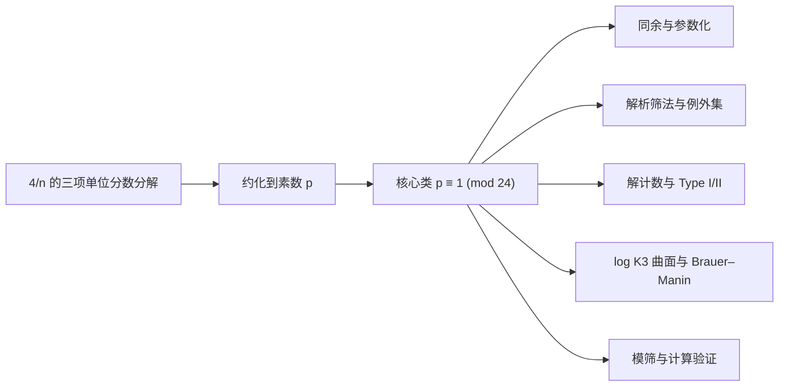

# Erdős–Straus 猜想研究进展综述

> 更新日期：2026-07-23
> 核查口径：优先采用原始论文、出版社页面、arXiv 正文及作者公开代码。同行评议论文、一般预印本和“声称完全证明”的预印本在下文中明确区分。

## 执行摘要

Erdős–Straus 猜想断言：对每个整数 \(n\ge 2\)，存在正整数 \(x,y,z\) 使

\[
\frac{4}{n}=\frac1x+\frac1y+\frac1z.
\]

等价地，

\[
4xyz=n(xy+xz+yz).
\]

截至 2026 年 7 月 23 日，**该猜想仍未解决**。经典恒等式把核心困难约化到素数
\(p\equiv1\pmod{24}\)；现有研究从同余构造、解析筛法、解计数、代数几何和计算验证等方向取得了显著进展，但尚未给出适用于每个这类素数的无条件构造。[Salez（2014）](https://arxiv.org/abs/1406.6307)、[Elsholtz 与 Tao（2013）](https://doi.org/10.1017/S1446788712000468)以及 [Bright 与 Loughran（2020）](https://doi.org/10.1112/blms.12374)分别提供了这些方向的现代基础。

计算方面，Salez 报告验证到 \(10^{17}\)，Mihnea 与 Dumitru 的 2025 年预印本报告验证到 \(10^{18}\)。两项原始计算报告均以 arXiv 预印本形式公开；2026 年经同行评议发表的 Pomerance–Weingartner 论文提及并致谢这两项计算，但这**不等于对 \(10^{18}\) 的独立复现**。因此，准确表述应是：**目前公开报告的最高验证上界为 \(10^{18}\)，其依据是带公开代码的预印本计算**。[Salez（2014）](https://arxiv.org/abs/1406.6307)、[Mihnea 与 Dumitru（2025）](https://arxiv.org/abs/2509.00128)、[Pomerance 与 Weingartner（2026）](https://doi.org/10.1007/s11139-025-01312-2)

2025–2026 年出现了多篇结构性预印本，也出现了个别“完全证明”声称。它们不能等量齐观：Bradford 的覆盖系统论证缺少覆盖性证明；Dyachenko 的仿射格论证则用一个共同平移量同时命中两个独立选取的剩余类，却没有证明二者相容。两处缺口都位于主证明链上，因此均不构成完整证明；同期论文仍明确把问题作为开放问题研究。[Bradford（2026）](https://arxiv.org/abs/2602.11774)、[Dyachenko（2025）](https://arxiv.org/abs/2511.07465)、[Chamberland（2026）](https://doi.org/10.5281/zenodo.19403738)

本次系统整理形成 51 张论文卡、18 张主张卡和 10 张概念卡。正文只概括主线；完整首发时间线见 [`index/timeline.md`](index/timeline.md)，规范 BibTeX 见 [`bibliography/library.bib`](bibliography/library.bib)，全部纳入、归并、排除与待审决定见 [`bibliography/candidates.yaml`](bibliography/candidates.yaml)。

## 研究路线总览

下表按“一个方法能回答什么问题”组织文献，而不是把不同量词的结论混在同一条进展线上。更细的可检索版本见 [`concepts/research-directions-and-proof-gap.md`](concepts/research-directions-and-proof-gap.md)。

| 路线 | 代表性已确立结论 | 仍未跨越的缺口 |
|---|---|---|
| 经典恒等式、同余类与多项式族 | 约化到 \(p\equiv1\pmod{24}\)；固定多项式机制可覆盖非平方原始类。 | 对所有核心素数给出覆盖，或突破平方类方法障碍。 |
| 解析筛法与例外集 | 可解分母具有自然密度 \(1\)，并有定量例外集上界。 | 密度零的例外仍可无限。 |
| Type I/II、gcd 与除子参数化 | 素数解可按整除型态穷尽分类；若存在解，多个参数化能给出可核验的除子证书。 | 对每个核心素数证明至少存在一个证书。 |
| 解计数与枚举算法 | 素数平均解数达到 \(N(\log N)^2\) 量级，并有可枚举算法。 | 平均解数和算法速度都不保证某个具体素数有解。 |
| 模筛与大规模计算 | 公开计算报告的上界达到 \(10^{18}\)，筛结构和代码可审查。 | 任意有限计算都不能替代无穷量词，也不等于独立全量复现。 |
| log K3 与 Brauer-Manin | 自然 Brauer 类不产生否定所需整点的该类障碍。 | 排除一种局部整体障碍并不构造整点。 |
| 一般 \(m/n\)、更多单位分数与 Erdős-Straus-Schinzel 问题 | 提供计数、算法和例外集工具，并显示一般固定分子有不同的例外现象。 | 一般问题的结论不能自动回推为 \(m=4\) 的逐点结论。 |

这张图给出阅读新材料的最低判据：有限同余族必须证明覆盖性，除子条件必须证明对所有目标素数可满足，计算必须说明范围和复现状态。任何一个环节没有闭合，都不能称为完整证明。

## 1. 问题结构与基本约化

### 1.1 从一般整数约化到素数

若 \(4/n=1/x+1/y+1/z\)，则对任意正整数 \(m\)，

\[
\frac{4}{mn}=\frac1{mx}+\frac1{my}+\frac1{mz}.
\]

因此，只要对每个素数分母证明猜想，就能推出一般整数情形；若存在最小反例，它必为素数。

### 1.2 只剩 \(p\equiv1\pmod{24}\)

经典显式恒等式分别处理

\[
n\equiv-1\pmod3,\qquad n\equiv-1\pmod4,
\qquad n\equiv-3\pmod8.
\]

结合素数约化，只需研究

\[
p\equiv1\pmod{24}.
\]

这不是新的猜想，而是所有现代理论与计算方法共享的核心瓶颈。[Salez（2014）](https://arxiv.org/abs/1406.6307)

### 1.3 Type I 与 Type II

对奇素数 \(p\)，Elsholtz 与 Tao 按分母是否被 \(p\) 整除把解分为两类：

- **Type I**：\(p\mid x\)，且 \(p\nmid yz\)；
- **Type II**：\(p\mid y,z\)，且 \(p\nmid x\)。

交换 \(x,y,z\) 后，每个解都落入其中一类，并有

\[
f(p)=3f_I(p)+3f_{II}(p),
\]

其中 \(f(p)\) 是有序正整数解的数量。[Elsholtz 与 Tao（2013）](https://doi.org/10.1017/S1446788712000468)

## 2. 已确立的理论进展

### 2.1 同余构造与参数化

Rosati、Yamamoto 等人的显式恒等式长期构成同余方法的基础。Salez 把**四条既有参考模方程**（其中包括 Yamamoto 整理的、源自 Rosati 的两条）与自己的**三条新方程**合并为七条参考方程，并证明一次素多项式情形下相应模方程的完备性。这里应理解为“共七条”，而不是把 Rosati、Yamamoto 与 Salez 的数量相加成九条。[Salez（2014）](https://arxiv.org/abs/1406.6307)

Mordell 的 *Diophantine Equations*（1969，第 287--290 页）是这条经典公式路线的常用二手入口，但不是 Rosati 公式的原始优先权来源。Salez 已明确按 Mordell 的归属把相关两种解型回溯到 Rosati；因此本库将 Mordell 作为历史枢纽书目，而把具体公式的原始归属保留给 Rosati。[Mordell 书目卡](papers/mordell1969.md)、[Rosati 书目卡](papers/rosati1954.md)

Elsholtz 与 Tao 还证明了一个重要的模 \(840\) 分类：若原始剩余类 \(n\equiv r\pmod{840}\) 中的 \(r\) 不是平方类，则该剩余类可由多项式恒等式统一处理；平方类则不能被这种固定多项式参数化覆盖。后一句并不表示平方类无解，只表示这一类统一参数化方法有结构性边界。[Elsholtz 与 Tao（2013）](https://doi.org/10.1017/S1446788712000468)

### 2.2 例外集与密度结果

令

\[
E(N)=\#\{n\le N:f(n)=0\}.
\]

Vaughan 证明存在常数 \(c>0\)，使

\[
E(N)\ll N\exp\!\left(-c(\log N)^{2/3}\right).
\]

因此，可解整数具有自然密度 \(1\)。Li 后来证明，对任意固定 \(k\)，

\[
E(N)=O_k\!\left(\frac{N}{(\log N)^k}\right).
\]

需要注意强弱关系：Li 的结果给出任意多重对数节省，但从渐近量级看，**弱于** Vaughan 的伸缩指数界，而不是更强。[Vaughan（1970）](https://doi.org/10.1112/S0025579300002886)、[Li（1981）](https://doi.org/10.1016/0022-314X(81)90039-1)

Sander 随后分别用 Rosser 筛与 Iwaniec 半维筛继续研究该问题。准确书目信息是：Rosser 筛论文发表于 *Acta Arithmetica* 59（1991），183–204；半维筛论文发表于 *Journal of Number Theory* 46（1994），123–136。[Sander（1991）](https://doi.org/10.4064/aa-59-2-183-204)、[Sander（1994）](https://doi.org/10.1006/jnth.1994.1008)

Pomerance 与 Weingartner 把这条例外集路线推广到更一般的 Erdős–Straus–Schinzel 型问题。该文已在 2026 年同行评议发表，但它是例外集理论的推广，不是 \(m=4\) 情形的完全证明。[Pomerance 与 Weingartner（2026）](https://doi.org/10.1007/s11139-025-01312-2)

### 2.3 解计数与枚举算法

Elsholtz 与 Tao 证明

\[
N(\log N)^2
\ll \sum_{p\le N}f(p)
\ll N(\log N)^2\log\log N.
\]

这是素数分母解数的平均阶估计。它说明总体解数丰富，但平均值本身不能单独推出每个素数都有解；逐点非零仍是猜想最困难的部分。[Elsholtz 与 Tao（2013）](https://doi.org/10.1017/S1446788712000468)

在可快速分解整数的标准期望复杂度模型下，该文还给出枚举所有 Type I 与 Type II 解的期望时间，分别为

\[
O\!\left(n^{3/5+o(1)}\right),\qquad
O\!\left(n^{2/5+o(1)}\right).
\]

Elsholtz 与 Planitzer 将这一方向推广到一般 \(m/n\)，对固定 \(m\) 得到表示数上界

\[
O_\varepsilon\!\left(n^{3/5+\varepsilon}\right)
\]

以及枚举全部解的期望时间

\[
O_\varepsilon\!\left(
n^\varepsilon\left(\frac{n^3}{m^2}\right)^{1/5}
\right).
\]

[Elsholtz 与 Planitzer（2020）](https://doi.org/10.1017/prm.2018.137)

### 2.4 代数几何视角

Bright 与 Loughran 把

\[
4u_1u_2u_3=n(u_1u_2+u_1u_3+u_2u_3)
\]

视为仿射三次曲面 \(U_n\) 的整点问题；其几何模型是奇异的 log K3 曲面。他们证明，自然解空间没有足以否定猜想的 Brauer–Manin 障碍，但该障碍会阻碍某种强逼近，并统一解释了古典文献中的若干二次互反条件。这项工作提供的是结构约束，而不是逐个构造所有 \(p\equiv1\pmod{24}\) 的算法。[Bright 与 Loughran（2020）](https://doi.org/10.1112/blms.12374)

### 2.5 一变量约化、除子条件与有限证书

这条路线把“找三个分母”改写为“找一个满足整除和同余条件的参数”。Bradford 2021 在**假设解存在**的前提下用 gcd 恒等式消去第三个变量；它是结构刻画而非存在性定理。Bradford 2025 进一步证明，对于素数 \(p\)，Type I 或 Type II 解与最小分母 \(x\) 的除子 \(d\mid x^2\) 所满足的相应同余条件可以相互恢复。该等价把验证和枚举转成短证书问题，但“每个 \(p\) 都有这样的 \(x,d\)”仍正是原猜想的逐点难题。[Bradford（2021）](https://doi.org/10.5281/zenodo.10807535)、[Bradford（2025）](https://doi.org/10.5281/zenodo.15755958)

Chamberland 2026 对 Type II 给出另一种素数形状的充要刻画；Bello-Hernández、Benito、Fernández 2026 则用 `fab` 除子函数把一类“所有分母被给定分子整除”的分解统一参数化，并报告有限窗口实验。这些是互补的结构和计算语言，均没有证明对每个核心素数都存在可用参数。[Chamberland（2026）](https://doi.org/10.5281/zenodo.19403738)、[Bello-Hernández 等（2026）](https://arxiv.org/abs/2606.10922)

## 3. 2024–2026 年前沿材料的证据分级

| 工作 | 主要内容 | 当前证据状态 | 应如何引用 |
|---|---|---|---|
| Bradford 2025 | 把解的存在与两类除子同余条件建立对应 | 已发表于 *Integers* | 可作为已发表的结构性结果，不等于猜想已证 |
| Mihnea–Dumitru 2025 | 报告计算验证到 \(10^{18}\)，公开 Python、C++/GMP 代码 | arXiv 预印本；后续期刊文献提及，未见独立全量复现 | 写作“公开报告的计算上界” |
| Dyachenko 2025 | 声称对全部 \(p\equiv1\pmod4\) 构造解 | 预印本；仿射格对角平移步骤存在关键相容性缺口 | 不应写作已证明 |
| Bradford 2026（solution） | 声称完全解决猜想 | 预印本；覆盖系统关键步骤未证明 | 不应写作已证明或仅“待核验” |
| Mballa 2026 | 对含 \(3\pmod4\) 素因子的 \(n\equiv1\pmod4\) 构造解，该集合密度为 \(1\) | arXiv 预印本；核心素数全部在其零密度补集 | 写作显式 density-one 结果，不写作核心素数进展 |
| Chamberland 2026 | 刻画素数存在 Type II 解的充要形式 \(p=qr-4s_1s_2\) | 已发表于 *Integers*；等价定理已核对 | “全部素数都具有该形式”仍是猜想 |
| Xu 2026 | 提出 tame/wild 分类并做有限范围实验 | arXiv 预印本 | 写作分类框架与计算观察 |
| Ventas 2026 | 用 ceiling continued fractions 做大范围启发式搜索 | arXiv 预印本 | 只能作为启发式证据 |
| Bello-Hernández–Benito–Fernández 2026 | 提出一般除子参数化、平移不变模筛及有限参数刚性障碍 | arXiv 预印本 | 写作结构性部分结果，作者不是 Bradford |
| Pomerance–Weingartner 2026 | 推广 Erdős–Straus–Schinzel 例外集理论 | 同行评议期刊论文 | 可作为已发表的解析进展，不是完全证明 |

对应来源：[Bradford（2025）](https://doi.org/10.5281/zenodo.15755958)、[Mihnea 与 Dumitru（2025）](https://arxiv.org/abs/2509.00128)、[Dyachenko（2025）](https://arxiv.org/abs/2511.07465)、[Bradford（2026）](https://arxiv.org/abs/2602.11774)、[Mballa（2026）](https://arxiv.org/abs/2602.20036)、[Chamberland（2026）](https://doi.org/10.5281/zenodo.19403738)、[Xu（2026）](https://arxiv.org/abs/2605.23601)、[Ventas（2026）](https://arxiv.org/abs/2605.04551)、[Bello-Hernández 等（2026）](https://arxiv.org/abs/2606.10922)、[Pomerance 与 Weingartner（2026）](https://doi.org/10.1007/s11139-025-01312-2)。

### 关键归属与证明核查

1. **作者归属修正。** *A Divisor Parametrization for the Erdős–Straus Conjecture*（arXiv:2606.10922）的作者是 M. Bello-Hernández、M. Benito 与 E. Fernández，不是 Kyle Bradford。该文讨论一般除子函数、平移不变模筛和有限参数覆盖的刚性障碍，并与 Bradford 的方法作比较。

2. **“完全证明”声称的核查。** Bradford 的 arXiv:2602.11774 在正文中把最后一步表述为证明所列同余类构成覆盖系统，随后只检查或列举了开头若干素数情形，没有给出覆盖全部相关素数的论证。该缺口位于证明主链上，不能视为省略的例行细节。因此，本报告不把该预印本计入已解决结果。

3. **仿射格声称的核查。** Dyachenko 的 arXiv:2511.07465 在 Proposition 9.25 附近先分别选择满足两个模条件的代表元，再试图用同一个对角平移参数同时到达二者。第一个坐标已经决定该参数，正文没有证明第二个坐标自动相容；相关引理也未证明一个秩一对角陪集等于固定两个剩余类的全部格点。因此 Theorem 9.21 的关键存在性步骤尚未成立。

4. **已发表的 Type II 等价定理。** Chamberland 证明：素数 \(p\) 存在 Type II 解，当且仅当可写成 \(p=qr-4s_1s_2\)，其中 \(q\equiv3\pmod4\) 且 \(s_1,s_2\mid(q+1)/4\)。双向等价是定理；“所有素数都有这种表示”是论文另行提出的猜想，二者不可合并。

## 4. 时间线与里程碑

| 年份 | 进展 | 性质 |
|---:|---|---|
| 1948 | 通行文献把猜想提出时间追溯到 Erdős 与 Straus 的讨论；本库尚未定位二人共同署名的原始公告 | 历史归属，保留出处边界 |
| 1950 | Erdős 的一般单位分数论文与 Obláth 的直接论文构成最早印刷入口 | 原始书目入口 |
| 1954–1965 | Rosati、Bernstein、Yamamoto 等发展显式同余构造 | 经典部分结果 |
| 1962 | Bernstein 独立验证到 \(8000\)；这不是当时的最高纪录，因为更早已有超过 \(10^5\) 的计算记录 | 历史计算，非纪录推进 |
| 1970 | Vaughan 给出伸缩指数型例外集上界 | 解析里程碑 |
| 1981 | Li 给出任意多重对数节省的例外集界 | 解析部分结果 |
| 1991 | Sander 发表 Rosser 筛论文 | 解析筛法 |
| 1994 | Sander 引入 Iwaniec 半维筛 | 解析筛法 |
| 2012 | Bello-Hernández、Benito、Fernández 报告验证到 \(2\times10^{14}\) | 参数化与计算 |
| 2013 | Elsholtz–Tao 建立平均解数与 Type I/II 计数框架 | 理论里程碑 |
| 2013 | Rios 的渐近估计预印本后来因公式 (3)、(5) 的关键符号错误由作者撤回 | 负面研究记录，不可引用其结论 |
| 2014 | Salez 完成七个参考模方程框架并报告验证到 \(10^{17}\) | 理论与计算 |
| 2020 | Bright–Loughran 建立 log K3 / Brauer–Manin 框架 | 代数几何里程碑 |
| 2020 | Elsholtz–Planitzer 推广解计数上界与枚举算法 | 理论与算法 |
| 2021 | Bradford 发表一变量约化；Gionfriddo–Guardo 的 \(13\pmod{24}\) 结果正式发表 | 结构结果与易类公式 |
| 2025 | Bradford 发表除子同余对应；Mihnea–Dumitru 报告验证到 \(10^{18}\) | 已发表结构结果；预印本计算 |
| 2026 | Pomerance–Weingartner 发表例外集推广；Chamberland 发表 Type II 等价刻画；多篇预印本提出新参数化、分类和启发式 | 已发表进展与前沿探索并存 |

早期计算史和文献表可参见 [Elsholtz 与 Tao（2013）](https://doi.org/10.1017/S1446788712000468)；上表有意不把“独立完成的小范围验证”误写成“刷新最高纪录”。

### 4.1 计算验证阶梯及其证据边界

| 来源或历史归属 | 报告范围 | 应如何理解 |
|---|---:|---|
| Oblath（1948/49，1950 出版） | \(106128\) | Elsholtz--Tao 历史表归属，非本库原文重跑。 |
| Rosati（1954） | \(141648\) | 同为历史表归属。 |
| Yamamoto（1964/65） | \(10^7\) | 历史表把计算年份与论文出版年分开。 |
| Terzi（1971） | \(10^8\) | 历史表也警告后来的 Franceschine 记载不是独立复核。 |
| Jollensten（1976） | \(1.1\times10^7\) | 独立计算报告，但不是当时最高范围。 |
| Kotsireas（1999） | \(10^{10}\) | 已发表会议记录；此前还有未发表的 Elsholtz--Roth 范围，不能混作公开纪录。 |
| Swett（1999） | \(10^{14}\) | 作者网页计算报告。 |
| Bello-Hernández、Benito、Fernández（2012） | \(2\times10^{14}\) | 论文报告的有限验证。 |
| Salez（2014） | \(10^{17}\) | arXiv 论文和附件代码报告，未在本库全量复现。 |
| Mihnea--Dumitru（2025） | \(10^{18}\) | 公开代码的预印本报告，目前不是独立全量复现记录。 |

所以，“最高公开报告”与“最高经过独立复现的上界”是两项不同指标。当前前者为 \(10^{18}\)，后者在本库中不作未证实的宣称；只有小尺度公式和证书复现被标为 `computationally_reproduced`。

## 5. 计算验证与复现要点

### 5.1 Salez 的模筛

Salez 从 \(N_0=\{n:n\equiv1\pmod{24}\}\) 出发，用模过滤器排除已由参考方程保证可解的整数。文中给出的几个基础过滤器包括

\[
S_5=\{0,2,3\},\qquad
S_7=\{0,3,5,6\},\qquad
S_{11}=\{0,7,8,10\}.
\]

对合数模数再使用缩短过滤器 \(S_m^*\)，去掉已被真因子过滤器覆盖的冗余剩余类。依次使用 \(5,7,11,13,17,19,23\) 后，Salez 得到

\[
G_7=892\,371\,480,
\qquad \#R_7=147\,348,
\qquad g_7=6056.
\]

“约 43 倍”必须注明比较基准：在只使用 \(5,7\) 后，平均间隔为 \(140\)，所以 \(6056/140\approx43.3\)。若与原始序列 \(24k+1\) 的间隔 \(24\) 比较，则是约 \(252\) 倍，而不是 43 倍。[Salez（2014）](https://arxiv.org/abs/1406.6307)

对 \(N=10^{17}\)，论文报告实际检查候选数

\[
16\,512\,783\,482\,880,
\]

其中平方数为 \(51\,732\,427\)，并提供 arXiv 附件 `program.cpp`。这使其算法结构可以审查，但原始报告本身仍是 arXiv 预印本。

### 5.2 \(10^{18}\) 计算报告

Mihnea 与 Dumitru 延续模过滤器路线，使用 Python 生成过滤器，使用 C++/GMP 校验大整数，并将搜索拆成批次以便多线程执行。作者报告中等配置运行约两周，代码与数据公开在 [`esc-paper/erdos-straus`](https://github.com/esc-paper/erdos-straus)，仓库标注 CC0-1.0 许可。[Mihnea 与 Dumitru（2025）](https://arxiv.org/abs/2509.00128)

对该结果应区分三层证据：

- 论文和代码公开，可由第三方检查；
- Pomerance–Weingartner 的期刊论文提及并致谢该计算；
- 尚不能据此声称已有独立团队完整复现 \(10^{18}\) 的全部搜索。

因此，本报告采用“公开报告验证到 \(10^{18}\)”这一措辞。

### 5.3 本知识库的小尺度复现

[`reproductions/esc_reproduce.py`](reproductions/esc_reproduce.py) 使用整数运算和 `fractions.Fraction` 独立交叉核对四个环节：三个经典约化恒等式；\(S_5,S_7\) 与 \(n\equiv1\pmod{24}\) 合并后模 \(840\) 的六个残余类

\[
1,121,169,289,361,529;
\]

固定首分母后的因子对恒等式 \((ay-b)(az-b)=b^2\)；以及 Bradford Type I/II 除子条件到显式分母的对应。当前结果逐个验证 \(2\le n\le1000\)，并为 \(p\le10000\) 的全部 1229 个素数找到并精确核对一个 Type I 或 Type II 证书，其中首次命中的 Type I 为 851 个、Type II 为 378 个。

这些数字只说明复现脚本在有限范围内与理论接口一致，**不是**对 \(10^{17}\) 或 \(10^{18}\) 搜索的缩略证明，也不能外推为全称结论。运行方法和哈希见 [`reproductions/README.md`](reproductions/README.md) 与 [`reproductions/results.json`](reproductions/results.json)。

## 6. 方法评估与可行研究方向

### 6.1 各路线的能力边界

- **同余构造**直接、可计算，但七个参考方程的完备性表明，仅寻找更多同类型线性模恒等式可能难以覆盖全部困难素数。
- **解析筛法**能把潜在例外集压得极薄，却通常不能对一个给定的 \(p\equiv1\pmod{24}\) 产生具体分解。
- **解计数与除子参数化**兼具结构与算法价值，但平均解数为正不等于每个分母都有解。
- **Brauer–Manin 方法**统一了局部二次剩余限制，目前仍缺少把必要条件转化为全局充分构造的机制。
- **大规模计算**持续增强数值证据，不能替代对所有整数的证明；其长期价值取决于代码、参数和校验链是否可复现。

### 6.2 值得优先推进的问题

1. **残差类与短除子证书。** 将 Salez 过滤器漏出的剩余类输入 Bradford 2025 或 Bello-Hernández 等 2026 的除子条件，统计最短证书、最小分母和除子分布，寻找可证明的统一界。
2. **tame/wild 分类的定量化。** Xu 报告：在 \(p=24m+1\)、\(m\le30000\) 的样本中只有 9 个 wild primes；在 \(m\le2000\) 的 591 个样本中有 586 个 tame primes。下一步应把有限样本现象转化为 wild 集合的可证明计数界。[Xu（2026）](https://arxiv.org/abs/2605.23601)
3. **局部条件与除子条件合并。** 把 Bright–Loughran 的 Legendre/Hilbert 必要条件用作预筛，再与 Type I/II 除子参数化结合，寻找“局部通过即存在短证书”的充分条件。
4. **独立复现与形式化校验。** 对 \(10^{18}\) 搜索建立第二套实现，交叉核对 CRT、过滤器生成和边界分批逻辑；可进一步把有限模恒等式交给 Lean、Isabelle 或其他证明助手验证。

## 7. 推荐阅读顺序

| 优先级 | 文献 | 阅读目的 |
|---|---|---|
| 1 | Salez 2014 | 掌握 \(p\equiv1\pmod{24}\) 约化、七个参考方程和现代模筛 |
| 2 | Elsholtz–Tao 2013 | 掌握 Type I/II、平均解数、参数化和早期计算史 |
| 3 | Bright–Loughran 2020 | 理解 log K3 曲面与二次互反条件的统一来源 |
| 4 | Elsholtz–Planitzer 2020 | 进入一般 \(m/n\) 的解计数和枚举算法 |
| 5 | Bradford 2025 | 进入一变量/除子同余路线 |
| 6 | Chamberland 2026 | 掌握 Type II 解的素数结构等价刻画 |
| 7 | Mihnea–Dumitru 2025 与公开代码 | 复现或扩展计算验证 |
| 8 | Xu 2026、Bello-Hernández 等 2026 | 跟进 tame/wild 与一般除子参数化前沿 |
| 9 | Vaughan、Li、Sander、Pomerance–Weingartner | 系统研究例外集与解析筛法 |
| 10 | Bradford 2026、Dyachenko 2025 的审计卡 | 学习如何定位全称证明中的覆盖与格相容性缺口 |

## 参考文献

以下按第一作者姓氏字母顺序排列。文章标题采用原文；有 DOI 时优先链接 DOI，否则链接 arXiv。

1. Bello-Hernández, M., Benito, M., & Fernández, E. (2012). *On Egyptian fractions*. arXiv:1010.2035. https://arxiv.org/abs/1010.2035
2. Bello-Hernández, M., Benito, M., & Fernández, E. (2026). *A divisor parametrization for the Erdős–Straus conjecture*. arXiv:2606.10922. https://arxiv.org/abs/2606.10922
3. Bradford, K. (2025). Elementary patterns from the Erdős–Straus conjecture. *Integers, 25*, A54. https://doi.org/10.5281/zenodo.15755958
4. Bradford, K. (2026). *A solution to the Straus–Erdős conjecture*. arXiv:2602.11774. https://arxiv.org/abs/2602.11774
5. Bright, M., & Loughran, D. (2020). Brauer–Manin obstruction for Erdős–Straus surfaces. *Bulletin of the London Mathematical Society, 52*, 746–761. https://doi.org/10.1112/blms.12374
6. Chamberland, M. (2026). The Erdős–Straus conjecture and the structure of primes. *Integers, 26*, A42. https://doi.org/10.5281/zenodo.19403738
7. Dyachenko, E. (2025). *Constructive proofs of the Erdős–Straus conjecture for prime numbers with \(p\equiv1\pmod4\)*. arXiv:2511.07465. https://arxiv.org/abs/2511.07465
8. Elsholtz, C., & Planitzer, S. (2020). The number of solutions of the Erdős–Straus equation and sums of \(k\) unit fractions. *Proceedings of the Royal Society of Edinburgh Section A: Mathematics, 150*, 1401–1427. https://doi.org/10.1017/prm.2018.137
9. Elsholtz, C., & Tao, T. (2013). Counting the number of solutions to the Erdős–Straus equation on unit fractions. *Journal of the Australian Mathematical Society, 94*, 50–105. https://doi.org/10.1017/S1446788712000468
10. Gionfriddo, M., & Guardo, E. (2021). A short proof of Erdös–Straus conjecture for every \(n\equiv13\pmod{24}\). *Journal of Interdisciplinary Mathematics, 24*(8), 2307–2312. https://doi.org/10.1080/09720502.2021.1907018
11. Ionascu, E. J., & Wilson, A. (2011). On the Erdős–Straus conjecture. *Revue Roumaine de Mathématiques Pures et Appliquées, 56*(1), 21–30. https://arxiv.org/abs/1001.1100
12. Jia, C. (2012). The estimate for mean values on prime numbers relative to \(4/p=1/n_1+1/n_2+1/n_3\). *Science China Mathematics, 55*(3), 465–474. https://doi.org/10.1007/s11425-011-4348-9
13. Li, D. (1981). On the equation \(4/n=1/x+1/y+1/z\). *Journal of Number Theory, 13*, 485–494. https://doi.org/10.1016/0022-314X(81)90039-1
14. Mordell, L. J. (1969). *Diophantine equations*. Academic Press, London. [书目卡](papers/mordell1969.md)
15. Mballa, P. U. (2026). *A unified parametric approach to the Erdős–Straus conjecture with explicit solutions for a set of integers of natural density one*. arXiv:2602.20036. https://arxiv.org/abs/2602.20036
16. Mihnea, S., & Dumitru, B. C. (2025). *Further verification and empirical evidence for the Erdős–Straus conjecture*. arXiv:2509.00128. https://arxiv.org/abs/2509.00128
17. Pomerance, C., & Weingartner, A. (2026). Exceptions to the Erdős–Straus–Schinzel conjecture. *The Ramanujan Journal, 69*(2), Article 31. https://doi.org/10.1007/s11139-025-01312-2
18. Rios, E. (2013). *Asymptotic estimates on the Erdős–Straus conjecture*. arXiv:1302.0872. **作者已因公式 (3)、(5) 的关键符号错误撤回。** https://arxiv.org/abs/1302.0872
19. Salez, S. E. (2014). *The Erdős–Straus conjecture: New modular equations and checking up to \(N=10^{17}\)*. arXiv:1406.6307. https://arxiv.org/abs/1406.6307
20. Sander, J. W. (1991). On \(4/n=1/x+1/y+1/z\) and Rosser’s sieve. *Acta Arithmetica, 59*, 183–204. https://doi.org/10.4064/aa-59-2-183-204
21. Sander, J. W. (1994). On \(4/n=1/x+1/y+1/z\) and Iwaniec’ half dimensional sieve. *Journal of Number Theory, 46*, 123–136. https://doi.org/10.1006/jnth.1994.1008
22. Subburam, S., & Togbé, A. (2016). A note on the Erdős–Straus conjecture. *Periodica Mathematica Hungarica, 72*(1), 43–49. https://doi.org/10.1007/s10998-015-0109-9
23. Vaughan, R. C. (1970). On a problem of Erdős, Straus and Schinzel. *Mathematika, 17*, 193–198. https://doi.org/10.1112/S0025579300002886
24. Ventas, A. (2026). *A ceiling continued fraction approach to the Erdős–Straus conjecture: Heuristic finiteness of counterexamples*. arXiv:2605.04551. https://arxiv.org/abs/2605.04551
25. Xu, X. (2026). *Congruence classes of supporting the Erdös-Straus conjecture I: Tame solutions*. arXiv:2605.23601. https://arxiv.org/abs/2605.23601

## 核查说明

本版已移除全部内部检索引用标记，并将其替换为可公开访问的 DOI、arXiv 或代码仓库链接。灰色文献与被撤回文献保留在候选清单或专门论文卡中，但不会冒充已确立结论。本文使用 AI 辅助进行资料检索、格式检查、引文核对和小尺度复现；数学结论以所列原始文献及每张卡片的核查状态为准。
